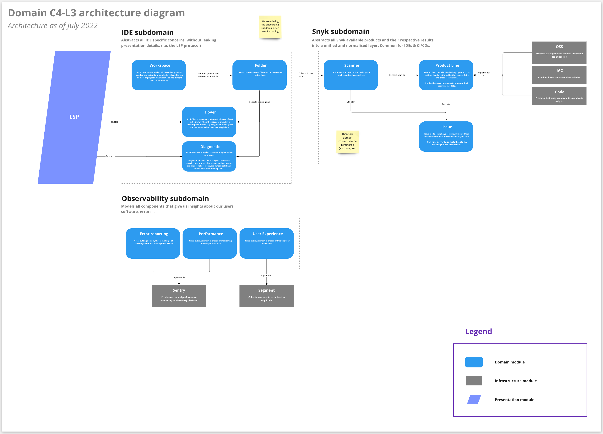

# Dev Environment
You'll need
- Gnu Make
- Bash
- Python 3 (incl. requests module)
- Go 1.21

# Architecture

Snyk language server acts as an integration point encompassing the following features:

- Providing platform for Snyk product integrations
- Enabling feature delivery into IDEs that support Language Server Protocol
- Abstracting away Snyk and IDE domains from presentation, infrastructure and application.

## Code structure

The codebase
follows [DDD layering](https://docs.microsoft.com/en-us/dotnet/architecture/microservices/microservice-ddd-cqrs-patterns/ddd-oriented-microservice#layers-in-ddd-microservices)
with the following layers:

- Domain
  - Encapsulates main business model and business rules. This is the core.
- Infrastructure
  - Supports application by implementing the abstractions and integrations to external libraries and systems.
- Application
  - Responsible for gluing other layers together, coordinating and delegating work further down.
- Internal
  - Internal code, acts as standard library for the whole application. It is shared across all layers.

## Domain

Current domain is depicted in the following diagram:


# Contributing new Snyk products

To integrate a new product, the language server provides
a [Scanner](https://github.com/snyk/snyk-lsp/blob/8849121339c49d7ad03f9e8d795ba11c056bf43d/domain/snyk/scanner.go#L13)
interface as an abstraction for scanning that can be performed over an IDE workspace folder. Scanner implementation
allows to surface detected issues visually within IDE. This includes IDE diagnostic messages, hovers, code actions,
description urls and more.

As a new product developer, you are required to implement the Scanner interface in the infrastructure layer. The owners
of language server will ensure to carry out the final wiring within application layer and review the code change.

Please check this guide to see how a new product can be added to the Language
Server: [Snyk LSP Contribution Example](./docs/example.md).

## Instrumentation

Error reporting and performance monitoring is done via [Sentry](https://sentry.io/). Analytics are captured
via [Segment](https://segment.com/) and further propagated to [Amplitude Analytics](https://amplitude.com/).

### Error reporting

`error_reporting.ErrorReporter` can be injected via the new scanner's constructor. It is used to report errors to Sentry
via `CaptureError` function. We recommend using `CaptureError` to report only errors that are exceptions to the normal
flow of the application and cannot be handled another way. These errors will be visually surfaced to the user in the
IDE.

For example, if your product scanner reaches API that is temporarily unavailable, this should not be reported as an
error. Instead, fault-tolerance mechanism should be employed to handle temporary API outage. If fault tolerance doesn't
succeed, this can be reported as an error.

Another example is if an API response returns unexpected response payload that prevents parsing, this can be reported as
an error.

:warning: Please ensure you set up necessary [alerting](https://docs.sentry.io/product/alerts/) for these errors for
your team in [Sentry](https://sentry.io/organizations/snyk/alerts/rules/?project=6242547).

### Analytics

We follow growth-oriented mindset and try to capture usage analytics to constantly improve our product. Events are
defined in the [Amplitude Data tracking plan](https://data.amplitude.com/snyk/Snyk/events/main/latest).

`ux.Analytics` provides an interface for logging analytical events. Please
follow [Snyk's analytics practices](https://www.notion.so/snyk/Amplitude-Data-for-Developers-Overview-1723b875d9ed43dcad090722e0506e07)
when updating or adding new events.

### Performance Monitoring

If you are interested in performance monitoring you can utilize `performance.Instrumentor` to instrument your code.

### Release process

Language Server automatically releases all unreleased commits on merge to main. We
use [goreleaser](https://goreleaser.com/) to automate the release process.
It automatically creates a tag and a release and uploads it to GitHub. Furthermore, it uploads the artifacts
to [static.snyk.io](https://static.snyk.io/snyk-ls) to
make them available for download for plugins. An example, how to download the latest version is
the [getLanguageServer.sh](getLanguageServer.sh) script, which implements the same logic
as the Eclipse plugin for download.

It is important to be aware of the variable `LS_PROTOCOL_VERSION`
in [the goreleaser configuration](.goreleaser.yaml#L53). This controls the upload location
of the artifacts. The download URL is constructed as follows:

```https://static.snyk.io/snyk-ls/$LS_PROTOCOL_VERSION/snyk-ls_$VERSION_$OS_$ARCH```

This way, when the language server has an incompatible api change, we can change the `LS_PROTOCOL_VERSION` so that old
plugins don't break. If we update
`LS_PROTOCOL_VERSION` without updating the plugins, e.g.
the [Snyk Eclipse Plugin](https://github.com/snyk/snyk-eclipse-plugin), new plugin versions will
not receive language server updates anymore.

Therefore, a protocol change must always be accompanied by a client plugin change. As an example, in case of the Eclipse
plugin, it would have to be done
[here](https://github.com/snyk/snyk-eclipse-plugin/blob/babad5b5b67de21d08a58aac5ac94fa1a292c024/plugin/src/main/java/io/snyk/languageserver/download/LsBinaries.java#L7)
.

If you updated any dependency, please run the Makefile target `make license-update` to update the license files.
