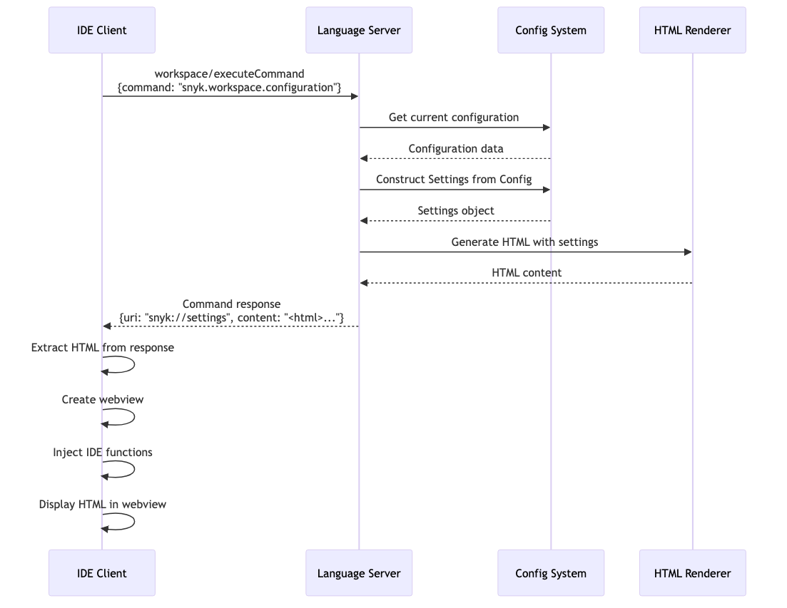
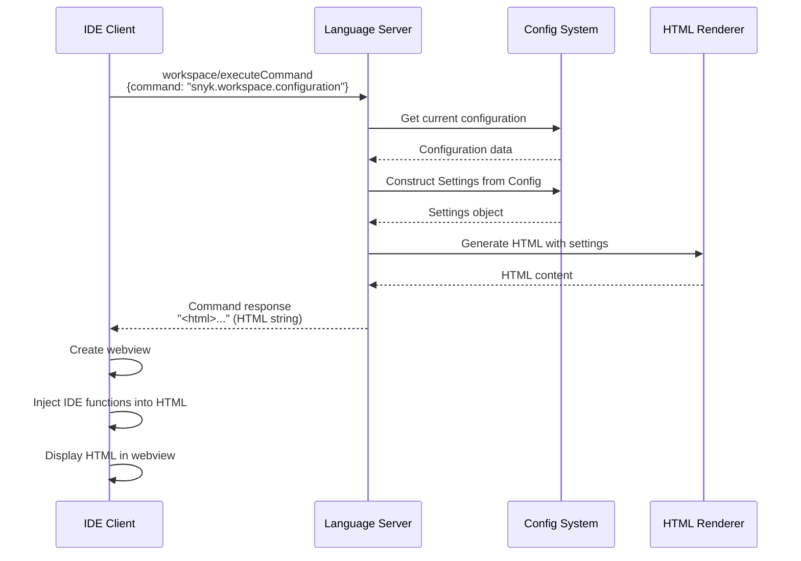
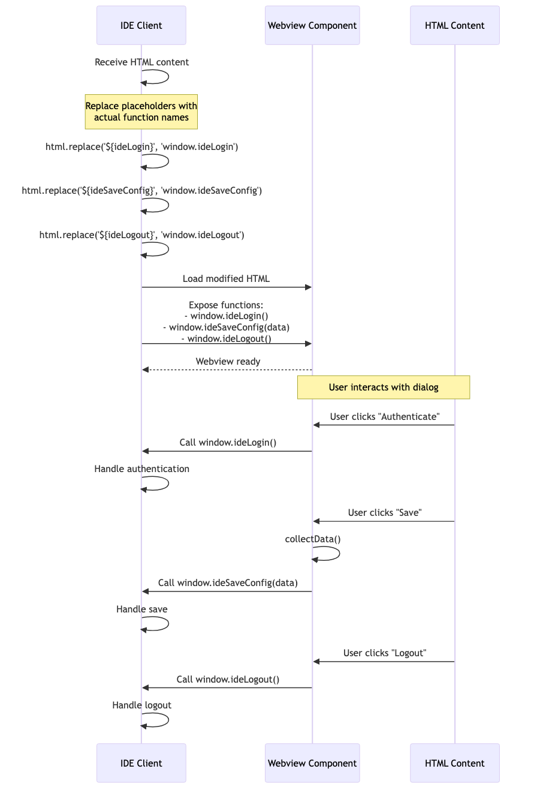
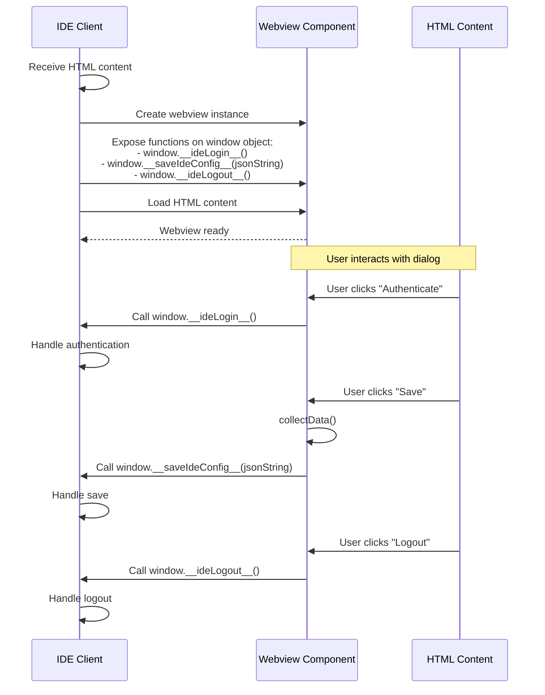
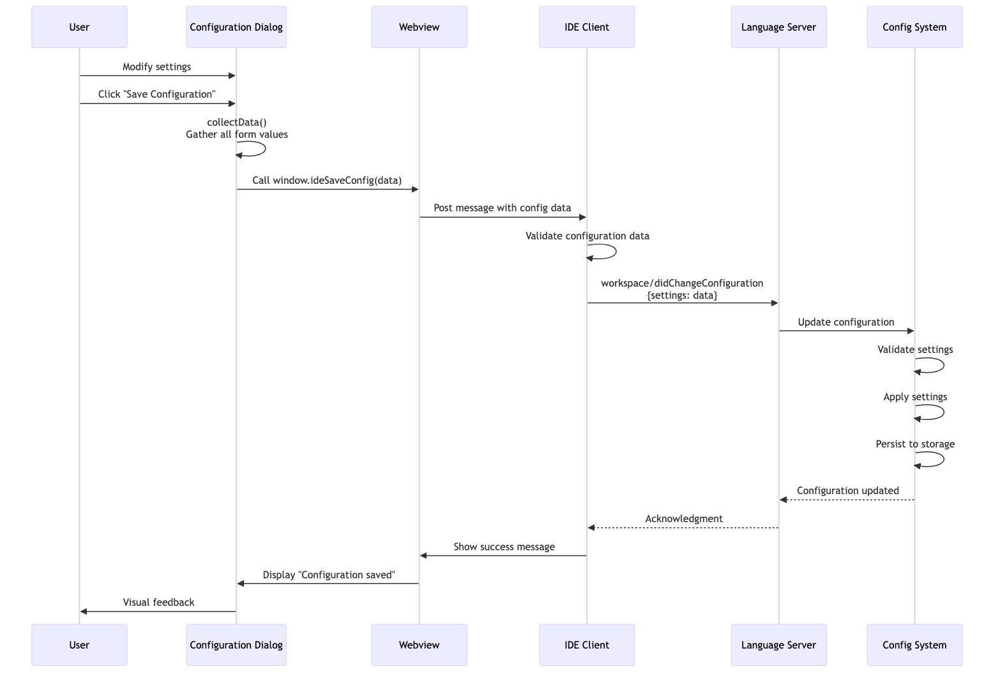
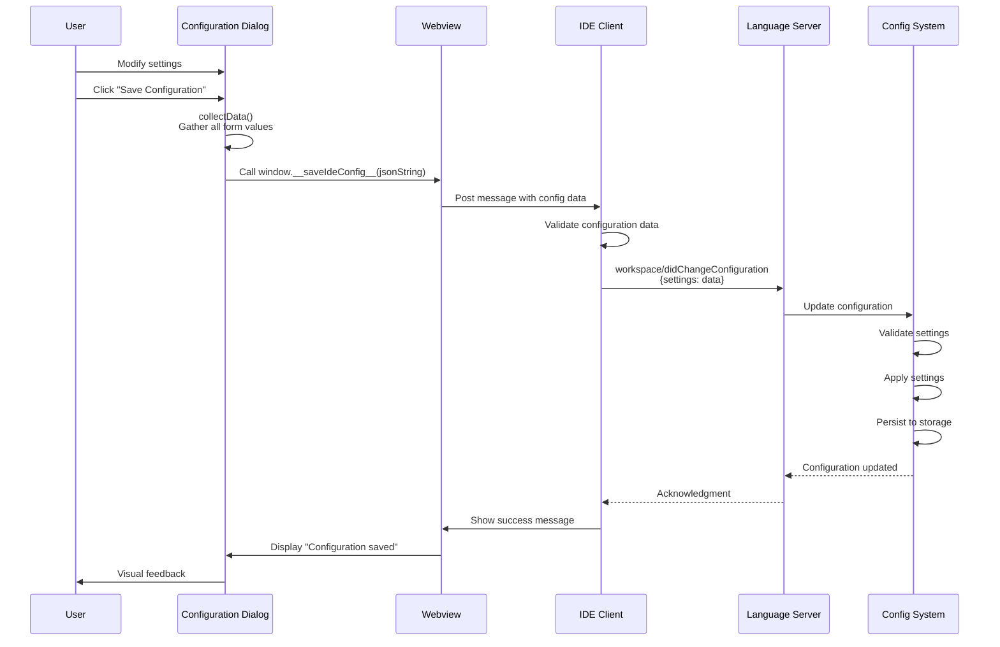
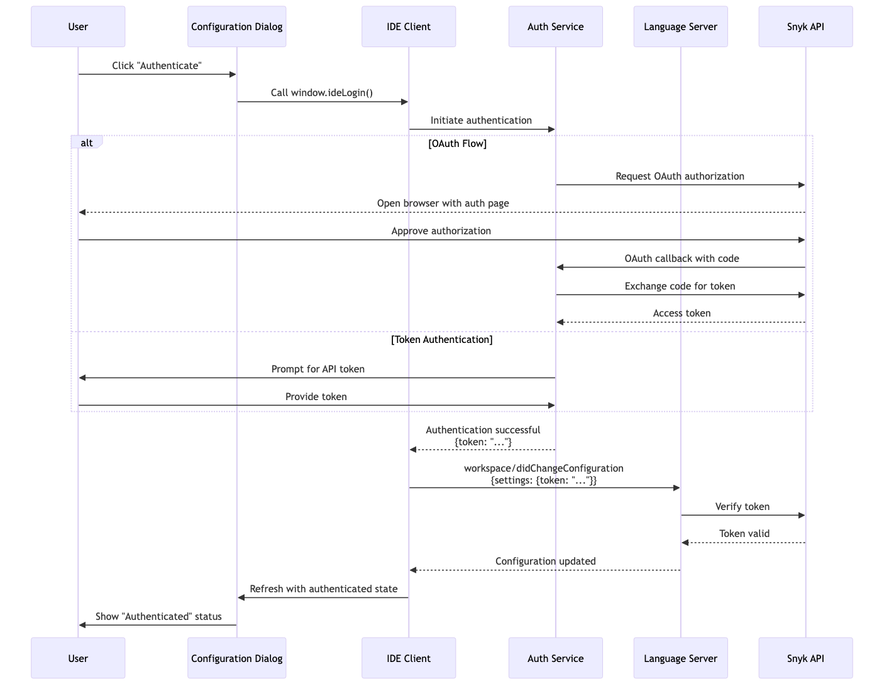
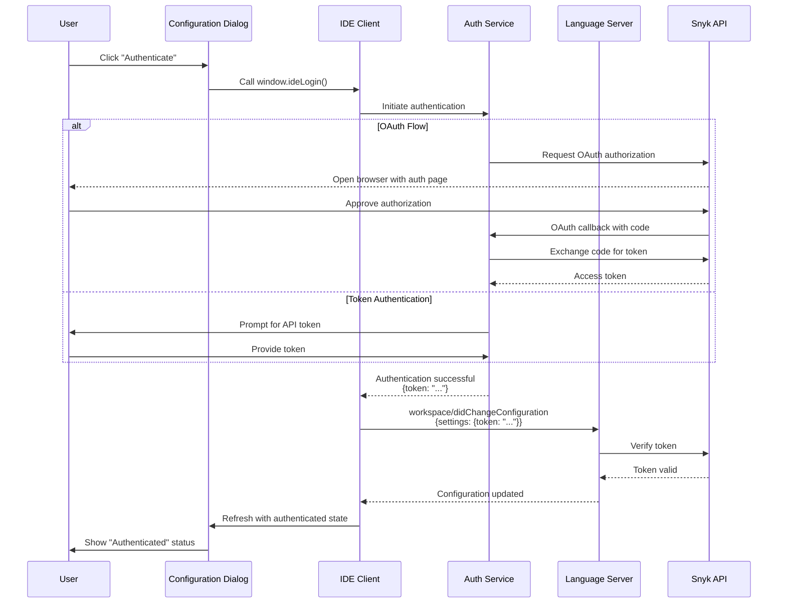
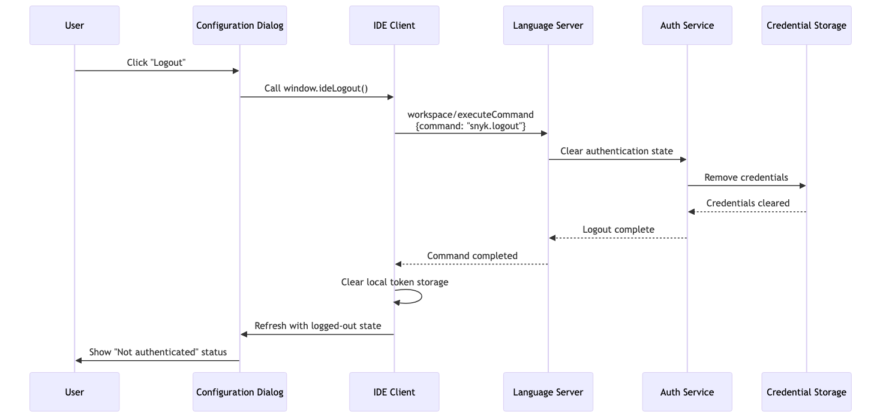
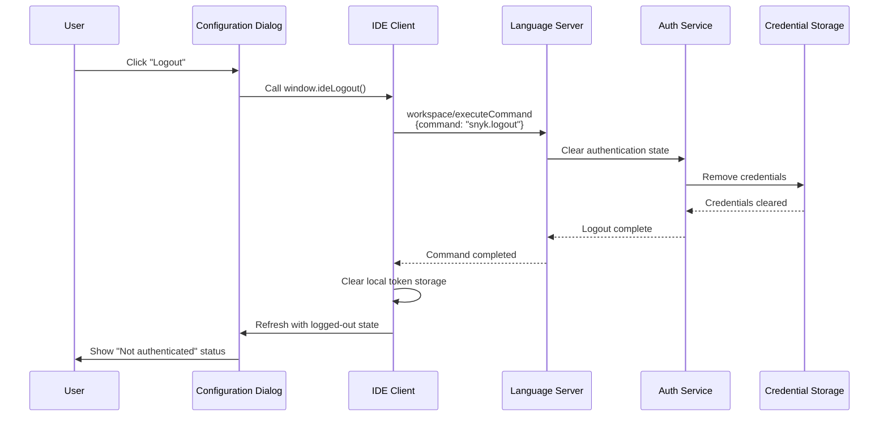

# Configuration Dialog Integration Guide

This guide explains how IDEs can integrate with the Snyk Language Server's configuration dialog to provide a user-friendly interface for managing Snyk settings.

## Overview

The configuration dialog is an HTML-based interface that allows users to view and modify all Snyk Language Server settings. The dialog is triggered via an LSP command and displayed in the IDE's webview or browser component.

## Architecture

The configuration dialog follows a client-server pattern:

- **Language Server**: Generates HTML content with current settings, handles configuration updates
- **IDE Client**: Displays the HTML, injects JavaScript functions for user interactions, applies configuration changes

### JavaScript Architecture

The dialog uses a modular JavaScript architecture with all modules organized under `infrastructure/configuration/template/js/`:

- **utils.js**: Core utilities (deep cloning, debouncing, normalization, IE7 polyfills)
- **dirty-tracker.js**: DirtyTracker class for tracking form state changes
- **helpers.js**: DOM manipulation helpers (get, addEvent, addClass, removeClass)
- **validation.js**: Form validation logic (endpoint, risk score, additional env)
- **form-data.js**: Form data collection and serialization
- **auto-save.js**: Auto-save functionality with debouncing
- **authentication.js**: Login and logout operations
- **folder-management.js**: Folder-specific configuration management
- **trusted-folders.js**: Trusted folder list management
- **dirty-tracking.js**: Dirty tracking module that integrates DirtyTracker with the form
- **init.js**: Main initialization that wires up all event handlers

All modules are namespaced under `window.ConfigApp` to minimize global namespace pollution. The `DirtyTracker` class and `FormUtils` are exposed globally as they are referenced by multiple modules and the IDE integration layer.

## Integration Flow

### 1. Opening the Configuration Dialog

The IDE triggers the configuration dialog by executing the LSP command `snyk.workspace.configuration`.

**Command Details:**
- **Command**: `workspace/executeCommand`
- **Command ID**: `snyk.workspace.configuration`
- **Arguments**: `[]` (no arguments required)

**Response:**
```
"<html>... full HTML content ...</html>"
```

The command returns the complete HTML content as a string. The IDE can directly display this in a webview without any additional processing.

See [Opening Configuration Dialog Sequence](#opening-configuration-dialog) for the detailed flow.

### 2. Displaying the HTML Content

The IDE should:

1. Execute the command and receive the response
2. Extract the `content` field from the command response
3. Create a webview or browser component
4. Inject IDE-specific JavaScript functions (see [Function Injection](#function-injection))
5. Load the HTML content and display it

**Example (conceptual):**
```typescript
// Execute command and receive HTML
const html = await client.sendRequest('workspace/executeCommand', {
  command: 'snyk.workspace.configuration',
  arguments: []
});

// Create webview and display
const webview = createWebview();
webview.html = injectFunctions(html);
webview.show();
```

### 3. Function Injection

The IDE must expose the following functions on the window object for the dialog to function:

| Function | Purpose | Required | Parameters |
|----------|---------|----------|------------|
| `window.__ideLogin__()` | Handle authentication | Yes | None |
| `window.__saveIdeConfig__(jsonString)` | Save configuration | Yes | JSON string of config data |
| `window.__ideLogout__()` | Handle logout | Yes | None |
| `window.__IS_IDE_AUTOSAVE_ENABLED__` | Enable auto-save mode | No | Boolean (default: false) |
| `window.__onFormDirtyChange__(isDirty)` | Dirty state notifications | No | Boolean indicating dirty state |

**Additional IDE-Callable Functions:**

The dialog also exposes these functions that the IDE can call:

| Function | Purpose | Returns |
|----------|---------|---------|
| `window.getAndSaveIdeConfig()` | Collect and save current form data | void |
| `window.__isFormDirty__()` | Check if form has unsaved changes | Boolean |
| `window.__resetDirtyState__()` | Reset dirty tracker after save | void |

**Injection Example:**
```typescript
// Expose functions to webview before loading HTML
webview.window.__ideLogin__ = async () => {
  const token = await handleLogin();
  // Optionally refresh dialog or update token field
};

webview.window.__saveIdeConfig__ = async (jsonString: string) => {
  const data = JSON.parse(jsonString);
  await handleSaveConfig(data);
};

webview.window.__ideLogout__ = async () => {
  await handleLogout();
};

// Optional: Enable auto-save
webview.window.__IS_IDE_AUTOSAVE_ENABLED__ = true;

// Optional: Listen for dirty state changes
webview.window.__onFormDirtyChange__ = (isDirty: boolean) => {
  // Update IDE UI to show unsaved changes indicator
  updateTabTitle(isDirty ? "* Settings" : "Settings");
};
```

See [Function Injection Flow](#function-injection-flow) for the detailed sequence.

### 4. Saving Configuration

When the user clicks "Save Configuration", the dialog collects all form data and calls `ideSaveConfig(data)`.

**Configuration Data Format:**
```typescript
interface ConfigurationData {
  // Core Authentication
  token?: string;
  endpoint?: string;
  organization?: string;
  automaticAuthentication?: string; // "true" | "false"
  
  // Product Activation
  activateSnykOpenSource?: string;
  activateSnykCode?: string;
  activateSnykIac?: string;
  activateSnykCodeSecurity?: string;
  activateSnykCodeQuality?: string;
  
  // CLI Settings
  cliPath?: string;
  path?: string;
  insecure?: string;
  manageBinariesAutomatically?: string;
  
  // Operational Settings
  sendErrorReports?: string;
  scanningMode?: string; // "auto" | "manual"
  
  // Feature Toggles
  enableSnykLearnCodeActions?: string;
  enableSnykOSSQuickFixCodeActions?: string;
  enableSnykOpenBrowserActions?: string;
  enableDeltaFindings?: string;
  enableTrustedFoldersFeature?: string;
  
  // Advanced Settings
  filterSeverity?: {
    critical?: boolean;
    high?: boolean;
    medium?: boolean;
    low?: boolean;
  };
  issueViewOptions?: {
    openIssues?: boolean;
    ignoredIssues?: boolean;
  };
  
  // Folder-specific settings (dynamic)
  folder_0_folderPath?: string;
  folder_0_baseBranch?: string;
  folder_0_localBranches?: string;
  folder_0_additionalParameters?: string;
  folder_0_referenceFolderPath?: string;
  folder_0_preferredOrg?: string;
  folder_0_riskScoreThreshold?: number;
  
  // Scan command configuration per product per folder
  folder_0_scanConfig_oss_preScanCommand?: string;
  folder_0_scanConfig_oss_preScanOnlyReferenceFolder?: boolean;
  folder_0_scanConfig_oss_postScanCommand?: string;
  folder_0_scanConfig_oss_postScanOnlyReferenceFolder?: boolean;
  
  folder_0_scanConfig_code_preScanCommand?: string;
  folder_0_scanConfig_code_preScanOnlyReferenceFolder?: boolean;
  folder_0_scanConfig_code_postScanCommand?: string;
  folder_0_scanConfig_code_postScanOnlyReferenceFolder?: boolean;
  
  folder_0_scanConfig_iac_preScanCommand?: string;
  folder_0_scanConfig_iac_preScanOnlyReferenceFolder?: boolean;
  folder_0_scanConfig_iac_postScanCommand?: string;
  folder_0_scanConfig_iac_postScanOnlyReferenceFolder?: boolean;
  
  // ... additional folders follow the same pattern with folder_1_, folder_2_, etc.
}
```

**Sending Configuration to Language Server:**

The IDE should send the configuration using the `workspace/didChangeConfiguration` notification:

```typescript
client.sendNotification('workspace/didChangeConfiguration', {
  settings: configData
});
```

**How the Language Server Processes Configuration:**

1. **Receives Notification**: The language server receives the `workspace/didChangeConfiguration` notification
2. **Validates Settings**: Validates all configuration values (e.g., endpoint URLs, numeric ranges)
3. **Applies Configuration**: Updates the active configuration in memory
4. **Persists Settings**: Saves configuration to persistent storage (typically in the user's config directory)
5. **Applies Changes**: Immediately applies changes that affect behavior (e.g., enables/disables products, updates tokens)
6. **Acknowledgment**: The notification is fire-and-forget (no response), but the IDE can verify success by:
   - Monitoring for configuration-related errors via `window/showMessage`
   - Re-executing `snyk.workspace.configuration` to see if changes were applied

**Complete Implementation Example:**

```typescript
async function handleSaveConfig(configData: ConfigurationData) {
  try {
    // 1. Optional: Validate configuration data on IDE side
    if (configData.endpoint && !isValidEndpoint(configData.endpoint)) {
      showError('Invalid endpoint URL');
      return;
    }
    
    // 2. Send configuration to language server
    await client.sendNotification('workspace/didChangeConfiguration', {
      settings: configData
    });
    
    // 3. Provide user feedback
    showMessage('Configuration saved successfully');
    
    // 4. Optional: Refresh the dialog to show updated values
    // await refreshConfigurationDialog();
    
  } catch (error) {
    showError('Failed to save configuration: ' + error.message);
  }
}
```

**Important Notes:**
- The `workspace/didChangeConfiguration` notification is **one-way** (no response expected)
- All settings are optional - only include fields you want to change
- The language server merges provided settings with existing configuration
- Invalid settings are logged but don't fail the entire configuration update
- Sensitive data (tokens) is encrypted when persisted to disk
- Changes take effect immediately after the language server processes them

**Error Handling:**
- Monitor `window/showMessage` notifications for configuration-related errors from the language server
- Validate critical fields (endpoint, paths) on the IDE side before sending
- Provide immediate user feedback for both success and failure cases

See [Saving Configuration Flow](#saving-configuration-flow) for the detailed sequence diagram.

### 5. Authentication Flow

When the user clicks "Authenticate", the dialog calls `ideLogin()`.

**IDE Responsibilities:**
1. Initiate OAuth or token-based authentication
2. On success, update the token in the webview (if needed)
3. Notify the language server of the new authentication state

**Example:**
```typescript
async function handleLogin() {
  try {
    const token = await authenticateWithSnyk();
    
    // Update language server
    await client.sendNotification('workspace/didChangeConfiguration', {
      settings: { token }
    });
    
    // Optionally, refresh the dialog to show authenticated state
    await refreshConfigurationDialog();
  } catch (error) {
    showError('Authentication failed: ' + error.message);
  }
}
```

See [Authentication Flow](#authentication-flow) for the detailed sequence.

### 6. Logout Flow

When the user clicks "Logout", the dialog calls `ideLogout()`.

**IDE Responsibilities:**
1. Clear stored authentication credentials
2. Execute the logout command on the language server
3. Update UI to reflect logged-out state

**Example:**
```typescript
async function handleLogout() {
  try {
    // Execute logout command
    await client.sendRequest('workspace/executeCommand', {
      command: 'snyk.logout',
      arguments: []
    });
    
    // Clear local credentials
    await clearStoredCredentials();
    
    // Optionally, refresh the dialog
    await refreshConfigurationDialog();
  } catch (error) {
    showError('Logout failed: ' + error.message);
  }
}
```

See [Logout Flow](#logout-flow) for the detailed sequence.

### 7. Dirty Tracking

The dialog includes a dirty tracking system that monitors form changes and notifies the IDE when there are unsaved changes.

**How it Works:**

1. **Initial State Capture**: When the dialog loads, the `DirtyTracker` captures a deep clone of the initial form state
2. **Change Detection**: Form inputs are monitored with event listeners - text inputs and textareas use `input` and `change` events, while select dropdowns and checkboxes use `change` events
3. **Deep Comparison**: Before comparison, values are normalized (empty strings → null, "true"/"false" → booleans, numeric strings → numbers). The tracker then performs deep equality checks between normalized current and original state
4. **State Transition Events**: When dirty state transitions (clean→dirty or dirty→clean), `window.__onFormDirtyChange__(isDirty)` is called
5. **Reset After Save**: After successful save, the tracker resets with the new saved state as the baseline

**IDE Integration:**

```typescript
// Listen for dirty state changes
webview.window.__onFormDirtyChange__ = (isDirty: boolean) => {
  if (isDirty) {
    // Show unsaved changes indicator
    setDocumentIcon("*");
    enableSaveButton();
  } else {
    // Clear indicator
    setDocumentIcon("");
    disableSaveButton();
  }
};

// Check dirty state before closing dialog
function beforeClose() {
  if (webview.window.__isFormDirty__()) {
    const shouldClose = confirm("You have unsaved changes. Close anyway?");
    if (!shouldClose) return false;
  }
  return true;
}

// Reset dirty state after successful save
async function handleSave(jsonString: string) {
  try {
    await saveConfiguration(jsonString);
    webview.window.__resetDirtyState__(); // Only reset on success
  } catch (error) {
    // Keep dirty state on save failure
    showError('Failed to save: ' + error.message);
  }
}
```

**Features:**

- Deep equality comparison handles nested objects and arrays
- Value normalization (empty strings = null, "true"/"false" to booleans)
- Debounced change detection for performance
- Automatic reset after successful save

## Sequence Diagrams

### Opening Configuration Dialog





### Function Injection Flow





### Saving Configuration Flow





### Authentication Flow





### Logout Flow





## Implementation Checklist

### Basic Integration
- [ ] Execute `snyk.workspace.configuration` command
- [ ] Extract HTML content from command response
- [ ] Create webview/browser component for display
- [ ] Expose required window functions (`__ideLogin__`, `__saveIdeConfig__`, `__ideLogout__`)
- [ ] Display HTML content in webview

### Configuration Management
- [ ] Implement `window.__saveIdeConfig__(jsonString)` to receive config data
- [ ] Parse JSON configuration data
- [ ] Send `workspace/didChangeConfiguration` notification
- [ ] Validate configuration data before sending
- [ ] Handle configuration errors gracefully
- [ ] Provide user feedback on save success/failure
- [ ] Call `window.__resetDirtyState__()` after successful save

### Authentication
- [ ] Implement `window.__ideLogin__()` function
- [ ] Support OAuth flow (recommended)
- [ ] Support PAT (Personal Access Token) authentication
- [ ] Support API token authentication (legacy)
- [ ] Update language server on successful authentication
- [ ] Handle authentication errors
- [ ] Optionally refresh dialog after authentication

### Logout
- [ ] Implement `window.__ideLogout__()` function
- [ ] Execute `snyk.logout` command
- [ ] Clear stored credentials
- [ ] Update UI to reflect logged-out state
- [ ] Optionally refresh dialog after logout

### Dirty Tracking (Optional but Recommended)
- [ ] Implement `window.__onFormDirtyChange__(isDirty)` callback
- [ ] Show unsaved changes indicator in IDE UI (e.g., "*" in tab title)
- [ ] Warn user before closing dialog with unsaved changes using `window.__isFormDirty__()`
- [ ] Disable save button when form is clean
- [ ] Enable save button when form is dirty

### Auto-Save (Optional)
- [ ] Set `window.__IS_IDE_AUTOSAVE_ENABLED__ = true` before loading HTML
- [ ] Handle automatic saves triggered by form changes
- [ ] Provide feedback for auto-save operations

### User Experience
- [ ] Display loading indicators during operations
- [ ] Show success/error messages
- [ ] Provide validation feedback for form fields
- [ ] Support dialog refresh after configuration changes
- [ ] Handle dialog close/cancel actions
- [ ] Implement beforeunload confirmation for unsaved changes

## Best Practices

1. **Error Handling**: Always wrap LSP calls in try-catch blocks and provide meaningful error messages to users.

2. **Validation**: Validate configuration data on the IDE side before sending to the language server.

3. **Security**: 
   - Never log or expose authentication tokens
   - Use secure credential storage
   - Clear sensitive data on logout

4. **User Feedback**: Provide immediate visual feedback for all user actions (save, authenticate, logout).

5. **Refresh Strategy**: After authentication or logout, consider refreshing the dialog to show the updated state.

6. **Webview Isolation**: Use proper webview security settings to isolate the dialog from other IDE components.

## Troubleshooting

### Dialog doesn't open
- Verify the command ID is correct: `snyk.workspace.configuration`
- Check that the language server is initialized
- Ensure `workspace/executeCommand` capability is supported

### Functions not working
- Verify function injection is replacing all placeholders
- Check that webview message passing is configured correctly
- Ensure functions are exposed to the webview's global scope

### Configuration not saving
- Verify the `workspace/didChangeConfiguration` notification format
- Check that the language server has `workspace.configuration` capability
- Validate configuration data structure

### Authentication fails
- Ensure network connectivity to Snyk API
- Verify OAuth redirect URLs are configured correctly
- Check that the token is valid and not expired

## Related Documentation

- [LSP Specification](https://microsoft.github.io/language-server-protocol/)
- [Snyk API Documentation](https://docs.snyk.io/snyk-api-info)
- [Configuration Settings Reference](./configuration-settings.md)

## Support

For issues or questions about the configuration dialog integration:
- Open an issue on [GitHub](https://github.com/snyk/snyk-ls/issues)
- Join the discussion in [Snyk Community](https://community.snyk.io/)

