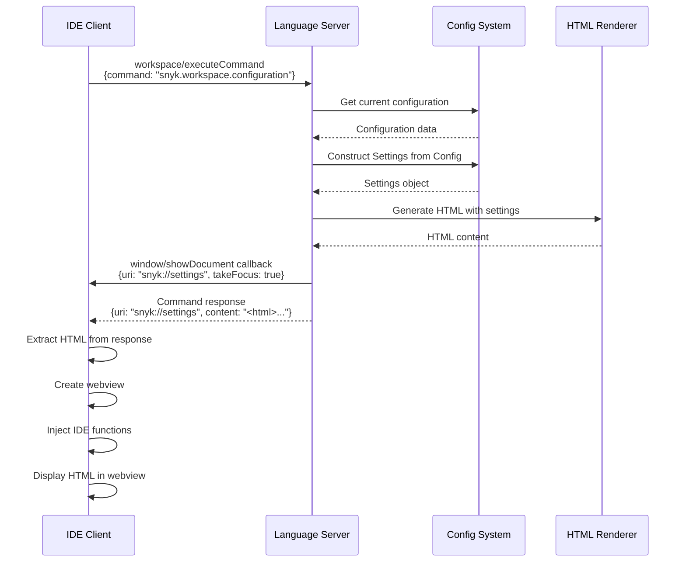
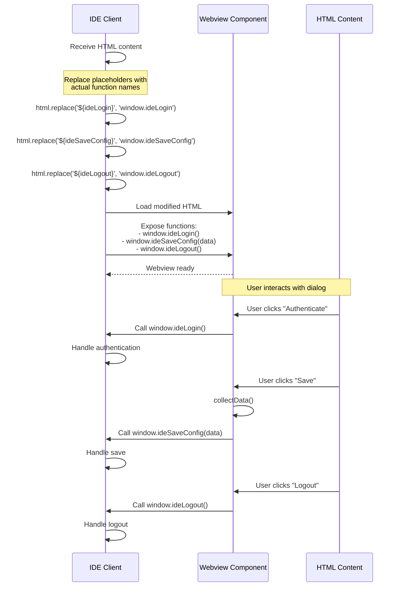
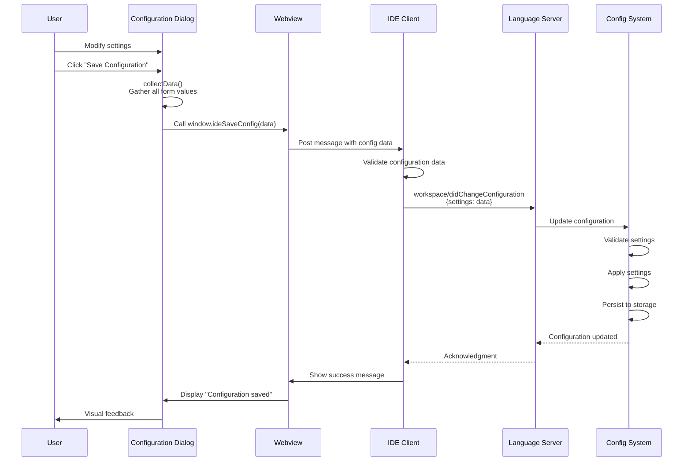
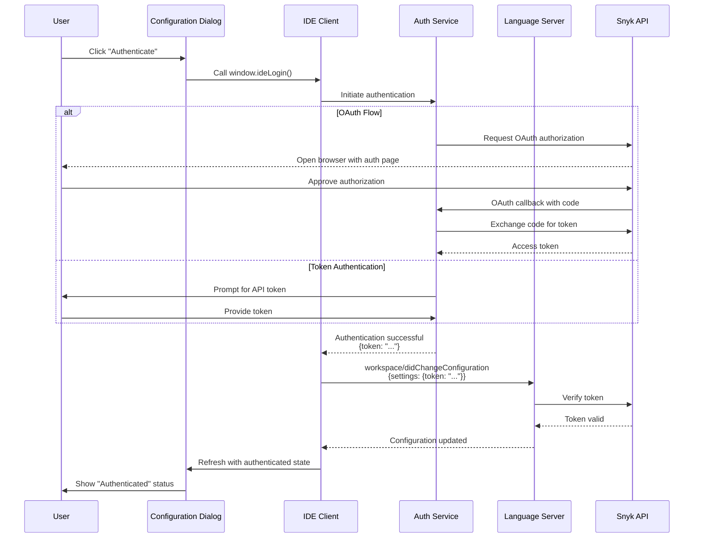
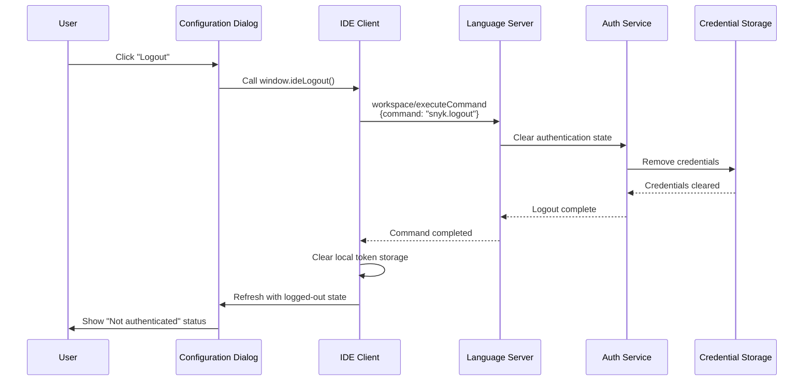

# Configuration Dialog Integration Guide

This guide explains how IDEs can integrate with the Snyk Language Server's configuration dialog to provide a user-friendly interface for managing Snyk settings.

## Overview

The configuration dialog is an HTML-based interface that allows users to view and modify all Snyk Language Server settings. The dialog is triggered via an LSP command and displayed in the IDE's webview or browser component.

## Architecture

The configuration dialog follows a client-server pattern:

- **Language Server**: Generates HTML content with current settings, handles configuration updates
- **IDE Client**: Displays the HTML, injects JavaScript functions for user interactions, applies configuration changes

## Integration Flow

### 1. Opening the Configuration Dialog

The IDE triggers the configuration dialog by executing the LSP command `snyk.workspace.configuration`.

**Command Details:**
- **Command**: `workspace/executeCommand`
- **Command ID**: `snyk.workspace.configuration`
- **Arguments**: `[]` (no arguments required)

**Response:**
```json
{
  "uri": "snyk://settings",
  "content": "<html>... full HTML content ...</html>"
}
```

**Callback Notification:**
The server also sends a `window/showDocument` callback:
```json
{
  "uri": "snyk://settings",
  "external": false,
  "takeFocus": true
}
```

See [Opening Configuration Dialog Sequence](#opening-configuration-dialog) for the detailed flow.

### 2. Displaying the HTML Content

The IDE should:

1. Extract the `content` field from the command response
2. Create a webview or browser component
3. Load the HTML content
4. Inject IDE-specific JavaScript functions (see [Function Injection](#function-injection))

**Example (conceptual):**
```typescript
// Execute command
const response = await client.sendRequest('workspace/executeCommand', {
  command: 'snyk.workspace.configuration',
  arguments: []
});

// Extract HTML
const html = response.content;
const uri = response.uri;

// Create webview
const webview = createWebview();
webview.html = injectFunctions(html);
webview.show();
```

### 3. Function Injection

The HTML contains placeholders for IDE-specific functions that must be injected:

| Placeholder | Purpose | Expected Behavior |
|------------|---------|-------------------|
| `${ideLogin}` | Handle authentication | Trigger OAuth or token-based login flow |
| `${ideSaveConfig}` | Save configuration | Receive config data, send to language server |
| `${ideLogout}` | Handle logout | Clear authentication, notify language server |

**Injection Example:**
```typescript
function injectFunctions(html: string): string {
  return html
    .replace('${ideLogin}', 'window.ideLogin')
    .replace('${ideSaveConfig}', 'window.ideSaveConfig')
    .replace('${ideLogout}', 'window.ideLogout');
}

// Expose functions to webview
webview.onDidReceiveMessage(message => {
  switch (message.command) {
    case 'login':
      handleLogin();
      break;
    case 'saveConfig':
      handleSaveConfig(message.data);
      break;
    case 'logout':
      handleLogout();
      break;
  }
});
```

See [Function Injection Flow](#function-injection-flow) for the detailed sequence.

### 4. Saving Configuration

When the user clicks "Save Configuration", the dialog collects all form data and calls `ideSaveConfig(data)`.

**Configuration Data Format:**
```typescript
interface ConfigurationData {
  // Core Authentication
  token?: string;
  endpoint?: string;
  organization?: string;
  automaticAuthentication?: string; // "true" | "false"
  
  // Product Activation
  activateSnykOpenSource?: string;
  activateSnykCode?: string;
  activateSnykIac?: string;
  activateSnykCodeSecurity?: string;
  activateSnykCodeQuality?: string;
  
  // CLI Settings
  cliPath?: string;
  path?: string;
  insecure?: string;
  manageBinariesAutomatically?: string;
  
  // Operational Settings
  sendErrorReports?: string;
  scanningMode?: string; // "auto" | "manual"
  
  // Feature Toggles
  enableSnykLearnCodeActions?: string;
  enableSnykOSSQuickFixCodeActions?: string;
  enableSnykOpenBrowserActions?: string;
  enableDeltaFindings?: string;
  enableTrustedFoldersFeature?: string;
  
  // Advanced Settings
  filterSeverity?: {
    critical?: boolean;
    high?: boolean;
    medium?: boolean;
    low?: boolean;
  };
  issueViewOptions?: {
    openIssues?: boolean;
    ignoredIssues?: boolean;
  };
  
  // Folder-specific settings (dynamic)
  folder_0_folderPath?: string;
  folder_0_baseBranch?: string;
  folder_0_localBranches?: string;
  folder_0_additionalParameters?: string;
  folder_0_referenceFolderPath?: string;
  folder_0_preferredOrg?: string;
  folder_0_riskScoreThreshold?: number;
  
  // Scan command configuration per product per folder
  folder_0_scanConfig_oss_preScanCommand?: string;
  folder_0_scanConfig_oss_preScanOnlyReferenceFolder?: boolean;
  folder_0_scanConfig_oss_postScanCommand?: string;
  folder_0_scanConfig_oss_postScanOnlyReferenceFolder?: boolean;
  
  folder_0_scanConfig_code_preScanCommand?: string;
  folder_0_scanConfig_code_preScanOnlyReferenceFolder?: boolean;
  folder_0_scanConfig_code_postScanCommand?: string;
  folder_0_scanConfig_code_postScanOnlyReferenceFolder?: boolean;
  
  folder_0_scanConfig_iac_preScanCommand?: string;
  folder_0_scanConfig_iac_preScanOnlyReferenceFolder?: boolean;
  folder_0_scanConfig_iac_postScanCommand?: string;
  folder_0_scanConfig_iac_postScanOnlyReferenceFolder?: boolean;
  
  // ... additional folders follow the same pattern with folder_1_, folder_2_, etc.
}
```

**Sending Configuration to Language Server:**

The IDE should send the configuration using the `workspace/didChangeConfiguration` notification:

```typescript
client.sendNotification('workspace/didChangeConfiguration', {
  settings: configData
});
```

See [Saving Configuration Flow](#saving-configuration-flow) for the detailed sequence.

### 5. Authentication Flow

When the user clicks "Authenticate", the dialog calls `ideLogin()`.

**IDE Responsibilities:**
1. Initiate OAuth or token-based authentication
2. On success, update the token in the webview (if needed)
3. Notify the language server of the new authentication state

**Example:**
```typescript
async function handleLogin() {
  try {
    const token = await authenticateWithSnyk();
    
    // Update language server
    await client.sendNotification('workspace/didChangeConfiguration', {
      settings: { token }
    });
    
    // Optionally, refresh the dialog to show authenticated state
    await refreshConfigurationDialog();
  } catch (error) {
    showError('Authentication failed: ' + error.message);
  }
}
```

See [Authentication Flow](#authentication-flow) for the detailed sequence.

### 6. Logout Flow

When the user clicks "Logout", the dialog calls `ideLogout()`.

**IDE Responsibilities:**
1. Clear stored authentication credentials
2. Execute the logout command on the language server
3. Update UI to reflect logged-out state

**Example:**
```typescript
async function handleLogout() {
  try {
    // Execute logout command
    await client.sendRequest('workspace/executeCommand', {
      command: 'snyk.logout',
      arguments: []
    });
    
    // Clear local credentials
    await clearStoredCredentials();
    
    // Optionally, refresh the dialog
    await refreshConfigurationDialog();
  } catch (error) {
    showError('Logout failed: ' + error.message);
  }
}
```

See [Logout Flow](#logout-flow) for the detailed sequence.

## Sequence Diagrams

### Opening Configuration Dialog




### Function Injection Flow




### Saving Configuration Flow




### Authentication Flow




### Logout Flow




## Implementation Checklist

### Basic Integration
- [ ] Execute `snyk.workspace.configuration` command
- [ ] Extract HTML content from response
- [ ] Create webview/browser component for display
- [ ] Inject `ideLogin`, `ideSaveConfig`, `ideLogout` functions
- [ ] Handle `window/showDocument` callback

### Configuration Management
- [ ] Parse configuration data from dialog
- [ ] Send `workspace/didChangeConfiguration` notification
- [ ] Validate configuration data before sending
- [ ] Handle configuration errors gracefully
- [ ] Provide user feedback on save success/failure

### Authentication
- [ ] Implement `ideLogin()` function
- [ ] Support OAuth flow (recommended)
- [ ] Support token-based authentication (fallback)
- [ ] Update language server on successful authentication
- [ ] Handle authentication errors

### Logout
- [ ] Implement `ideLogout()` function
- [ ] Execute `snyk.logout` command
- [ ] Clear stored credentials
- [ ] Update UI to reflect logged-out state

### User Experience
- [ ] Display loading indicators during operations
- [ ] Show success/error messages
- [ ] Provide validation feedback for form fields
- [ ] Support dialog refresh after configuration changes
- [ ] Handle dialog close/cancel actions

## Best Practices

1. **Error Handling**: Always wrap LSP calls in try-catch blocks and provide meaningful error messages to users.

2. **Validation**: Validate configuration data on the IDE side before sending to the language server.

3. **Security**: 
   - Never log or expose authentication tokens
   - Use secure credential storage
   - Clear sensitive data on logout

4. **User Feedback**: Provide immediate visual feedback for all user actions (save, authenticate, logout).

5. **Refresh Strategy**: After authentication or logout, consider refreshing the dialog to show the updated state.

6. **Webview Isolation**: Use proper webview security settings to isolate the dialog from other IDE components.

## Troubleshooting

### Dialog doesn't open
- Verify the command ID is correct: `snyk.workspace.configuration`
- Check that the language server is initialized
- Ensure `workspace/executeCommand` capability is supported

### Functions not working
- Verify function injection is replacing all placeholders
- Check that webview message passing is configured correctly
- Ensure functions are exposed to the webview's global scope

### Configuration not saving
- Verify the `workspace/didChangeConfiguration` notification format
- Check that the language server has `workspace.configuration` capability
- Validate configuration data structure

### Authentication fails
- Ensure network connectivity to Snyk API
- Verify OAuth redirect URLs are configured correctly
- Check that the token is valid and not expired

## Related Documentation

- [LSP Specification](https://microsoft.github.io/language-server-protocol/)
- [Snyk API Documentation](https://docs.snyk.io/snyk-api-info)
- [Configuration Settings Reference](./configuration-settings.md)

## Support

For issues or questions about the configuration dialog integration:
- Open an issue on [GitHub](https://github.com/snyk/snyk-ls/issues)
- Join the discussion in [Snyk Community](https://community.snyk.io/)

