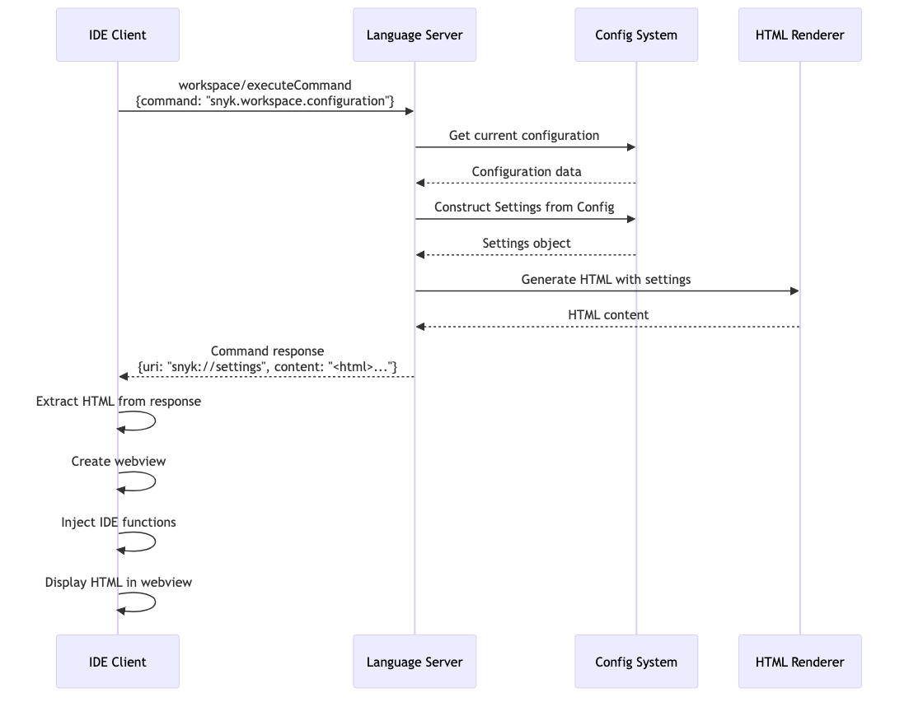
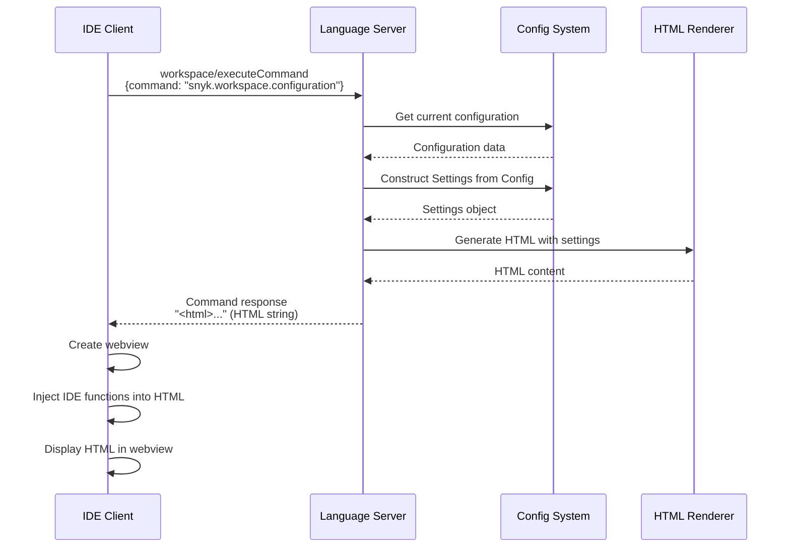
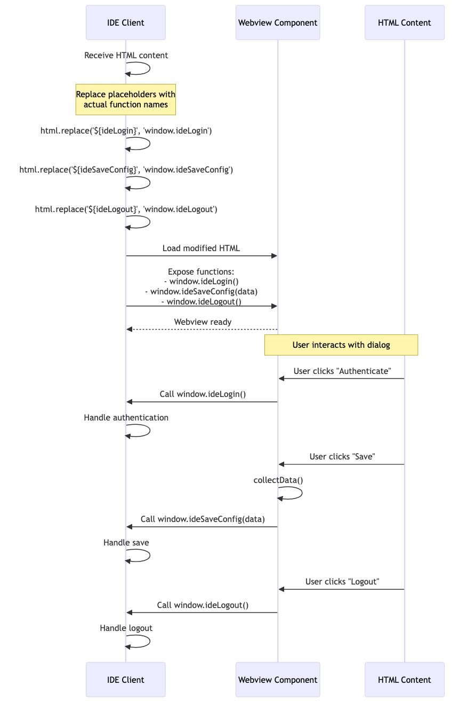
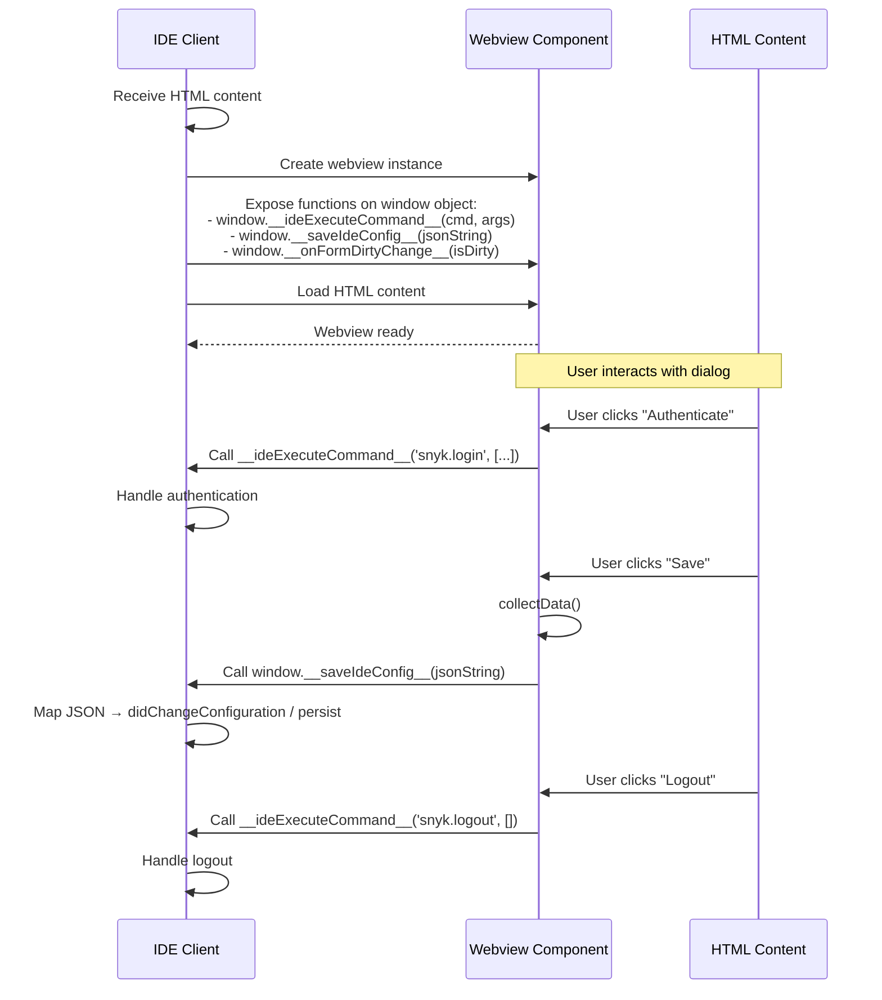
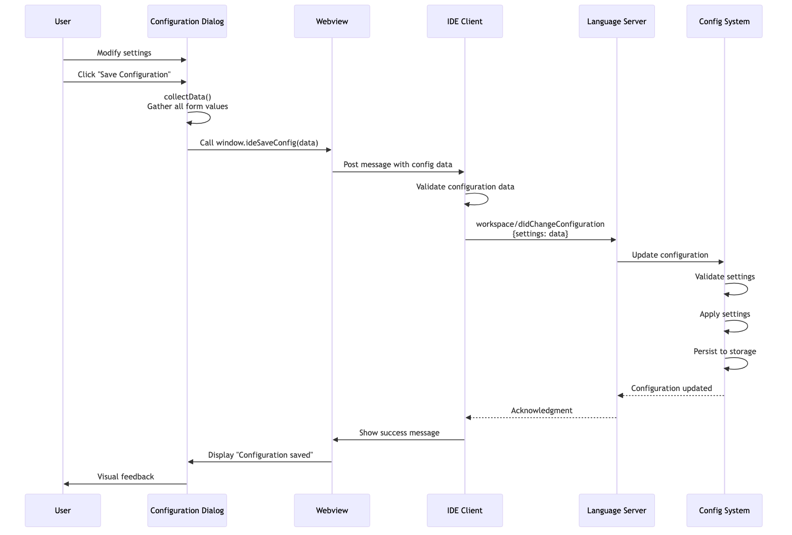
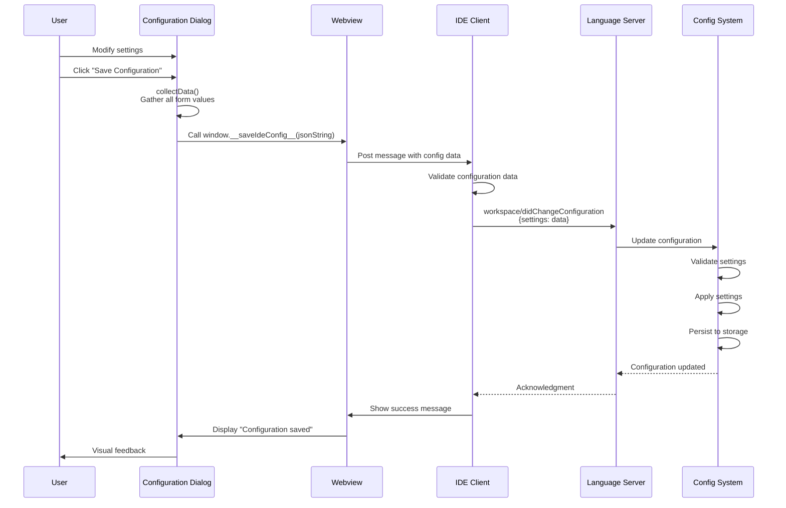
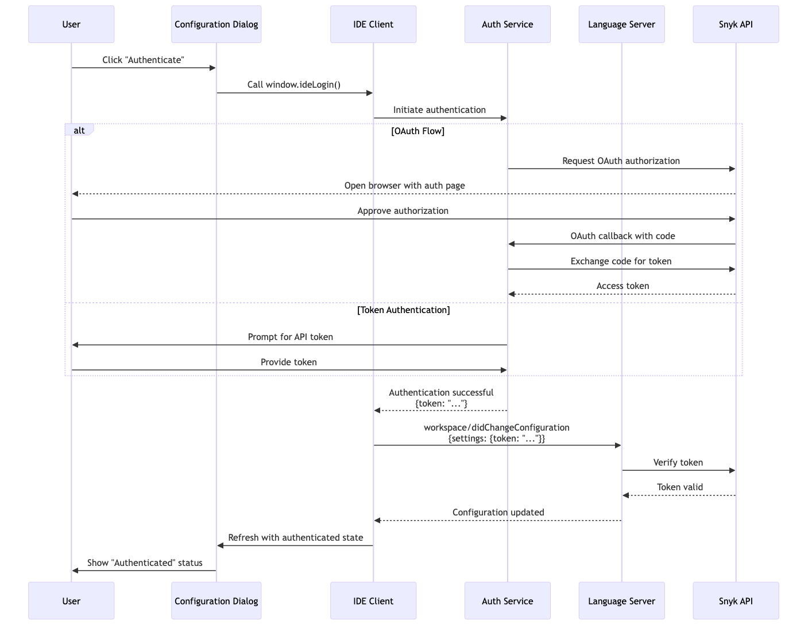
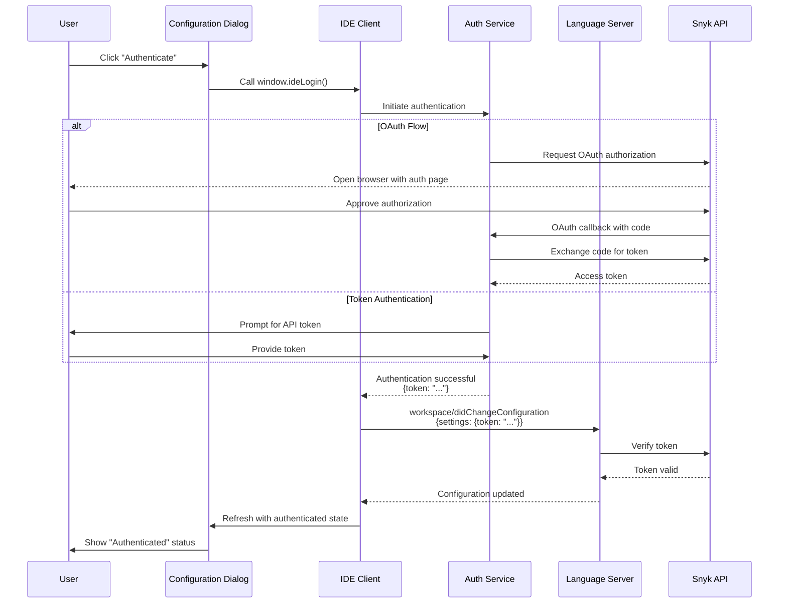
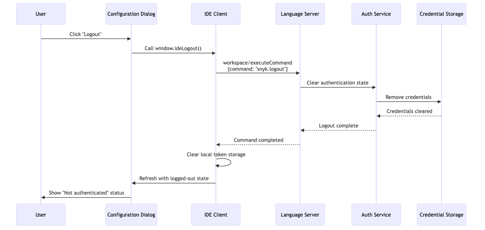
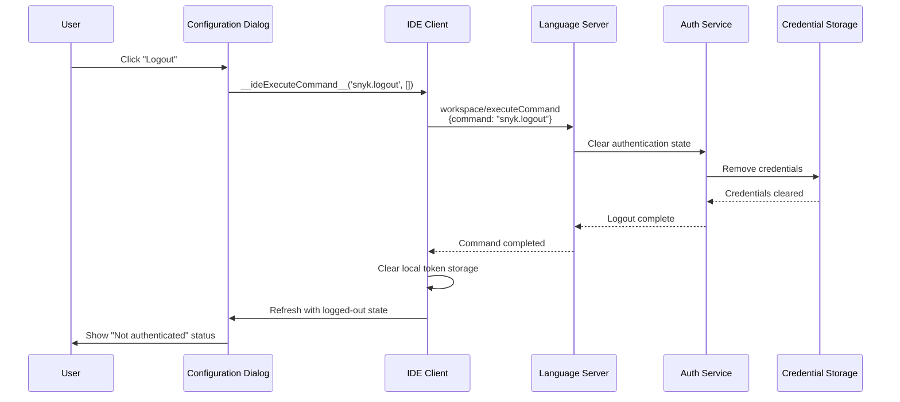

# Configuration Dialog Integration Guide

This guide explains how IDEs can integrate with the Snyk Language Server's configuration dialog to provide a user-friendly interface for managing Snyk settings.

## Overview

The configuration dialog is an HTML-based interface that allows users to view and modify all Snyk Language Server settings. The dialog is triggered via an LSP command and displayed in the IDE's webview or browser component.

## Architecture

The configuration dialog follows a client-server pattern:

- **Language Server**: Generates HTML content with current settings, handles configuration updates
- **IDE Client**: Displays the HTML, injects JavaScript functions for user interactions, applies configuration changes

### JavaScript Architecture

The dialog uses a modular JavaScript architecture under `infrastructure/configuration/template/js/` (loaded via `app.js`):

| Path | Role |
|------|------|
| `app.js` | Bootstraps `ConfigApp` and loads modules |
| `core/utils.js` | Utilities (debounce, cloning, IE-oriented helpers) |
| `core/dom.js` | DOM helpers (`ConfigApp.dom`: get, addEvent, triggerEvent, …) |
| `state/dirty-tracker.js` | `DirtyTracker` — dirty state vs last-saved snapshot |
| `state/form-state.js` | Listeners for dirty + auto-save orchestration |
| `ui/form-handler.js` | **`collectData()`** — builds the JSON object sent to the IDE (pflag-style keys, see below) |
| `ui/reset-handler.js` | Section reset actions |
| `ui/tooltips.js` | Tooltip behavior |
| `features/auto-save.js` | Validates, stringifies, calls `ideBridge.saveConfig` |
| `features/validation.js` | Endpoint, risk score, additional env validation |
| `features/authentication.js` | Auth UI wiring |
| `features/auth-field-monitor.js` | Token / auth-sensitive field baseline sync |
| `features/folders.js` | Folder-specific UI helpers |
| `ide/bridge.js` | **`ConfigApp.ideBridge`** — save, login/logout via `executeCommand`, dirty notify |

Global instances: `window.dirtyTracker`, `window.ConfigApp` (namespace). IDE bridge functions are on `window` (see below).

## Integration Flow

### 1. Opening the Configuration Dialog

The IDE triggers the configuration dialog by executing the LSP command `snyk.workspace.configuration`.

**Command Details:**
- **Command**: `workspace/executeCommand`
- **Command ID**: `snyk.workspace.configuration`
- **Arguments**: `[]` (no arguments required)

**Response:**
```
"<html>... full HTML content ...</html>"
```

The command returns the complete HTML content as a string. The IDE can directly display this in a webview without any additional processing.

See [Opening Configuration Dialog Sequence](#opening-configuration-dialog) for the detailed flow.

### 2. Displaying the HTML Content

The IDE should:

1. Execute the command and receive the response
2. Use the returned string as the webview HTML (the handler returns the HTML body directly)
3. Create a webview or browser component
4. Inject IDE-specific JavaScript functions (see [Function Injection](#function-injection))
5. Load the HTML content and display it

**Example (conceptual):**
```typescript
// Execute command and receive HTML
const html = await client.sendRequest('workspace/executeCommand', {
  command: 'snyk.workspace.configuration',
  arguments: []
});

// Create webview and display
const webview = createWebview();
webview.html = injectFunctions(html);
webview.show();
```

### 3. Function Injection

The HTML does **not** use `__ideLogin__` / `__ideLogout__` — authentication and logout go through **`window.__ideExecuteCommand__`** (same pattern as the tree view). The IDE must implement:

| Function | Purpose | Required |
|----------|---------|----------|
| `window.__ideExecuteCommand__(command, args, callback?)` | Forward to `workspace/executeCommand` | Yes |
| `window.__saveIdeConfig__(jsonString)` | Persist settings from the HTML form | Yes |
| `window.__IS_IDE_AUTOSAVE_ENABLED__` | If `true`, form changes trigger save via `auto-save.js` | No (default false) |
| `window.__onFormDirtyChange__(isDirty)` | Dirty-state callback for tab chrome | No |
| `window.__ideSaveAttemptFinished__(status)` | Save outcome: `success`, `validation_error`, `bridge_missing`, `error` | No |

**Calls from `ide/bridge.js`:**

- Login: `__ideExecuteCommand__('snyk.login', [authMethod, endpoint, insecure])`
- Logout: `__ideExecuteCommand__('snyk.logout', [])`
- Save: `__saveIdeConfig__(jsonString)` where `jsonString` is **`JSON.stringify`** of the object from `form-handler.collectData()` (not `workspace/didChangeConfiguration` — the IDE maps into LSP config).

**IDE-callable helpers (on `window`):**

| Function | Purpose |
|----------|---------|
| `window.getAndSaveIdeConfig()` | Run validation + save (same as auto-save path) |
| `window.__isFormDirty__()` | Whether `DirtyTracker` sees unsaved edits |
| `window.setAuthToken(token, apiUrl?)` | After OAuth/token login: set `token` / `api_endpoint` fields and sync dirty baseline |

**Injection example (conceptual):**
```typescript
webview.window.__ideExecuteCommand__ = (command, args, callback) => {
  client.sendRequest('workspace/executeCommand', { command, arguments: args }).then(callback);
};
webview.window.__saveIdeConfig__ = async (jsonString: string) => {
  await persistHtmlFormJsonToSnykSettings(jsonString); // IDE maps keys → LspConfigurationParam
};
webview.window.__IS_IDE_AUTOSAVE_ENABLED__ = true;
webview.window.__onFormDirtyChange__ = (isDirty: boolean) => { /* update tab title */ };
```

See [Function Injection Flow](#function-injection-flow) for the detailed sequence.

### 4. Saving Configuration

On save (or auto-save), `features/auto-save.js` calls `form-handler.collectData()`, then `JSON.stringify`s the result and passes that string to **`window.__saveIdeConfig__(jsonString)`**. The object uses **the same pflag-oriented names as the rest of the LS** (snake_case / wire names), not legacy camelCase init-option names.

**Global keys (examples)** — see `infrastructure/configuration/template/js/ui/form-handler.js` and `template/config.html`:

- `snyk_oss_enabled`, `snyk_code_enabled`, `snyk_iac_enabled`, `snyk_secrets_enabled` (booleans)
- `scan_automatic`, `organization`, `api_endpoint`, `token`, `proxy_insecure`, `authentication_method`
- `severity_filter_critical`, `severity_filter_high`, `severity_filter_medium`, `severity_filter_low` (booleans)
- `issue_view_open_issues`, `issue_view_ignored_issues` (booleans)
- `risk_score_threshold` (number), `scan_net_new` (boolean — delta / net-new findings)
- `cli_path`, `automatic_download`, `binary_base_url`, `cli_release_channel`
- `trusted_folders`: string array (from `trustedFolder_*` inputs)

**Per folder:** `folderConfigs` is an array of objects with keys such as `folderPath`, `preferred_org`, `additional_parameters` (array of CLI tokens), `additional_environment`, `org_set_by_user`, `scan_command_config`, plus folder-scope overrides (`scan_automatic`, `severity_filter_critical`, `severity_filter_high`, `severity_filter_medium`, `severity_filter_low`, `snyk_oss_enabled`, …) as produced by `processFolderOverrides()`.

**From IDE to LS (protocol v25):** the plugin must translate the saved JSON into `workspace/didChangeConfiguration` using the **nested envelope** documented in [configuration.md](configuration.md) and `types.DidChangeConfigurationParams` — the LSP `settings` field wraps an `LspConfigurationParam` (`settings` map of `ConfigSetting`, `folderConfigs`, `trustedFolders`). Keys in the maps are **pflag names** (e.g. `snyk_oss_enabled`, `api_endpoint`).

**Processing (server):** `UpdateSettings` in `application/server/configuration.go` applies machine and folder maps, respects `changed` on each `ConfigSetting`, then persists and notifies (e.g. `$/snyk.configuration`).

**Important notes:**
- HTML → IDE is a **JSON string**; parsing and mapping to LSP are IDE-side.
- Tokens and other write-only settings follow the same resolution rules as in [configuration.md](configuration.md).

See [Saving Configuration Flow](#saving-configuration-flow) for the sequence diagram.

### 5. Authentication Flow

When the user clicks **Authenticate**, `features/authentication.js` calls `ConfigApp.ideBridge.login(authMethod, endpoint, insecure)`, which invokes **`window.__ideExecuteCommand__('snyk.login', [authMethod, endpoint, insecure])`**.

**IDE responsibilities:**
1. Run the Snyk login flow (OAuth, API token, or PAT per IDE).
2. On success, call **`window.setAuthToken(token, apiUrl?)`** so the form fields `token` and optionally `api_endpoint` update (and dirty baseline syncs).
3. Persist auth via your normal path (LS token + `didChangeConfiguration` / internal APIs as your plugin already does).

Do **not** rely on sending a flat `{ token }` object through `didChangeConfiguration` unless you map it to `ConfigSetting` entries with pflag keys (`token`, `api_endpoint`, …).

See [Authentication Flow](#authentication-flow) for the detailed sequence.

### 6. Logout Flow

When the user clicks **Logout**, `ideBridge.logout()` runs **`window.__ideExecuteCommand__('snyk.logout', [])`**.

**IDE responsibilities:** clear credentials, complete server-side logout, refresh UI / webview as needed.

See [Logout Flow](#logout-flow) for the detailed sequence.

### 7. Dirty Tracking

The dialog includes a dirty tracking system that monitors form changes and notifies the IDE when there are unsaved changes.

**How it Works:**

1. **Initial State Capture**: When the dialog loads, the `DirtyTracker` captures a deep clone of the initial form state
2. **Change Detection**: Form inputs are monitored with event listeners - text inputs and textareas use `input` and `change` events, while select dropdowns and checkboxes use `change` events
3. **Deep Comparison**: Before comparison, values are normalized (empty strings → null, "true"/"false" → booleans, numeric strings → numbers). The tracker then performs deep equality checks between normalized current and original state
4. **State Transition Events**: When dirty state transitions (clean→dirty or dirty→clean), `window.__onFormDirtyChange__(isDirty)` is called
5. **Reset After Save**: After successful save, the tracker resets with the new saved state as the baseline

**IDE Integration:**

```typescript
// Listen for dirty state changes
webview.window.__onFormDirtyChange__ = (isDirty: boolean) => {
  if (isDirty) {
    // Show unsaved changes indicator
    setDocumentIcon("*");
    enableSaveButton();
  } else {
    // Clear indicator
    setDocumentIcon("");
    disableSaveButton();
  }
};

// Check dirty state before closing dialog
function beforeClose() {
  if (webview.window.__isFormDirty__()) {
    const shouldClose = confirm("You have unsaved changes. Close anyway?");
    if (!shouldClose) return false;
  }
  return true;
}

// After successful save, the HTML calls dirtyTracker.reset(data) internally; do not rely on a separate __resetDirtyState__
async function handleSave(jsonString: string) {
  try {
    await saveConfiguration(jsonString);
  } catch (error) {
    showError('Failed to save: ' + error.message);
  }
}
```

**Features:**

- Deep equality comparison handles nested objects and arrays
- Value normalization (empty strings = null, "true"/"false" to booleans)
- Debounced change detection for performance
- Automatic reset after successful save

## Sequence Diagrams

### Opening Configuration Dialog




```mermaid
sequenceDiagram
    participant IDE as IDE Client
    participant LSP as Language Server
    participant Config as Config System
    participant HTML as HTML Renderer
    
    IDE->>LSP: workspace/executeCommand<br/>{command: "snyk.workspace.configuration"}
    
    LSP->>Config: Get current configuration
    Config-->>LSP: Configuration data
    
    LSP->>Config: Construct Settings from Config
    Config-->>LSP: Settings object
    
    LSP->>HTML: Generate HTML with settings
    HTML-->>LSP: HTML content
    
    LSP-->>IDE: Command response<br/>"<html>..." (HTML string)
    
    IDE->>IDE: Create webview
    IDE->>IDE: Inject IDE functions into HTML
    IDE->>IDE: Display HTML in webview
```

### Function Injection Flow




```mermaid
sequenceDiagram
    participant IDE as IDE Client
    participant Webview as Webview Component
    participant HTML as HTML Content

    IDE->>IDE: Receive HTML content

    IDE->>Webview: Create webview instance

    IDE->>Webview: Expose functions on window object:<br/>- window.__ideExecuteCommand__(cmd, args)<br/>- window.__saveIdeConfig__(jsonString)<br/>- window.__onFormDirtyChange__(isDirty)

    IDE->>Webview: Load HTML content

    Webview-->>IDE: Webview ready

    Note over HTML,Webview: User interacts with dialog

    HTML->>Webview: User clicks "Authenticate"
    Webview->>IDE: Call __ideExecuteCommand__('snyk.login', [...])
    IDE->>IDE: Handle authentication

    HTML->>Webview: User clicks "Save"
    Webview->>Webview: collectData()
    Webview->>IDE: Call window.__saveIdeConfig__(jsonString)
    IDE->>IDE: Map JSON → didChangeConfiguration / persist

    HTML->>Webview: User clicks "Logout"
    Webview->>IDE: Call __ideExecuteCommand__('snyk.logout', [])
    IDE->>IDE: Handle logout
```

### Saving Configuration Flow




```mermaid
sequenceDiagram
    participant User as User
    participant Dialog as Configuration Dialog
    participant Webview as Webview
    participant IDE as IDE Client
    participant LSP as Language Server
    participant Config as Config System
    
    User->>Dialog: Modify settings
    User->>Dialog: Click "Save Configuration"
    
    Dialog->>Dialog: collectData()<br/>Gather all form values
    
    Dialog->>Webview: Call window.__saveIdeConfig__(jsonString)
    
    Webview->>IDE: Post message with config data
    
    IDE->>IDE: Validate configuration data
    
    IDE->>LSP: workspace/didChangeConfiguration<br/>{settings: data}
    
    LSP->>Config: Update configuration
    Config->>Config: Validate settings
    Config->>Config: Apply settings
    Config->>Config: Persist to storage
    Config-->>LSP: Configuration updated
    
    LSP-->>IDE: Acknowledgment
    
    IDE->>Webview: Show success message
    Webview->>Dialog: Display "Configuration saved"
    Dialog->>User: Visual feedback
```

### Authentication Flow




```mermaid
sequenceDiagram
    participant User as User
    participant Dialog as Configuration Dialog
    participant IDE as IDE Client
    participant Auth as Auth Service
    participant LSP as Language Server
    participant Snyk as Snyk API
    
    User->>Dialog: Click "Authenticate"
    Dialog->>IDE: Call window.ideLogin()
    
    IDE->>Auth: Initiate authentication
    
    alt OAuth Flow
        Auth->>Snyk: Request OAuth authorization
        Snyk-->>User: Open browser with auth page
        User->>Snyk: Approve authorization
        Snyk->>Auth: OAuth callback with code
        Auth->>Snyk: Exchange code for token
        Snyk-->>Auth: Access token
    else Token Authentication
        Auth->>User: Prompt for API token
        User->>Auth: Provide token
    end
    
    Auth-->>IDE: Authentication successful<br/>{token: "..."}
    
    IDE->>LSP: workspace/didChangeConfiguration<br/>{settings: {token: "..."}}
    
    LSP->>Snyk: Verify token
    Snyk-->>LSP: Token valid
    
    LSP-->>IDE: Configuration updated
    
    IDE->>Dialog: Refresh with authenticated state
    Dialog->>User: Show "Authenticated" status
```

### Logout Flow




```mermaid
sequenceDiagram
    participant User as User
    participant Dialog as Configuration Dialog
    participant IDE as IDE Client
    participant LSP as Language Server
    participant Auth as Auth Service
    participant Storage as Credential Storage
    
    User->>Dialog: Click "Logout"
    Dialog->>IDE: __ideExecuteCommand__('snyk.logout', [])
    
    IDE->>LSP: workspace/executeCommand<br/>{command: "snyk.logout"}
    
    LSP->>Auth: Clear authentication state
    Auth->>Storage: Remove credentials
    Storage-->>Auth: Credentials cleared
    Auth-->>LSP: Logout complete
    
    LSP-->>IDE: Command completed
    
    IDE->>IDE: Clear local token storage
    
    IDE->>Dialog: Refresh with logged-out state
    Dialog->>User: Show "Not authenticated" status
```

## Implementation Checklist

### Basic Integration
- [ ] Execute `snyk.workspace.configuration` command
- [ ] Use returned string as webview HTML
- [ ] Create webview/browser component for display
- [ ] Expose `window.__ideExecuteCommand__`, `window.__saveIdeConfig__`, and optional `__onFormDirtyChange__` / `__ideSaveAttemptFinished__`
- [ ] Display HTML content in webview

### Configuration Management
- [ ] Implement `window.__saveIdeConfig__(jsonString)` to receive **`JSON.stringify` output** from the form
- [ ] Parse JSON and map keys to **`ConfigSetting` maps** (pflag names); send `workspace/didChangeConfiguration` with the `LspConfigurationParam` envelope (see `types.DidChangeConfigurationParams`)
- [ ] Validate configuration data before sending
- [ ] Handle configuration errors gracefully
- [ ] Provide user feedback on save success/failure (`__ideSaveAttemptFinished__` / UI)
- [ ] Rely on HTML `dirtyTracker.reset` after successful save (no separate `__resetDirtyState__`)

### Authentication
- [ ] Implement `window.__ideExecuteCommand__` so `snyk.login` can run with optional `[authMethod, endpoint, insecure]`
- [ ] Support OAuth flow (recommended)
- [ ] Support PAT (Personal Access Token) authentication
- [ ] Support API token authentication (legacy)
- [ ] Update language server on successful authentication
- [ ] Handle authentication errors
- [ ] Optionally refresh dialog after authentication

### Logout
- [ ] Route logout through `__ideExecuteCommand__('snyk.logout', [])` (not a separate `__ideLogout__` on the window)
- [ ] Execute `snyk.logout` command
- [ ] Clear stored credentials
- [ ] Update UI to reflect logged-out state
- [ ] Optionally refresh dialog after logout

### Dirty Tracking (Optional but Recommended)
- [ ] Implement `window.__onFormDirtyChange__(isDirty)` callback
- [ ] Show unsaved changes indicator in IDE UI (e.g., "*" in tab title)
- [ ] Warn user before closing dialog with unsaved changes using `window.__isFormDirty__()`
- [ ] Disable save button when form is clean
- [ ] Enable save button when form is dirty

### Auto-Save (Optional)
- [ ] Set `window.__IS_IDE_AUTOSAVE_ENABLED__ = true` before loading HTML
- [ ] Handle automatic saves triggered by form changes
- [ ] Provide feedback for auto-save operations

### User Experience
- [ ] Display loading indicators during operations
- [ ] Show success/error messages
- [ ] Provide validation feedback for form fields
- [ ] Support dialog refresh after configuration changes
- [ ] Handle dialog close/cancel actions
- [ ] Implement beforeunload confirmation for unsaved changes

## Best Practices

1. **Error Handling**: Always wrap LSP calls in try-catch blocks and provide meaningful error messages to users.

2. **Validation**: Validate configuration data on the IDE side before sending to the language server.

3. **Security**: 
   - Never log or expose authentication tokens
   - Use secure credential storage
   - Clear sensitive data on logout

4. **User Feedback**: Provide immediate visual feedback for all user actions (save, authenticate, logout).

5. **Refresh Strategy**: After authentication or logout, consider refreshing the dialog to show the updated state.

6. **Webview Isolation**: Use proper webview security settings to isolate the dialog from other IDE components.

## Troubleshooting

### Dialog doesn't open
- Verify the command ID is correct: `snyk.workspace.configuration`
- Check that the language server is initialized
- Ensure `workspace/executeCommand` capability is supported

### Functions not working
- Verify function injection is replacing all placeholders
- Check that webview message passing is configured correctly
- Ensure functions are exposed to the webview's global scope

### Configuration not saving
- Verify the `workspace/didChangeConfiguration` notification format
- Check that the language server has `workspace.configuration` capability
- Validate configuration data structure

### Authentication fails
- Ensure network connectivity to Snyk API
- Verify OAuth redirect URLs are configured correctly
- Check that the token is valid and not expired

## Related Documentation

- [LSP Specification](https://microsoft.github.io/language-server-protocol/)
- [Snyk API Documentation](https://docs.snyk.io/snyk-api-info)
- [Configuration Settings Reference](./configuration-settings.md)

## Support

For issues or questions about the configuration dialog integration:
- Open an issue on [GitHub](https://github.com/snyk/snyk-ls/issues)
- Join the discussion in [Snyk Community](https://community.snyk.io/)

