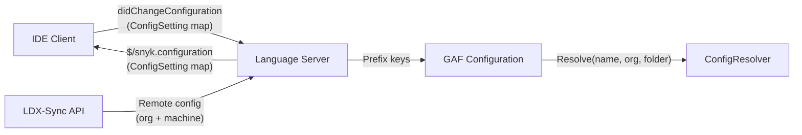
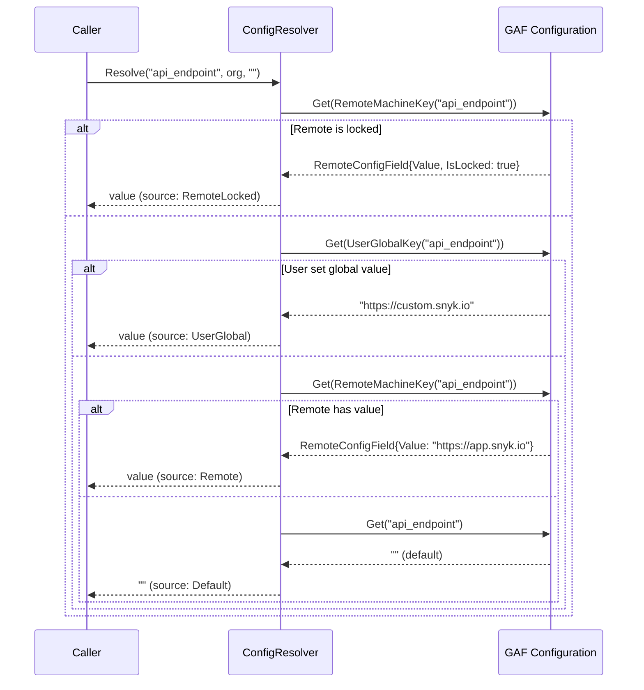
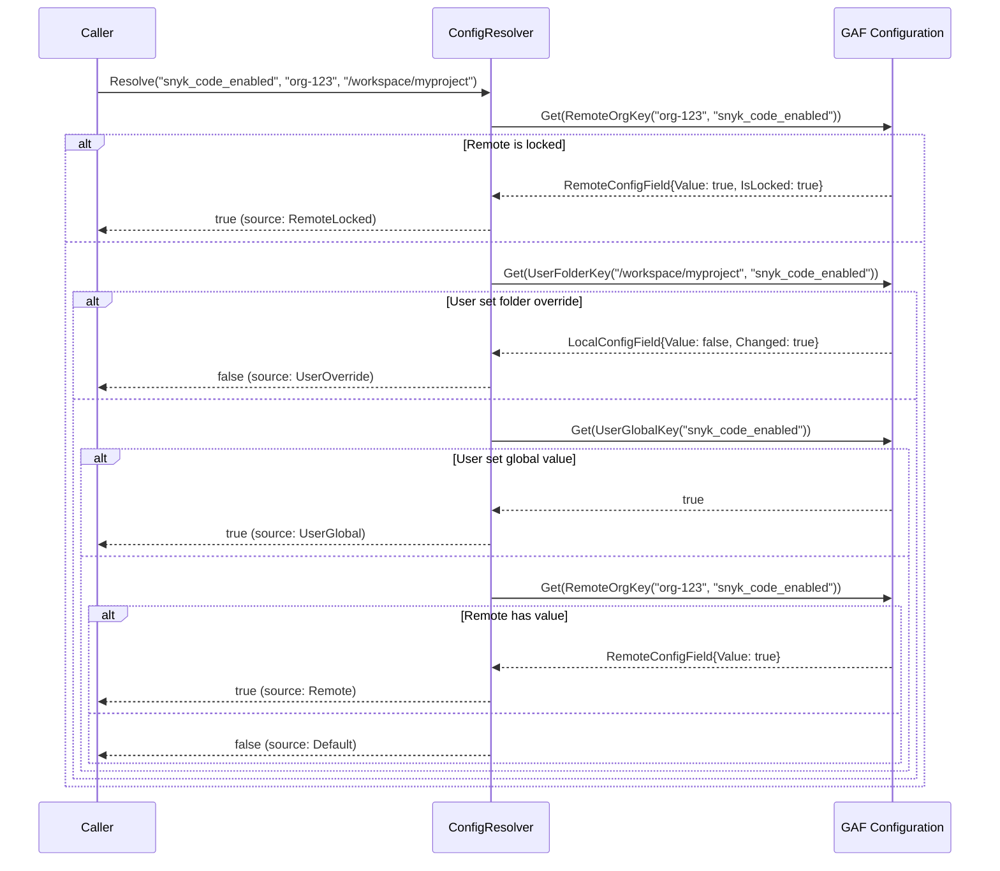
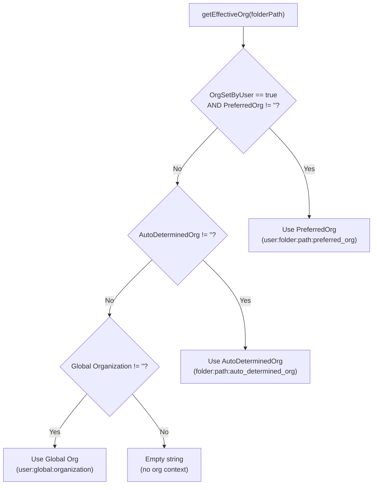
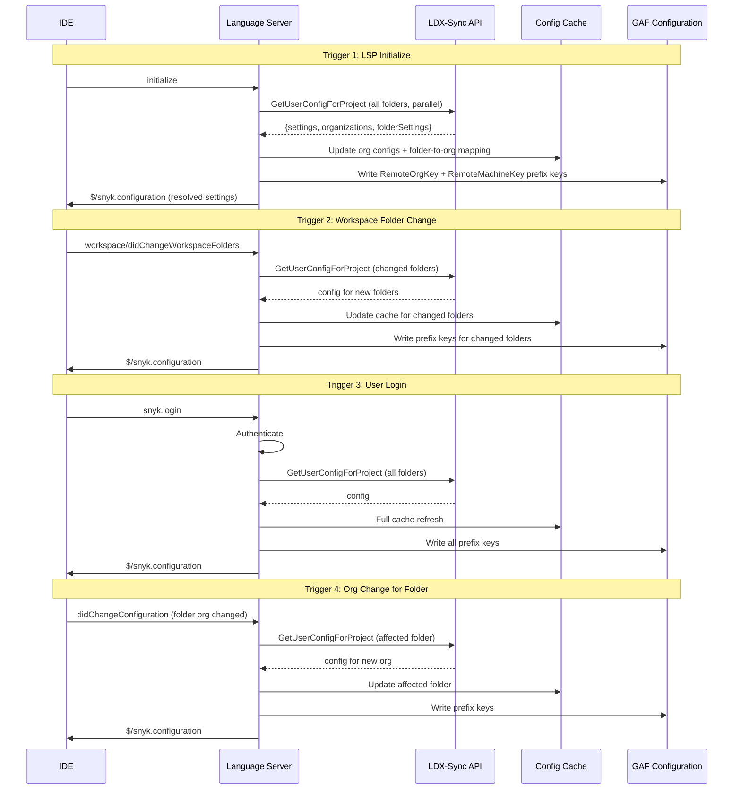
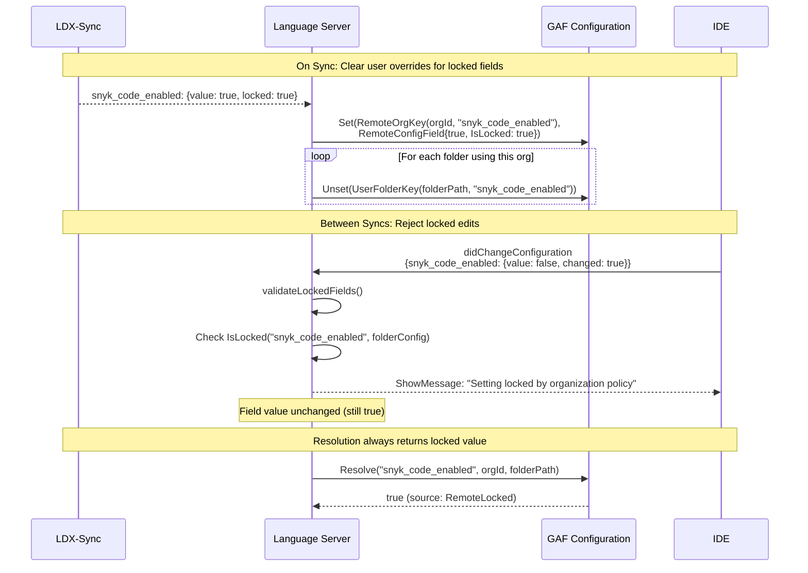
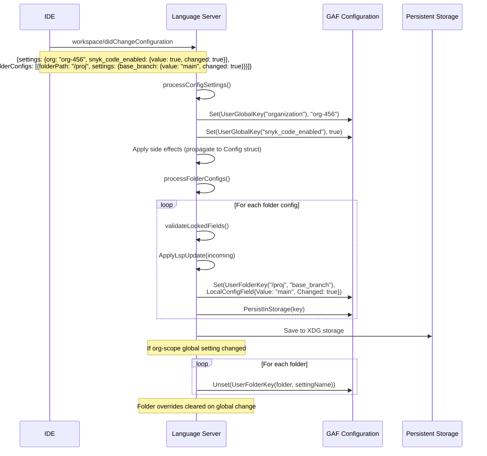
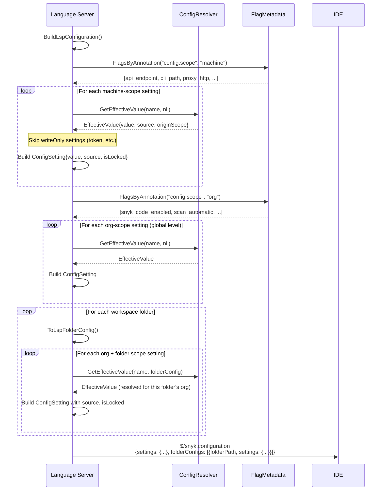
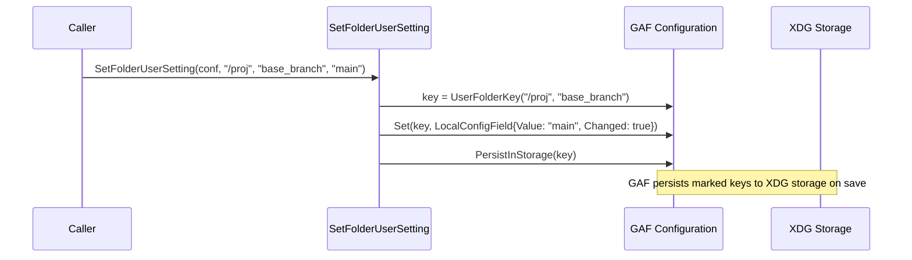

# Configuration System

This document describes the complete configuration architecture of the Snyk Language Server (LS), including how settings are registered, stored, resolved, and communicated between the LS and IDE clients.

## Table of Contents

- [Overview](#overview)
- [Configuration Scopes](#configuration-scopes)
- [Prefix Key Storage](#prefix-key-storage)
- [Flag Registration](#flag-registration)
- [Precedence Resolution](#precedence-resolution)
- [Effective Organization](#effective-organization)
- [Remote Configuration (LDX-Sync)](#remote-configuration-ldx-sync)
- [Locked Fields](#locked-fields)
- [IDE ↔ LS Protocol](#ide--ls-protocol)
- [FolderConfig](#folderconfig)
- [Persistence](#persistence)
- [Key Files Reference](#key-files-reference)

---

## Overview

The LS configuration system is built on top of GAF (Go Application Framework) and uses a **flagset-native** approach:

1. **Registration**: All settings are registered as `pflag.FlagSet` flags with annotations for scope, remote key mapping, display name, and IDE key mapping.
2. **Storage**: All values live in a single GAF `Configuration` instance, separated by **prefix keys** (e.g., `user:global:`, `user:folder:<path>:`, `remote:<orgId>:`).
3. **Resolution**: A stateless `ConfigResolver` resolves the effective value for any setting given the setting name, effective org, and folder path, applying scope-specific precedence rules.
4. **Communication**: The LS and IDE exchange settings via `map[string]*ConfigSetting` (keyed by pflag names), supporting both global and per-folder settings.



---

## Configuration Scopes

Every setting has a **scope** that determines where it applies and how precedence works:

| Scope | Meaning | Examples | Resolution Context |
|-------|---------|----------|--------------------|
| **Machine** | Applies to the entire LS instance | `api_endpoint`, `cli_path`, `proxy_http`, `automatic_download` | No folder context needed |
| **Org** | Per Snyk organization; different folders can use different orgs | `snyk_code_enabled`, `snyk_oss_enabled`, `scan_automatic`, `enabled_severities` | Requires effective org for the folder |
| **Folder** | Applies only to a specific workspace folder | `base_branch`, `additional_parameters`, `preferred_org`, `scan_command_config` | Requires folder path |

Scope is declared at registration time via the `config.scope` annotation on each pflag flag.

---

## Prefix Key Storage

All configuration values live in a single GAF `Configuration` instance. Sources are separated by key prefixes. Viper's delimiter is `.`; colons are safe as flat keys.

| Prefix | Format | Purpose |
|--------|--------|---------|
| `user:global:` | `user:global:<name>` | IDE-set global values (from `didChangeConfiguration`) |
| `user:folder:` | `user:folder:<folderPath>:<name>` | User settings for a specific folder (org-scope overrides and folder-scope settings) |
| `remote:<orgId>:` | `remote:<orgId>:<name>` | Remote org-level config from LDX-Sync |
| `remote:machine:` | `remote:machine:<name>` | Remote machine-level config from LDX-Sync |
| `folder:` | `folder:<folderPath>:<metadata>` | Folder metadata only (auto_determined_org, local_branches, sast_settings) |
| *(unprefixed)* | `<name>` | Default values (via `AddDefaultValue`) |

### Helper Functions

```go
configuration.UserGlobalKey("snyk_code_enabled")
// → "user:global:snyk_code_enabled"

configuration.UserFolderKey("/path/to/folder", "snyk_code_enabled")
// → "user:folder:/path/to/folder:snyk_code_enabled"

configuration.RemoteOrgKey("org-123", "snyk_code_enabled")
// → "remote:org-123:snyk_code_enabled"

configuration.RemoteMachineKey("api_endpoint")
// → "remote:machine:api_endpoint"

configuration.FolderMetadataKey("/path/to/folder", "auto_determined_org")
// → "folder:/path/to/folder:auto_determined_org"
```

### IsSet Semantics

- `conf.IsSet(UserGlobalKey(name))` → `true` only if the user explicitly set a global value
- `conf.IsSet(UserFolderKey(folderPath, name))` → `true` only if the user set a folder override
- Defaults are stored via `AddDefaultValue`; `IsSet(name)` is `false` for default-only keys

This distinguishes "user chose X" from "fallback to default."

---

## Flag Registration

All settings are registered via `RegisterAllConfigurations(fs *pflag.FlagSet)` in `internal/types/register_configurations.go`. Each flag carries annotations:

| Annotation | Purpose | Example |
|------------|---------|---------|
| `config.scope` | Setting scope: `machine`, `org`, or `folder` | `{"machine"}` |
| `config.remoteKey` | LDX-Sync API field name | `{"snyk_code_enabled"}` |
| `config.displayName` | Human-readable label for IDE UI | `{"Snyk Code"}` |
| `config.description` | Description of what the setting does | `{"Enable Snyk Code analysis"}` |
| `config.ideKey` | Legacy IDE setting key (for migration) | `{"activateSnykCode"}` |
| `config.writeOnly` | Accepted IDE→LS but NOT sent LS→IDE | `{"true"}` |

```go
registerFlag(fs, SettingSnykCodeEnabled, false, "Enable Snyk Code", map[string][]string{
    configuration.AnnotationScope:       {"org"},
    configuration.AnnotationDisplayName: {"Snyk Code Enabled"},
    configuration.AnnotationDescription: {"Enable Snyk Code security analysis"},
    configuration.AnnotationIdeKey:      {"activateSnykCode"},
})
```

When `conf.AddFlagSet(fs)` is called, GAF indexes annotations into lookup maps, enabling:
- `FlagsByAnnotation("config.scope", "org")` → all org-scoped flag names
- `FlagNameByAnnotation("config.remoteKey", "snyk_code_enabled")` → canonical flag name
- `GetFlagAnnotation("snyk_code_enabled", "config.scope")` → `"org"`

### Registered Settings

**Machine scope (16):** `api_endpoint`, `code_endpoint`, `authentication_method`, `proxy_http`, `proxy_https`, `proxy_no_proxy`, `proxy_insecure`, `auto_configure_mcp_server`, `publish_security_at_inception_rules`, `trust_enabled`, `binary_base_url`, `cli_path`, `automatic_download`, `cli_release_channel`, `organization`, `automatic_authentication`

**Org scope (13):** `enabled_severities`, `risk_score_threshold`, `cwe_ids`, `cve_ids`, `rule_ids`, `snyk_code_enabled`, `snyk_oss_enabled`, `snyk_iac_enabled`, `snyk_secrets_enabled`, `scan_automatic`, `scan_net_new`, `issue_view_open_issues`, `issue_view_ignored_issues`

**Folder scope (10):** `reference_folder`, `reference_branch`, `additional_parameters`, `additional_environment`, `base_branch`, `local_branches`, `preferred_org`, `auto_determined_org`, `org_set_by_user`, `scan_command_config`

**Write-only (5):** `token`, `send_error_reports`, `enable_snyk_learn_code_actions`, `enable_snyk_oss_quick_fix_code_actions`, `enable_snyk_open_browser_actions`

---

## Precedence Resolution

The `ConfigResolver` is the single entry point for reading effective configuration values. It is **stateless** — the effective org and folder path are parameters, not internal state.

```go
resolver.GetValue(settingName, folderConfig) → (value, ConfigSource)
resolver.GetBool(settingName, folderConfig) → bool
resolver.IsLocked(settingName, folderConfig) → bool
```

### Machine Scope Precedence

```
Locked Remote > User Global > Remote > Default
```



### Org Scope Precedence

```
Locked Remote > User Folder Override > User Global > Remote > Default
```



### Folder Scope Precedence

```
Folder Value > Default
```

Folder-scope settings have no remote config. The value is read from `user:folder:<path>:<name>` (or `folder:<path>:<name>` for metadata), falling back to the default.

---

## Effective Organization

A workspace can have multiple folders, each associated with a different Snyk organization. The **effective org** for a folder determines which org's remote config (from LDX-Sync) applies.



**Resolution order:**
1. **PreferredOrg** — User explicitly chose an org for this folder (`OrgSetByUser=true` and `PreferredOrg` non-empty)
2. **AutoDeterminedOrg** — LDX-Sync auto-determined an org based on the folder's Git remote URL
3. **Global Organization** — Fallback to the global organization. Reads `UserGlobalKey("organization")` first; if empty, falls back to `configuration.ORGANIZATION` (set by `SetOrganization()` / GAF CLI). This dual-read ensures the global org is found regardless of which code path set it.

---

## Remote Configuration (LDX-Sync)

LDX-Sync is a service that returns organization-level and machine-level configuration policies. Enterprise admins use it to enforce or suggest settings.

### Sync Triggers



### Response Processing

Each LDX-Sync response contains:
- **Settings** — org-scope and machine-scope settings with `value`, `locked`, and `origin` (scope hierarchy)
- **Organizations** — list of orgs with `preferredByAlgorithm` and `isDefault` flags
- **FolderSettings** — per-remote-URL settings (currently same as org settings)

The adapter dual-writes each response:
1. **Cache** (`LDXSyncConfigCache`) — stores `LDXSyncOrgConfig` per org ID and folder-to-org mapping
2. **Prefix keys** (`RemoteOrgKey` / `RemoteMachineKey`) — stores `RemoteConfigField` values in GAF Configuration

---

## Locked Fields

When LDX-Sync returns a setting as `locked`, the admin prevents any user override.

### Enforcement Mechanism



**Two enforcement points:**
1. **On sync**: User overrides for locked fields are cleared from all folders using that org
2. **Between syncs**: `validateLockedFields()` rejects incoming IDE changes for locked fields

---

## IDE ↔ LS Protocol

### Wire Types

```go
// LS → IDE and IDE → LS (bidirectional)
type ConfigSetting struct {
    Value       any    `json:"value"`
    Changed     bool   `json:"changed,omitempty"`
    Source      string `json:"source,omitempty"`       // "default", "global", "ldx-sync", "ldx-sync-locked", "user-override"
    OriginScope string `json:"originScope,omitempty"`  // "tenant", "group", "organization"
    IsLocked    bool   `json:"isLocked,omitempty"`
}

// Top-level config notification
type LspConfigurationParam struct {
    Settings      map[string]*ConfigSetting `json:"settings,omitempty"`
    FolderConfigs []LspFolderConfig         `json:"folderConfigs,omitempty"`
}

// Per-folder config
type LspFolderConfig struct {
    FolderPath FilePath                  `json:"folderPath"`
    Settings   map[string]*ConfigSetting `json:"settings,omitempty"`
}
```

### IDE → LS Flow (didChangeConfiguration)



### LS → IDE Flow ($/snyk.configuration)



---

## FolderConfig

`FolderConfig` is a thin wrapper around a folder path, an `Engine`, and a `ConfigResolver`. It holds no setting state — all values are in GAF Configuration prefix keys. The `Engine` provides access to GAF `Configuration`, `Logger`, `NetworkAccess`, and `InvokeWithConfig`.

```go
type FolderConfig struct {
    FolderPath      FilePath
    Engine          workflow.Engine             // GAF engine for configuration, logging, network, workflows
    ConfigResolver  ConfigResolverInterface
    EffectiveConfig map[string]EffectiveValue   // for HTML template display only
}
```

### Accessing Configuration via FolderConfig

```go
// Direct GAF configuration access (preferred for all settings)
conf := folderConfig.Conf()  // returns configuration.Configuration
enabled := conf.GetBool(configuration.UserGlobalKey(types.SettingSnykCodeEnabled))

// Via ConfigResolver (for precedence-aware resolution with folder context)
resolver := folderConfig.ConfigResolver
value, source := resolver.GetValue(types.SettingSnykCodeEnabled, folderConfig)

// Engine services
logger := folderConfig.Engine.GetLogger()
httpClient := folderConfig.Engine.GetNetworkAccess().GetHttpClient()
```

### Key Operations

- **`Clone()`** — Returns a new `FolderConfig` with the same path and resolver reference
- **`ToLspFolderConfig()`** — Iterates org + folder scope pflags via `FlagsByAnnotation`, resolves each, builds `LspFolderConfig`
- **`ApplyLspUpdate(update)`** — Writes incoming settings to prefix keys using PATCH semantics
- **`Conf()`** — Returns the GAF Configuration via `ConfigResolver.Configuration()`
- **`GetFeatureFlag(flag)`** — Reads feature flag from `FolderMetadataKey(path, "ff_" + flag)`

### Typed Accessors

Typed accessor methods read from `FolderConfigSnapshot` for template/display purposes:

```go
fc.BaseBranch()           // reads from UserFolderKey(path, "base_branch")
fc.PreferredOrg()         // reads from UserFolderKey(path, "preferred_org")
fc.AutoDeterminedOrg()    // reads from FolderMetadataKey(path, "auto_determined_org")
fc.UserOverrides()        // reads all org-scope UserFolderKey overrides
```

### Folder Config Snapshot

`ReadFolderConfigSnapshot(conf, folderPath)` reads all folder values from configuration into a `FolderConfigSnapshot` struct for comparison and analytics (e.g., detecting org changes, cache clearing).

---

## Persistence

Folder configuration is persisted to XDG-compliant storage using GAF's `PersistInStorage` mechanism.

### Write Path



### Read Path (Startup)

On startup, the stored config loader reads persisted folder configurations and injects them back into Configuration:

1. Read folder JSON from XDG storage
2. For each folder path, restore `user:folder:<path>:*` keys (user settings)
3. For each folder path, restore `folder:<path>:*` keys (metadata like `auto_determined_org`, `local_branches`)
4. Enrich `local_branches` from Git if available

### Persistence Helpers

```go
// User settings (stored under UserFolderKey)
SetFolderUserSetting(conf, folderPath, name, value)
// → conf.Set(UserFolderKey(path, name), &LocalConfigField{value, Changed: true})
// → conf.PersistInStorage(key)

// Metadata (stored under FolderMetadataKey)
SetFolderMetadataSetting(conf, folderPath, name, value)
// → conf.Set(FolderMetadataKey(path, name), value)
// → conf.PersistInStorage(key)
```

---

## Config Struct (Infrastructure Layer)

The `Config` struct in `application/config/config.go` serves as the infrastructure layer. All settings have been fully migrated to GAF — the struct holds only infrastructure fields:

```go
type Config struct {
    scrubbingWriter          zerolog.LevelWriter      // logging
    logFile                  *os.File                 // logging
    tokenChangeChannels      []chan string             // token change notifications
    prepareDefaultEnvChannel chan bool                 // default env readiness signal
    engine                   workflow.Engine           // GAF engine
    logger                   *zerolog.Logger           // logger
    storage                  storage.StorageWithCallbacks
    m                        sync.RWMutex             // internal synchronization
    ws                       types.Workspace           // workspace reference
    ldxSyncConfigCache       types.LDXSyncConfigCache  // LDX-Sync org config cache
    configResolver           types.ConfigResolverInterface
}
```

### Setting Access Pattern (Current)

All settings are read/written via GAF Configuration with `UserGlobalKey` prefix:

```go
// Reading a setting
conf := c.Engine().GetConfiguration()
enabled := conf.GetBool(configuration.UserGlobalKey(types.SettingSnykCodeEnabled))

// Writing a setting
conf.Set(configuration.UserGlobalKey(types.SettingSnykCodeEnabled), true)
```

The Config struct still provides convenience methods (160 total) that wrap these GAF calls. These are being progressively moved to standalone functions as part of the ongoing refactoring (Phase 3.4+).

### Business Logic Methods

Complex business logic methods on Config that interact with multiple services:

| Method | Responsibility |
|--------|---------------|
| `UpdateApiEndpoints()` | Derives API/UI/code URLs from base API URL |
| `SetToken()` | Token storage, OAuth handling, channel notifications |
| `ConfigureLogging()` | File logging setup, scrubbing writer, log levels |
| `FolderConfig()` / `ImmutableFolderConfig()` | Folder config retrieval with storage and resolver wiring |
| `FolderOrganization()` / `ResolveOrgToUUID()` | Org resolution (slug→UUID via GAF) |
| `SetOrganization()` | Redundancy-aware org setting with slug resolution |

---

## Key Files Reference

| File | Purpose |
|------|---------|
| `internal/types/register_configurations.go` | `RegisterAllConfigurations()` — pflag registration with annotations |
| `internal/types/config_resolver.go` | `ConfigResolver` — stateless precedence resolution |
| `internal/types/folder_config.go` | `FolderConfig` — thin wrapper, `ApplyLspUpdate`, `ToLspFolderConfig` |
| `internal/types/folder_config_helpers.go` | `FolderConfigSnapshot`, `SetFolderUserSetting`, `GetSastSettings`, etc. |
| `internal/types/ldx_sync_config.go` | `LDXSyncConfigCache`, `LDXSyncOrgConfig`, setting constants, scope registry |
| `internal/types/ldx_sync_adapter.go` | LDX-Sync response conversion, `WriteOrgConfigToConfiguration` |
| `internal/types/lsp.go` | `ConfigSetting`, `LspConfigurationParam`, `LspFolderConfig` wire types |
| `application/server/configuration.go` | `UpdateSettings`, `processConfigSettings`, `processFolderConfigs` |
| `domain/ide/command/ldx_sync_service.go` | `RefreshConfigFromLdxSync` — parallel fetch + cache update |
| `domain/ide/command/folder_handler.go` | Workspace folder add/remove handling |
| `internal/storedconfig/xdg.go` | XDG-compliant persistence (load/save folder configs) |
| `application/config/config.go` | `Config` struct — infrastructure-only (engine, logger, storage, workspace, token channels, LDX cache). All settings fully migrated to GAF. |

### GAF (go-application-framework) Files

| File | Purpose |
|------|---------|
| `pkg/configuration/prefix_keys.go` | `UserGlobalKey`, `UserFolderKey`, `RemoteOrgKey`, etc. |
| `pkg/configuration/config_fields.go` | `RemoteConfigField`, `LocalConfigField`, `ConfigSource` |
| `pkg/configuration/config_resolver.go` | GAF-level `ConfigResolver` with scope-based precedence |
| `pkg/configuration/flag_metadata.go` | `FlagMetadata` interface, annotation indexing |
