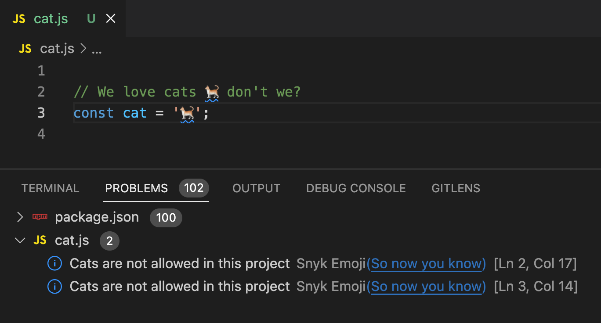

This document contains sample code illustrating contributing to language server. This should guide you when adding new features.

To explain the contribution, we will integrate a simple product called Snyk Emoji Scanner that detects cat emoji in IDE workspace, contributes code actions and provides a hover. You can find the full implementation in [example-code.md](./example-code.md).

# Adding new Emoji scanner
1. We will first add a new product to a set of Snyk products in the domain layer. Head to `domain/snyk/product.go` and add a new product constant set:
```go
// code from `domain/snyk/product.go`
const (
	ProductCode                 Product = "Snyk Code"
	ProductOpenSource           Product = "Snyk Open Source"
	ProductInfrastructureAsCode Product = "Snyk IaC"
	ProductEmoji                Product = "Snyk Emoji" // added this
)

```
2. To report problems, we add a new product scanner to the infrastructure layer. Let's create a new scanner implementation for emoji, matching the [ProductScanner interface](https://github.com/snyk/snyk-lsp/blob/e22b595ad2a9c862e484ce6ac86a18b07fcb49ed/domain/snyk/product.go#L5).

    We will add the following code in `infrastructure/snyk/scanner/emoji.go`:
```go
// code from `infrastructure/snyk/scanner/emoji.go`
type EmojiScanner struct {
}

func (sc *EmojiScanner) Scan(ctx context.Context, filePath string, folderPath string) []types.Issue {
  return []types.Issue{} // return no issues for now
}

func (sc *EmojiScanner) IsEnabled() bool {
	return true // enabled by default
}

func (sc *EmojiScanner) Product() snyk.Product {
	return snyk.ProductEmoji
}
```

  `IsEnabled` can be further updated to reflect the configuration from the underlying IDE. We will mark it as enabled for testing purposes now.

3. Let's add scanner implementation by implementing Scan function. We will assume it's a simple scanner that operates on a file level only and does not scan folders. If your scanner requires folder-scoped scanning, you can rely on `folderPath` parameter to carry out the scan.

    The function returns a slice of found issues. We will return all occurrences of cat emojis within a file as issues. To find them, we parse the file and match cat emoji using regular expression.

```go
// code from `infrastructure/snyk/scanner/emoji.go`
func (sc *EmojiScanner) Scan(ctx context.Context, path string, folderPath string) []types.Issue {
	fileInfo, err := os.Stat(path)
	if err != nil {
		// error handling
		sc.errorReporter.CaptureError(err)
		log.Err(err).Str("method", "emoji.Scan").Msg("Error while getting file info.")
	}

	if fileInfo.IsDir() {
		// our scanner don't need to scan folders, instead we operate on a file basis.
		return []types.Issue{}
	}

	bytes, err := os.ReadFile(path)
	if err != nil {
		sc.errorReporter.CaptureError(err)
		log.Err(err).Str("method", "emoji.Scan").Msg("Error while reading a file")
	}

	emojiRegexp := regexp.MustCompile(`\x{1F408}`) // 🐈 cat emoji regexp

	issues := make([]types.Issue, 0)

	lines := strings.Split(strings.ReplaceAll(string(bytes), "\r", ""), "\n") // split lines
	for i, line := range lines {
		locs := emojiRegexp.FindAllStringIndex(line, len(line))
		if locs == nil {
			continue // no cat emoji found
		}

		for _, loc := range locs {
			r := snyk.Range{
				Start: snyk.Position{Line: i, Character: loc[0]},
				End:   snyk.Position{Line: i, Character: loc[0] + 1},
			}

			issue := snyk.NewIssue(
				"So now you know",
				types.Low,
				snyk.EmojiIssue,
				r,
				"Cats are not allowed in this project",
				"",
				path,
				sc.Product(),
				[]types.Reference{},
				sc.catsEvilProofUrl,
				[]snyk.CodeAction{},
				[]snyk.Command{},
			)
			issues = append(issues, issue)
		}
	}

	return issues
}
```

  We have added few more properties to our new scanner as part of the implemention. One is to report errors using built-in error reporter. The other is a link to the proof on why cat's are not allowed in projects. Let's update our scanner struct to reflect this. We use dependency injection to pass required dependencies to the types. In this case `catsEvilProofUrl` can be set using constructor.

```go
// code from `infrastructure/snyk/scanner/emoji.go`
const (
	catsEvilProof = "https://www.scmp.com/yp/discover/lifestyle/features/article/3071676/13-reasons-why-cats-are-just-plain-evil"
)

type EmojiScanner struct {
	errorReporter    error_reporting.ErrorReporter
	catsEvilProofUrl *url.URL
}

func New(errorReporter error_reporting.ErrorReporter) *EmojiScanner {
	catsEvilProofUrl, _ := url.Parse(catsEvilProof)

	return &EmojiScanner{
		errorReporter,
		catsEvilProofUrl,
	}
}
```

  If new issue type is added as in our case, you need to update a constant set in the [issue.go](https://github.com/snyk/snyk-lsp/blob/e22b595ad2a9c862e484ce6ac86a18b07fcb49ed/domain/snyk/issues.go#L72) domain layer. We call the type `EmojiIssue`.

4. To finalize, we need to wire our new scanner with the whole application. Normally `@snyk/road-runner` team would do the wiring for you, as we want to act as a QA gate before new scanner is delivered to our customers. However, to verify its work you can wire yourself by adding the following code in `application/di/init.go`:

```go
// code from `infrastructure/snyk/scanner/emoji.go`

// declare singleton variable for our scanner
var emojiScanner *emoji.EmojiScanner

// update initDomain() to delegate work to emoji scanner
func initDomain() {
  ...NewDelegatingScanner(
    ...
	  emojiScanner,
  )
}

// update initInfrastructure() to initialize our scanner
func initInfrastructure() {
  ...
	emojiScanner = emoji.New(errorReporter)
}
```

5. That's it! You can now build the language server and proceed with testing the scanner. Point your preferable IDE of choice that supports LSP protocol to the language server built binary (normally dropped in the `build` folder). You should see an issue in your problems view and diagnostic highlighted in the editor:



# Adding code action
You've noticed that no code actions were added in the implementation of `Scan()` function to the collection of detected issues in file above. Let's add possibility to replace cat emoji with "woof!" string in editor.

## Adding text edit
First, we create text edit type and attach it to a new code action. We then pass code action to the new issue constructor.
```go
// code from `infrastructure/snyk/scanner/emoji.go`
textEdit := snyk.TextEdit{
  Range:   r, // same as issue.Range
  NewText: "woof!",
}

codeAction := snyk.CodeAction{
  Title: "Replace with 🐕",
  Edit: snyk.WorkspaceEdit{
    Changes: map[string][]snyk.TextEdit{
      path: {textEdit},
    },
  },
}

issue := snyk.NewIssue(
  "So now you know",
  types.Low,
  snyk.EmojiIssue,
  r,
  "Cats are not allowed in this project",
  "",
  path,
  sc.Product(),
  []types.Reference{},
  sc.catsEvilProofUrl,
  []snyk.CodeAction{codeAction}, // updated
  []snyk.Command{},
)
```

Once you rebuild the server and reload your IDE for testing, you will be able to see new code action shown upon triggering "show code actions" in the IDE:


If you execute it, this will perform string replacement for the supplied range.

## Adding command
A code action can execute not only text edits but also a command. A command can be passed with arguments. Our domain defines a [strict set of commands](https://github.com/snyk/snyk-lsp/blob/841b9f29e83679f64f891262a4822c37502634a7/domain/snyk/command.go#L3). We can reuse `snyk.openBrowser` command to open the url with the proof on why cats are not allowed in projects.

For this we need to make a single change in the code action definition from the above, passing command instead of the text edit as code action.

```go
// code from `infrastructure/snyk/scanner/emoji.go`
codeAction := snyk.CodeAction{
  Title:       "Learn why cats are evil",
  Command: snyk.Command{
    Title:     "Learn why",
    Command:   snyk.OpenBrowserCommand,
    Arguments: []interface{}{sc.catsEvilProofUrl.String()},
  },
}
```

Once rebuild, you will see new code action shown for the diagnostic. This will open a browser after you've executed it.

# Contributing a link to a hover
You have seen a message "Cats are not allowed in this project" when hovering over the cat emoji in editor. We can add more information to the hover by passing markdown formatted string to the issue constructor.

```go
// code from `infrastructure/snyk/scanner/emoji.go`
issue := snyk.NewIssue(
  "So now you know",
  types.Low,
  snyk.EmojiIssue,
  r,
  "Cats are not allowed in this project",
  sc.GetFormattedMessage(), // new function
  path,
  sc.Product(),
  []types.Reference{},
  sc.catsEvilProofUrl,
  []snyk.CodeAction{codeAction},
  []snyk.Command{},
)


func (sc *EmojiScanner) GetFormattedMessage() string {
	return fmt.Sprintf("## Cats are evil \n You can find proof by navigating to [this link](%s)", catsEvilProof)
}
```

The result will be visible as follows:


# Making HTTP Requests
If your scanner needs to make external requests to the API, you are encouraged to use [HTTP Client factory fuction](https://github.com/snyk/snyk-lsp/blob/841b9f29e83679f64f891262a4822c37502634a7/internal/httpclient/httpclient.go#L15) to create a new client for communication. This ensures that user's proxy configuration is taken into account when issuing network calls.

# Contributing to IDE settings
@snyk/road-runner is responsible to make changes to the frontend as this requires domain knowledge of IDEs we deliver configurations to.
