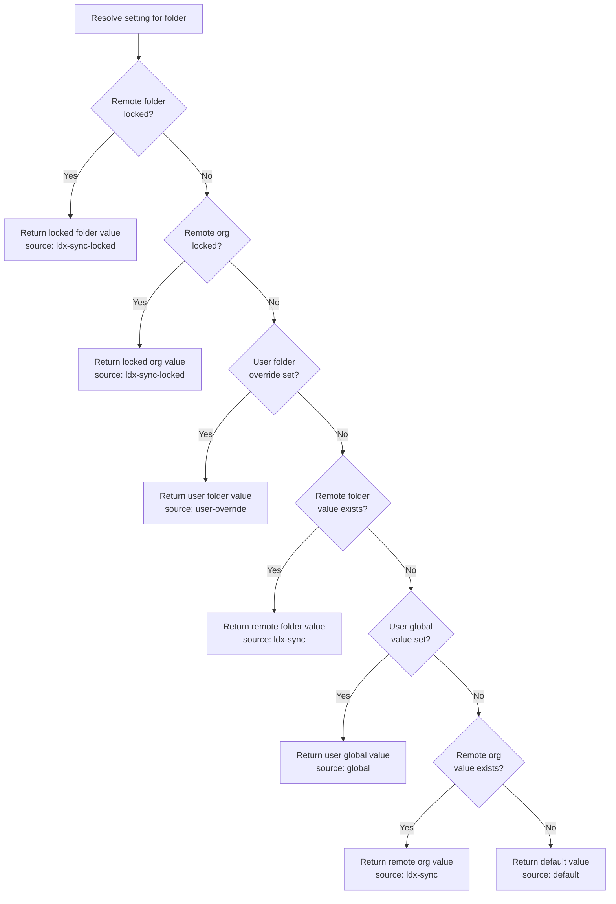
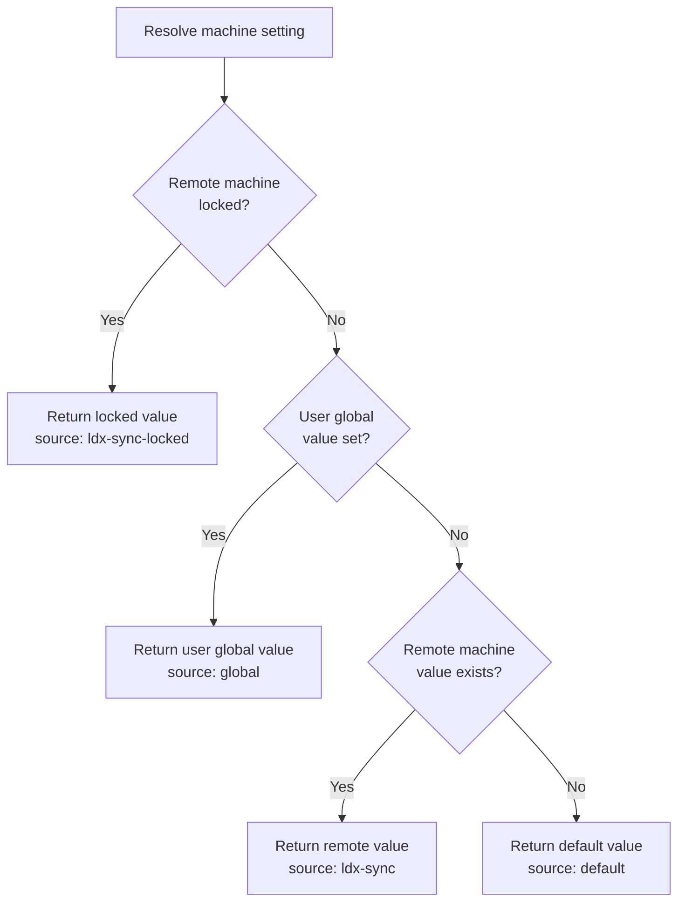
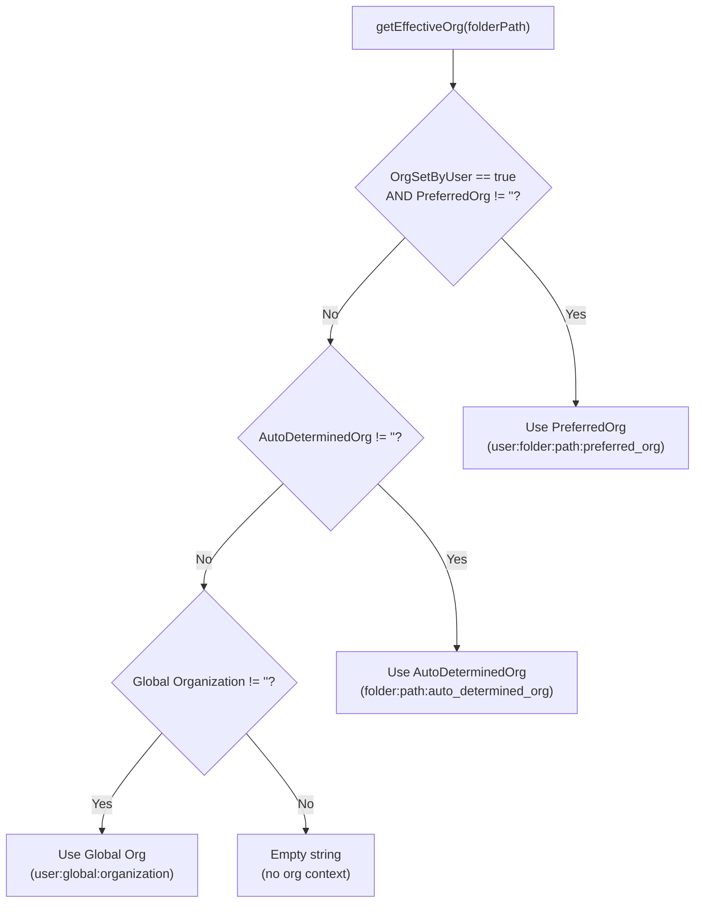
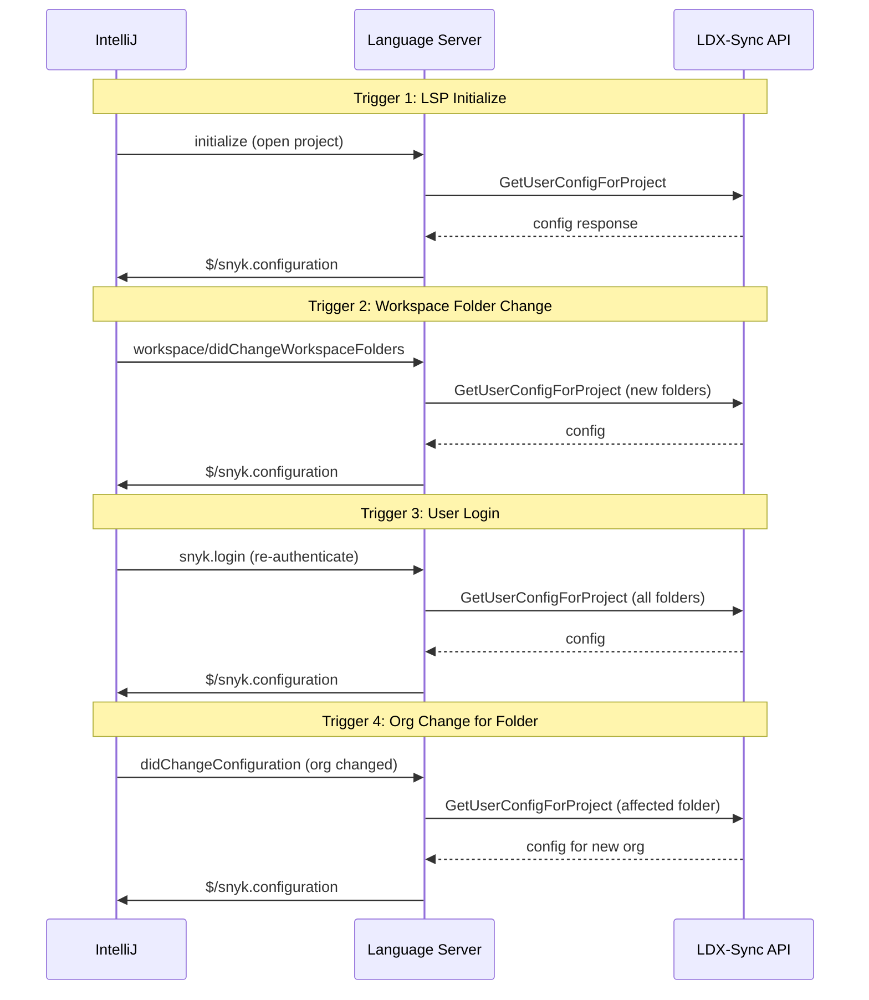

# Manual Testing Plan: Configuration Resolution

This document covers configuration resolution scenarios for the Snyk Language Server
(protocol **v25+** map-based `ConfigSetting` / `$/snyk.configuration`), with step-by-step
instructions for IntelliJ IDEA and curl-based validation. For architecture and key names, see [configuration.md](configuration.md).

## Table of Contents

- [Prerequisites](#prerequisites)
- [Reference: Precedence Rules](#reference-precedence-rules)
- [Reference: API Endpoints](#reference-api-endpoints)
- [Scenario 1: Default Values (No Config Set)](#scenario-1-default-values-no-config-set)
- [Scenario 2: User Global Settings via IDE](#scenario-2-user-global-settings-via-ide)
- [Scenario 3: Remote Org Config (LDX-Sync)](#scenario-3-remote-org-config-ldx-sync)
- [Scenario 4: User Global Overrides Remote Org (Unlocked)](#scenario-4-user-global-overrides-remote-org-unlocked)
- [Scenario 5: Remote Locked Field Prevents User Override](#scenario-5-remote-locked-field-prevents-user-override)
- [Scenario 6: User Folder Override](#scenario-6-user-folder-override)
- [Scenario 7: User Folder Override Beats Remote Org (Unlocked)](#scenario-7-user-folder-override-beats-remote-org-unlocked)
- [Scenario 8: Locked Remote Beats User Folder Override](#scenario-8-locked-remote-beats-user-folder-override)
- [Scenario 9: Remote Folder-Level Config](#scenario-9-remote-folder-level-config)
- [Scenario 10: Remote Folder-Level Locked Override](#scenario-10-remote-folder-level-locked-override)
- [Scenario 11: Machine-Scope Remote Config](#scenario-11-machine-scope-remote-config)
- [Scenario 12: Machine-Scope Locked Remote](#scenario-12-machine-scope-locked-remote)
- [Scenario 13: Effective Org Resolution](#scenario-13-effective-org-resolution)
- [Scenario 14: Multi-Folder Workspace with Different Orgs](#scenario-14-multi-folder-workspace-with-different-orgs)
- [Scenario 15: Folder-Native Settings (Git Enrichment)](#scenario-15-folder-native-settings-git-enrichment)
- [Scenario 16: Config Persistence Across Restarts](#scenario-16-config-persistence-across-restarts)
- [Scenario 17: LDX-Sync Triggers](#scenario-17-ldx-sync-triggers)
- [Scenario 18: Write-Only Settings](#scenario-18-write-only-settings)
- [Scenario 19: Changed Flag Behavior](#scenario-19-changed-flag-behavior)
- [Scenario 20: Remote Config Cleared on Org Change](#scenario-20-remote-config-cleared-on-org-change)
- [Checklist](#checklist)

---

## Prerequisites

### Environment Setup

1. **IntelliJ IDEA** (2024.x or later) with the Snyk plugin installed
   - Path: `File > Settings > Plugins > Marketplace > Search "Snyk"` (macOS: `IntelliJ IDEA > Preferences > Plugins`)
2. **Snyk API Token** — obtain from [https://app.snyk.io/account](https://app.snyk.io/account)
3. **Your personal org ID (UUID)** — retrieve via:
   ```bash
   curl -s -H "Authorization: token $SNYK_TOKEN" \
     "https://api.snyk.io/rest/self?version=2024-10-15" | jq '.data.attributes.default_org_context'
   ```
4. **A test repository** — a Git repo with a remote URL (e.g., `https://github.com/<you>/nodejs-goof`)
5. **jq** installed for JSON parsing
6. **LS debug logging** — enable in IntelliJ:
   - `File > Settings > Tools > Snyk` (or the HTML config panel)
   - Or check LS logs at `~/.local/share/snyk/snyk-ls.log`

### Environment Variables

```bash
export SNYK_TOKEN="<your-snyk-api-token>"
export SNYK_API="https://api.snyk.io"
export ORG_ID="<your-org-uuid>"
export REPO_URL="https://github.com/<you>/nodejs-goof"
```

### How to Access IntelliJ Settings

- **macOS**: `IntelliJ IDEA > Preferences > Tools > Snyk` (or `Cmd + ,`)
- **Windows/Linux**: `File > Settings > Tools > Snyk` (or `Ctrl + Alt + S`)
- **Quick access**: Click the Snyk icon in the toolbar > gear icon

### How to Check Effective Config in the IDE

The LS exposes resolved configuration via the `$/snyk.configuration` notification. To inspect:

1. Open IntelliJ LS log: `Help > Show Log in Finder/Explorer` or check `~/.local/share/snyk/snyk-ls.log`
2. Search for `$/snyk.configuration` to see the resolved settings with `source` and `isLocked` fields
3. Alternatively, use the Snyk Language Server configuration command from the IDE

---

## Reference: Precedence Rules

### Machine-Scope Settings

```
Locked Remote (machine) > User Global > Remote (machine) > Default
```

### Folder-Scope Settings

```
Locked Remote (folder-level) > Locked Remote (org-level) > User Folder Override > Remote Folder > User Global > Remote Org > Default
```

### Source Strings in `$/snyk.configuration`

| Source String | Meaning | Prefix Key |
|---|---|---|
| `"default"` | Registered default, no explicit value set | *(unprefixed)* |
| `"global"` | User set a machine-wide value via IDE | `user:global:` |
| `"folder"` | Folder-native setting (git enrichment, preferred org) | `user:folder:` (native) |
| `"user-override"` | User explicitly overrode a remote default for a folder | `user:folder:` (non-native) |
| `"ldx-sync"` | Remote value from LDX-Sync, unlocked | `remote:<orgId>:` |
| `"ldx-sync-locked"` | Remote value from LDX-Sync, locked by admin | `remote:<orgId>:` (locked) |

### Precedence Diagram (Folder Scope)



### Precedence Diagram (Machine Scope)



---

## Reference: API Endpoints

### Base URL

```
{SNYK_API}/rest/remote_client_connector/config
```

### GET — Retrieve Config (Merged)

```bash
curl -s -H "Authorization: token $SNYK_TOKEN" \
  -H "Content-Type: application/vnd.api+json" \
  "$SNYK_API/rest/remote_client_connector/config?version=2024-10-15&merged=true&org=$ORG_ID&remote_url=$REPO_URL"
```

### GET — Retrieve Org-Scope Config (Raw, Unmerged)

```bash
curl -s -H "Authorization: token $SNYK_TOKEN" \
  -H "Content-Type: application/vnd.api+json" \
  "$SNYK_API/rest/remote_client_connector/config?version=2024-10-15&org=$ORG_ID"
```

### POST — Create Config for Org

```bash
curl -s -X POST \
  -H "Authorization: token $SNYK_TOKEN" \
  -H "Content-Type: application/vnd.api+json" \
  "$SNYK_API/rest/remote_client_connector/config?version=2024-10-15&org=$ORG_ID" \
  -d '{
    "data": {
      "type": "config",
      "attributes": {
        "settings": [
          {"name": "enabled_products", "value": {"code": true, "oss": true, "iac": false, "secrets": false}},
          {"name": "scan_automatic", "value": true}
        ],
        "folder_configs": [
          {
            "remote_url": "'"$REPO_URL"'",
            "folder_path": ".",
            "settings": [
              {"name": "reference_branch", "value": "main"}
            ]
          }
        ]
      }
    }
  }'
```

### PATCH — Update Existing Config by ID

```bash
curl -s -X PATCH \
  -H "Authorization: token $SNYK_TOKEN" \
  -H "Content-Type: application/vnd.api+json" \
  "$SNYK_API/rest/remote_client_connector/config/$CONFIG_ID?version=2024-10-15" \
  -d '{
    "data": {
      "attributes": {
        "settings": [
          {"name": "enabled_products", "value": {"code": false, "oss": true, "iac": true, "secrets": true}, "locked": true}
        ]
      }
    }
  }'
```

### DELETE — Remove Config by ID

```bash
curl -s -X DELETE \
  -H "Authorization: token $SNYK_TOKEN" \
  "$SNYK_API/rest/remote_client_connector/config/$CONFIG_ID?version=2024-10-15"
```

### Global Setting Names (for `settings[]`)

`api_endpoint`, `code_endpoint`, `authentication_method`, `proxy_http`, `proxy_https`,
`proxy_no_proxy`, `proxy_insecure`, `severity_filter_critical`, `severity_filter_high`, `severity_filter_medium`, `severity_filter_low`, `risk_score_threshold`,
`cwe_ids`, `cve_ids`, `rule_ids`, `enabled_products`, `scan_automatic`, `scan_net_new`,
`issue_view_open_issues`, `issue_view_ignored_issues`, `auto_configure_mcp_server`,
`secure_at_inception_execution_frequency`, `trust_enabled`, `binary_base_url`, `cli_path`,
`automatic_download`, `cli_release_channel`

### Folder Setting Names (for `folder_configs[].settings[]`)

`reference_folder`, `reference_branch`, `additional_parameters`, `additional_environment`,
`pre_assigned_org_id`

---

## Scenario 1: Default Values (No Config Set)

**Goal**: Verify that default values are used when no user or remote config exists.

### Steps

1. **Clean state**: Remove any existing remote config for your org:
   ```bash
   # First, get your config ID
   CONFIG_ID=$(curl -s -H "Authorization: token $SNYK_TOKEN" \
     "$SNYK_API/rest/remote_client_connector/config?version=2024-10-15&org=$ORG_ID" \
     | jq -r '.data.id // empty')

   # Delete if exists
   if [ -n "$CONFIG_ID" ]; then
     curl -s -X DELETE -H "Authorization: token $SNYK_TOKEN" \
       "$SNYK_API/rest/remote_client_connector/config/$CONFIG_ID?version=2024-10-15"
   fi
   ```

2. **Reset IntelliJ settings**:
   - Go to `File > Settings > Tools > Snyk`
   - Reset all product toggles, severity filters, and other settings to their defaults
   - Click `Apply`

3. **Restart IntelliJ** to trigger a fresh LS initialization

4. **Open a project** with a Git remote

### Expected Results

| Setting | Expected Value | Expected Source |
|---|---|---|
| `snyk_code_enabled` | `false` | `"default"` |
| `snyk_oss_enabled` | `false` | `"default"` |
| `scan_automatic` | `false` | `"default"` |
| `severity_filter_critical`, `severity_filter_high`, `severity_filter_medium`, `severity_filter_low` | all enabled | `"default"` |

### Validation

Check LS log for `$/snyk.configuration` notification:
```bash
grep '$/snyk.configuration' ~/.local/share/snyk/snyk-ls.log | tail -1 | jq '.params.folderConfigs[0].settings.snyk_code_enabled'
# Expected: {"value": false, "source": "default"}
```

---

## Scenario 2: User Global Settings via IDE

**Goal**: Verify that IDE-set global settings are reflected with source `"global"`.

### Steps

1. Open IntelliJ and navigate to `File > Settings > Tools > Snyk`
2. **Enable Snyk Code**: Check the "Snyk Code Security" checkbox
3. **Enable Snyk OSS**: Check the "Snyk Open Source" checkbox
4. **Set severity filter**: Uncheck "Low" severity
5. Click `Apply`

### Expected Results

| Setting | Expected Value | Expected Source |
|---|---|---|
| `snyk_code_enabled` | `true` | `"global"` |
| `snyk_oss_enabled` | `true` | `"global"` |
| `severity_filter_critical`, `severity_filter_high`, `severity_filter_medium` | `true` | `"global"` |
| `severity_filter_low` | `false` | `"global"` |

### Validation

```bash
grep '$/snyk.configuration' ~/.local/share/snyk/snyk-ls.log | tail -1 | \
  jq '.params.settings.snyk_code_enabled, .params.folderConfigs[0].settings.snyk_code_enabled'
```

---

## Scenario 3: Remote Org Config (LDX-Sync)

**Goal**: Verify that remote org-level config from LDX-Sync is applied when no user value exists.

### Steps

1. **Create remote config** for your org:
   ```bash
   curl -s -X POST \
     -H "Authorization: token $SNYK_TOKEN" \
     -H "Content-Type: application/vnd.api+json" \
     "$SNYK_API/rest/remote_client_connector/config?version=2024-10-15&org=$ORG_ID" \
     -d '{
       "data": {
         "type": "config",
         "attributes": {
           "settings": [
             {"name": "enabled_products", "value": {"code": true, "oss": false, "iac": true, "secrets": false}},
             {"name": "scan_automatic", "value": false},
             {"name": "severity_filter_critical", "value": true},
             {"name": "severity_filter_high", "value": true},
             {"name": "severity_filter_medium", "value": false},
             {"name": "severity_filter_low", "value": false}
           ]
         }
       }
     }'
   ```
   Save the returned config `id` as `CONFIG_ID`.

2. **Validate remote config was created**:
   ```bash
   curl -s -H "Authorization: token $SNYK_TOKEN" \
     "$SNYK_API/rest/remote_client_connector/config?version=2024-10-15&merged=true&org=$ORG_ID" \
     | jq '.data.attributes.settings'
   ```

3. **Reset IntelliJ settings** to defaults (uncheck all explicit overrides)
4. **Restart IntelliJ** to trigger LDX-Sync

### Expected Results

| Setting | Expected Value | Expected Source |
|---|---|---|
| `snyk_code_enabled` | `true` | `"ldx-sync"` |
| `snyk_oss_enabled` | `false` | `"ldx-sync"` |
| `snyk_iac_enabled` | `true` | `"ldx-sync"` |
| `scan_automatic` | `false` | `"ldx-sync"` |
| `severity_filter_critical`, `severity_filter_high` | `true` | `"ldx-sync"` |
| `severity_filter_medium`, `severity_filter_low` | `false` | `"ldx-sync"` |

### Validation

```bash
grep '$/snyk.configuration' ~/.local/share/snyk/snyk-ls.log | tail -1 | \
  jq '.params.folderConfigs[0].settings | {snyk_code_enabled, snyk_oss_enabled, snyk_iac_enabled}'
# Each should have source: "ldx-sync"
```

### Cleanup

```bash
curl -s -X DELETE -H "Authorization: token $SNYK_TOKEN" \
  "$SNYK_API/rest/remote_client_connector/config/$CONFIG_ID?version=2024-10-15"
```

---

## Scenario 4: User Global Overrides Remote Org (Unlocked)

**Goal**: Verify that user global settings override unlocked remote org settings.

### Steps

1. **Create remote config** (unlocked, `locked: false` is the default):
   ```bash
   CONFIG_ID=$(curl -s -X POST \
     -H "Authorization: token $SNYK_TOKEN" \
     -H "Content-Type: application/vnd.api+json" \
     "$SNYK_API/rest/remote_client_connector/config?version=2024-10-15&org=$ORG_ID" \
     -d '{
       "data": {
         "type": "config",
         "attributes": {
           "settings": [
             {"name": "enabled_products", "value": {"code": true, "oss": true, "iac": true, "secrets": true}},
             {"name": "scan_automatic", "value": true}
           ]
         }
       }
     }' | jq -r '.data.id')
   echo "CONFIG_ID=$CONFIG_ID"
   ```

2. **In IntelliJ**, go to `File > Settings > Tools > Snyk`:
   - **Disable** Snyk Code (uncheck)
   - **Disable** scan on save (uncheck)
   - Click `Apply`

3. **Wait** for `$/snyk.configuration` to be sent (check LS log)

### Expected Results

For folder-scope settings, `user:global` has lower priority than `remote:org`, so the remote value should win:

| Setting | Expected Value | Expected Source | Why |
|---|---|---|---|
| `snyk_code_enabled` | `true` | `"ldx-sync"` | Remote org beats user:global for folder-scope settings |
| `scan_automatic` | `true` | `"ldx-sync"` | Same — remote org beats user:global |

**Important**: This is the correct precedence for **folder-scope** settings. `user:global` is the *lowest-priority* user fallback for folder-scope settings. The full chain is: `user:folder > remote:folder > user:global > remote:org > default`. So remote:org actually beats user:global.

Wait — re-reading the precedence: `Locked Remote (folder) > Locked Remote (org) > User Folder Override > Remote Folder > User Global > Remote Org > Default`. So `user:global` is higher than `remote:org`. Let me correct:

| Setting | Expected Value | Expected Source | Why |
|---|---|---|---|
| `snyk_code_enabled` | `false` (user's choice) | `"global"` | user:global beats unlocked remote:org |
| `scan_automatic` | `false` (user's choice) | `"global"` | user:global beats unlocked remote:org |

### Validation

```bash
grep '$/snyk.configuration' ~/.local/share/snyk/snyk-ls.log | tail -1 | \
  jq '.params.folderConfigs[0].settings | {snyk_code_enabled, scan_automatic}'
# Both should have source: "global"
```

### Cleanup

```bash
curl -s -X DELETE -H "Authorization: token $SNYK_TOKEN" \
  "$SNYK_API/rest/remote_client_connector/config/$CONFIG_ID?version=2024-10-15"
```

---

## Scenario 5: Remote Locked Field Prevents User Override

**Goal**: Verify that a locked remote field cannot be overridden by the user.

### Steps

1. **Create remote config with locked settings**:
   ```bash
   CONFIG_ID=$(curl -s -X POST \
     -H "Authorization: token $SNYK_TOKEN" \
     -H "Content-Type: application/vnd.api+json" \
     "$SNYK_API/rest/remote_client_connector/config?version=2024-10-15&org=$ORG_ID" \
     -d '{
       "data": {
         "type": "config",
         "attributes": {
           "settings": [
             {"name": "enabled_products", "value": {"code": true, "oss": true, "iac": false, "secrets": false}, "locked": true},
             {"name": "scan_automatic", "value": true, "locked": true}
           ]
         }
       }
     }' | jq -r '.data.id')
   echo "CONFIG_ID=$CONFIG_ID"
   ```

2. **Validate the config is locked**:
   ```bash
   curl -s -H "Authorization: token $SNYK_TOKEN" \
     "$SNYK_API/rest/remote_client_connector/config?version=2024-10-15&merged=true&org=$ORG_ID" \
     | jq '.data.attributes.settings | {enabled_products, scan_automatic}'
   # Both should show "locked": true
   ```

3. **Restart IntelliJ** to trigger LDX-Sync

4. **Attempt to override in IntelliJ**:
   - Go to `File > Settings > Tools > Snyk`
   - Try to **disable** Snyk Code
   - Try to **disable** scan on save
   - Click `Apply`

### Expected Results

- The IDE should show a warning message: *"Setting locked by organization policy"*
- The settings should remain at their remote values:

| Setting | Expected Value | Expected Source | Expected `isLocked` |
|---|---|---|---|
| `snyk_code_enabled` | `true` | `"ldx-sync-locked"` | `true` |
| `snyk_oss_enabled` | `true` | `"ldx-sync-locked"` | `true` |
| `snyk_iac_enabled` | `false` | `"ldx-sync-locked"` | `true` |
| `scan_automatic` | `true` | `"ldx-sync-locked"` | `true` |

### Validation

```bash
grep '$/snyk.configuration' ~/.local/share/snyk/snyk-ls.log | tail -1 | \
  jq '.params.folderConfigs[0].settings.snyk_code_enabled'
# Expected: {"value": true, "source": "ldx-sync-locked", "isLocked": true}
```

Also check for the lock rejection message:
```bash
grep -i "locked" ~/.local/share/snyk/snyk-ls.log | tail -5
```

### Cleanup

```bash
curl -s -X DELETE -H "Authorization: token $SNYK_TOKEN" \
  "$SNYK_API/rest/remote_client_connector/config/$CONFIG_ID?version=2024-10-15"
```

---

## Scenario 6: User Folder Override

**Goal**: Verify that per-folder user overrides work correctly and show source `"user-override"`.

### Steps

1. **Open a multi-module project** or add a second folder to the IntelliJ project:
   - `File > Project Structure > Modules > + > Import Module`
   - Or open a project that already has multiple content roots

2. **Set a folder-specific override** in the HTML settings panel:
   - Open the Snyk configuration panel
   - Find the folder-specific settings section
   - For one specific folder, disable Snyk Code
   - Click `Apply`

   Alternatively, if using the legacy settings dialog:
   - Set "Additional Parameters" for a specific folder (this is a folder-scope setting)

3. **Check the LS log** for `$/snyk.configuration`

### Expected Results

| Setting | Folder | Expected Source |
|---|---|---|
| `snyk_code_enabled` | folder with override | `"user-override"` |
| `snyk_code_enabled` | other folders | `"default"` or `"global"` or `"ldx-sync"` |

### Validation

```bash
grep '$/snyk.configuration' ~/.local/share/snyk/snyk-ls.log | tail -1 | \
  jq '.params.folderConfigs[] | {folderPath, snyk_code: .settings.snyk_code_enabled}'
```

---

## Scenario 7: User Folder Override Beats Remote Org (Unlocked)

**Goal**: Verify that a user folder override takes precedence over unlocked remote org config.

### Steps

1. **Create unlocked remote config**:
   ```bash
   CONFIG_ID=$(curl -s -X POST \
     -H "Authorization: token $SNYK_TOKEN" \
     -H "Content-Type: application/vnd.api+json" \
     "$SNYK_API/rest/remote_client_connector/config?version=2024-10-15&org=$ORG_ID" \
     -d '{
       "data": {
         "type": "config",
         "attributes": {
           "settings": [
             {"name": "enabled_products", "value": {"code": true, "oss": true, "iac": true, "secrets": true}}
           ]
         }
       }
     }' | jq -r '.data.id')
   echo "CONFIG_ID=$CONFIG_ID"
   ```

2. **Restart IntelliJ** (to sync remote config)

3. **Verify remote config is active**:
   ```bash
   grep '$/snyk.configuration' ~/.local/share/snyk/snyk-ls.log | tail -1 | \
     jq '.params.folderConfigs[0].settings.snyk_code_enabled'
   # Should be: {"value": true, "source": "ldx-sync"}
   ```

4. **Set a folder override** via the settings panel:
   - Disable Snyk Code for the specific folder
   - Click `Apply`

### Expected Results

| Setting | Expected Value | Expected Source |
|---|---|---|
| `snyk_code_enabled` (overridden folder) | `false` | `"user-override"` |
| `snyk_code_enabled` (other folders) | `true` | `"ldx-sync"` |

### Validation

```bash
grep '$/snyk.configuration' ~/.local/share/snyk/snyk-ls.log | tail -1 | \
  jq '.params.folderConfigs[] | {folderPath, snyk_code: .settings.snyk_code_enabled}'
```

### Cleanup

```bash
curl -s -X DELETE -H "Authorization: token $SNYK_TOKEN" \
  "$SNYK_API/rest/remote_client_connector/config/$CONFIG_ID?version=2024-10-15"
```

---

## Scenario 8: Locked Remote Beats User Folder Override

**Goal**: Verify that a locked remote setting overrides any user folder override and clears existing overrides.

### Steps

1. **Start with an unlocked remote config** and set a user folder override (repeat Scenario 7 steps 1-4)

2. **Verify the user folder override is active**:
   ```bash
   grep '$/snyk.configuration' ~/.local/share/snyk/snyk-ls.log | tail -1 | \
     jq '.params.folderConfigs[0].settings.snyk_code_enabled'
   # Should be: {"value": false, "source": "user-override"}
   ```

3. **Lock the remote config**:
   ```bash
   curl -s -X PATCH \
     -H "Authorization: token $SNYK_TOKEN" \
     -H "Content-Type: application/vnd.api+json" \
     "$SNYK_API/rest/remote_client_connector/config/$CONFIG_ID?version=2024-10-15" \
     -d '{
       "data": {
         "attributes": {
           "settings": [
             {"name": "enabled_products", "value": {"code": true, "oss": true, "iac": true, "secrets": true}, "locked": true}
           ]
         }
       }
     }'
   ```

4. **Restart IntelliJ** to trigger LDX-Sync refresh

### Expected Results

- The user folder override should be **cleared** (the LS runs `clearLockedOverridesFromFolderConfigs`)
- The locked remote value should be returned:

| Setting | Expected Value | Expected Source | `isLocked` |
|---|---|---|---|
| `snyk_code_enabled` | `true` | `"ldx-sync-locked"` | `true` |

### Validation

```bash
grep '$/snyk.configuration' ~/.local/share/snyk/snyk-ls.log | tail -1 | \
  jq '.params.folderConfigs[0].settings.snyk_code_enabled'
# Expected: {"value": true, "source": "ldx-sync-locked", "isLocked": true}
```

### Cleanup

```bash
curl -s -X DELETE -H "Authorization: token $SNYK_TOKEN" \
  "$SNYK_API/rest/remote_client_connector/config/$CONFIG_ID?version=2024-10-15"
```

---

## Scenario 9: Remote Folder-Level Config

**Goal**: Verify that remote folder-level config (per-repo-URL settings from LDX-Sync) is applied correctly.

### Steps

1. **Create remote config with folder-level settings**:
   ```bash
   CONFIG_ID=$(curl -s -X POST \
     -H "Authorization: token $SNYK_TOKEN" \
     -H "Content-Type: application/vnd.api+json" \
     "$SNYK_API/rest/remote_client_connector/config?version=2024-10-15&org=$ORG_ID" \
     -d '{
       "data": {
         "type": "config",
         "attributes": {
           "settings": [
             {"name": "enabled_products", "value": {"code": false, "oss": true, "iac": false, "secrets": false}}
           ],
           "folder_configs": [
             {
               "remote_url": "'"$REPO_URL"'",
               "folder_path": ".",
               "settings": [
                 {"name": "reference_branch", "value": "develop"},
                 {"name": "additional_parameters", "value": ["--all-projects"]}
               ]
             }
           ]
         }
       }
     }' | jq -r '.data.id')
   echo "CONFIG_ID=$CONFIG_ID"
   ```

2. **Validate the folder settings were created**:
   ```bash
   curl -s -H "Authorization: token $SNYK_TOKEN" \
     "$SNYK_API/rest/remote_client_connector/config?version=2024-10-15&merged=true&org=$ORG_ID&remote_url=$REPO_URL" \
     | jq '.data.attributes.folder_settings'
   ```

3. **Open the test repo** in IntelliJ and **restart** to trigger LDX-Sync

### Expected Results

| Setting | Expected Value | Expected Source |
|---|---|---|
| `snyk_code_enabled` | `false` | `"ldx-sync"` (from org-level) |
| `reference_branch` | `"develop"` | `"ldx-sync"` (from folder-level) |
| `additional_parameters` | `["--all-projects"]` | `"ldx-sync"` (from folder-level) |

### Validation

```bash
grep '$/snyk.configuration' ~/.local/share/snyk/snyk-ls.log | tail -1 | \
  jq '.params.folderConfigs[] | select(.folderPath | contains("nodejs-goof")) | .settings | {reference_branch, additional_parameters, snyk_code_enabled}'
```

### Cleanup

```bash
curl -s -X DELETE -H "Authorization: token $SNYK_TOKEN" \
  "$SNYK_API/rest/remote_client_connector/config/$CONFIG_ID?version=2024-10-15"
```

---

## Scenario 10: Remote Folder-Level Locked Override

**Goal**: Verify that locked folder-level remote settings take the highest priority.

### Steps

1. **Create remote config with locked folder settings**:
   ```bash
   CONFIG_ID=$(curl -s -X POST \
     -H "Authorization: token $SNYK_TOKEN" \
     -H "Content-Type: application/vnd.api+json" \
     "$SNYK_API/rest/remote_client_connector/config?version=2024-10-15&org=$ORG_ID" \
     -d '{
       "data": {
         "type": "config",
         "attributes": {
           "folder_configs": [
             {
               "remote_url": "'"$REPO_URL"'",
               "folder_path": ".",
               "settings": [
                 {"name": "reference_branch", "value": "release/stable", "locked": true}
               ]
             }
           ]
         }
       }
     }' | jq -r '.data.id')
   echo "CONFIG_ID=$CONFIG_ID"
   ```

2. **Restart IntelliJ** and open the test repo

3. **Try to change reference_branch** in the IDE settings for this folder

### Expected Results

| Setting | Expected Value | Expected Source | `isLocked` |
|---|---|---|---|
| `reference_branch` | `"release/stable"` | `"ldx-sync-locked"` | `true` |

- User should not be able to override this value
- If they try, a lock warning should be shown

### Validation

```bash
grep '$/snyk.configuration' ~/.local/share/snyk/snyk-ls.log | tail -1 | \
  jq '.params.folderConfigs[] | select(.folderPath | contains("nodejs-goof")) | .settings.reference_branch'
```

### Cleanup

```bash
curl -s -X DELETE -H "Authorization: token $SNYK_TOKEN" \
  "$SNYK_API/rest/remote_client_connector/config/$CONFIG_ID?version=2024-10-15"
```

---

## Scenario 11: Machine-Scope Remote Config

**Goal**: Verify that machine-scope remote config (e.g., `api_endpoint`) is applied correctly.

### Steps

1. **Create remote config with machine-scope settings**:
   ```bash
   CONFIG_ID=$(curl -s -X POST \
     -H "Authorization: token $SNYK_TOKEN" \
     -H "Content-Type: application/vnd.api+json" \
     "$SNYK_API/rest/remote_client_connector/config?version=2024-10-15&org=$ORG_ID" \
     -d '{
       "data": {
         "type": "config",
         "attributes": {
           "settings": [
             {"name": "automatic_download", "value": false},
             {"name": "cli_release_channel", "value": "rc"}
           ]
         }
       }
     }' | jq -r '.data.id')
   echo "CONFIG_ID=$CONFIG_ID"
   ```

2. **Restart IntelliJ**

### Expected Results

| Setting | Expected Value | Expected Source |
|---|---|---|
| `automatic_download` | `false` | `"ldx-sync"` |
| `cli_release_channel` | `"rc"` | `"ldx-sync"` |

### Validation

```bash
grep '$/snyk.configuration' ~/.local/share/snyk/snyk-ls.log | tail -1 | \
  jq '.params.settings | {automatic_download, cli_release_channel}'
```

### Cleanup

```bash
curl -s -X DELETE -H "Authorization: token $SNYK_TOKEN" \
  "$SNYK_API/rest/remote_client_connector/config/$CONFIG_ID?version=2024-10-15"
```

---

## Scenario 12: Machine-Scope Locked Remote

**Goal**: Verify that locked machine-scope remote settings override user global settings.

### Steps

1. **In IntelliJ**, set CLI release channel to `"stable"`:
   - `File > Settings > Tools > Snyk`
   - Set release channel dropdown to `stable`
   - Click `Apply`

2. **Create locked remote config**:
   ```bash
   CONFIG_ID=$(curl -s -X POST \
     -H "Authorization: token $SNYK_TOKEN" \
     -H "Content-Type: application/vnd.api+json" \
     "$SNYK_API/rest/remote_client_connector/config?version=2024-10-15&org=$ORG_ID" \
     -d '{
       "data": {
         "type": "config",
         "attributes": {
           "settings": [
             {"name": "cli_release_channel", "value": "preview", "locked": true}
           ]
         }
       }
     }' | jq -r '.data.id')
   echo "CONFIG_ID=$CONFIG_ID"
   ```

3. **Restart IntelliJ**

### Expected Results

Even though the user set `stable`, the locked remote value `preview` should win:

| Setting | Expected Value | Expected Source | `isLocked` |
|---|---|---|---|
| `cli_release_channel` | `"preview"` | `"ldx-sync-locked"` | `true` |

### Validation

```bash
grep '$/snyk.configuration' ~/.local/share/snyk/snyk-ls.log | tail -1 | \
  jq '.params.settings.cli_release_channel'
```

### Cleanup

```bash
curl -s -X DELETE -H "Authorization: token $SNYK_TOKEN" \
  "$SNYK_API/rest/remote_client_connector/config/$CONFIG_ID?version=2024-10-15"
```

---

## Scenario 13: Effective Org Resolution

**Goal**: Verify the org resolution chain: User-preferred > Auto-determined > Global fallback.

### Effective Org Resolution Diagram



### Sub-scenario 13a: Auto-determined org (via LDX-Sync)

1. **Ensure your repo is monitored** in your Snyk org
2. **Clear any preferred org** in IntelliJ
3. **Restart IntelliJ** — LDX-Sync will auto-determine the org based on the git remote URL
4. Check LS log for `auto_determined_org`:
   ```bash
   grep "auto_determined_org" ~/.local/share/snyk/snyk-ls.log | tail -5
   ```

### Sub-scenario 13b: User-preferred org

1. In IntelliJ settings, **uncheck** "Auto-select organization"
2. Enter your org ID in the "Organization" field for a specific folder
3. Click `Apply`
4. Verify the effective org is the user-preferred one:
   ```bash
   grep '$/snyk.configuration' ~/.local/share/snyk/snyk-ls.log | tail -1 | \
     jq '.params.folderConfigs[0].settings | {preferred_org, org_set_by_user, auto_determined_org}'
   ```

### Sub-scenario 13c: Global fallback

1. **Clear** any folder-level preferred org
2. **Clear** the repo from your Snyk org (so auto-determined returns empty)
3. **Set a global organization** in `File > Settings > Tools > Snyk > Organization`
4. Verify the global org is used as fallback

---

## Scenario 14: Multi-Folder Workspace with Different Orgs

**Goal**: Verify that different workspace folders can resolve to different orgs with different remote configs.

### Steps

1. **Open a multi-root project** in IntelliJ with two different repos:
   - Repo A: monitored in Org-1
   - Repo B: monitored in Org-2

2. **Create different remote configs** for each org:
   ```bash
   # Config for Org-1
   CONFIG_ID_1=$(curl -s -X POST \
     -H "Authorization: token $SNYK_TOKEN" \
     -H "Content-Type: application/vnd.api+json" \
     "$SNYK_API/rest/remote_client_connector/config?version=2024-10-15&org=$ORG_ID_1" \
     -d '{
       "data": {
         "type": "config",
         "attributes": {
           "settings": [
             {"name": "enabled_products", "value": {"code": true, "oss": false, "iac": false, "secrets": false}}
           ]
         }
       }
     }' | jq -r '.data.id')

   # Config for Org-2
   CONFIG_ID_2=$(curl -s -X POST \
     -H "Authorization: token $SNYK_TOKEN" \
     -H "Content-Type: application/vnd.api+json" \
     "$SNYK_API/rest/remote_client_connector/config?version=2024-10-15&org=$ORG_ID_2" \
     -d '{
       "data": {
         "type": "config",
         "attributes": {
           "settings": [
             {"name": "enabled_products", "value": {"code": false, "oss": true, "iac": true, "secrets": true}}
           ]
         }
       }
     }' | jq -r '.data.id')
   ```

3. **Restart IntelliJ**

### Expected Results

| Folder | `snyk_code_enabled` | `snyk_oss_enabled` | Source |
|---|---|---|---|
| Repo A (Org-1) | `true` | `false` | `"ldx-sync"` |
| Repo B (Org-2) | `false` | `true` | `"ldx-sync"` |

### Validation

```bash
grep '$/snyk.configuration' ~/.local/share/snyk/snyk-ls.log | tail -1 | \
  jq '.params.folderConfigs[] | {folderPath, snyk_code: .settings.snyk_code_enabled, snyk_oss: .settings.snyk_oss_enabled}'
```

### Cleanup

```bash
curl -s -X DELETE -H "Authorization: token $SNYK_TOKEN" \
  "$SNYK_API/rest/remote_client_connector/config/$CONFIG_ID_1?version=2024-10-15"
curl -s -X DELETE -H "Authorization: token $SNYK_TOKEN" \
  "$SNYK_API/rest/remote_client_connector/config/$CONFIG_ID_2?version=2024-10-15"
```

---

## Scenario 15: Folder-Native Settings (Git Enrichment)

**Goal**: Verify that git-enriched settings (`base_branch`, `local_branches`) are populated automatically.

### Steps

1. **Open a project** with a Git repository that has multiple branches
2. **Wait** for LS initialization to complete

### Expected Results

| Setting | Expected Source | Notes |
|---|---|---|
| `base_branch` | `"folder"` | Auto-detected from Git (usually `main` or `master`) |
| `local_branches` | `"folder"` | List of local Git branches |
| `auto_determined_org` | `"folder"` | If repo is monitored in Snyk |

### Validation

```bash
grep '$/snyk.configuration' ~/.local/share/snyk/snyk-ls.log | tail -1 | \
  jq '.params.folderConfigs[0].settings | {base_branch, local_branches}'
```

Verify the `source` field is `"folder"` (not `"default"` or `"global"`).

---

## Scenario 16: Config Persistence Across Restarts

**Goal**: Verify that folder settings persist across IDE/LS restarts via XDG storage.

### Steps

1. **Set a folder override** in IntelliJ (e.g., disable Snyk Code for a specific folder)
2. **Note the current settings** from LS log
3. **Close IntelliJ completely**
4. **Reopen IntelliJ** with the same project
5. **Compare** the restored settings

### Expected Results

- All `user:folder:` settings should be restored from XDG storage
- All `folder:` metadata (auto_determined_org, local_branches) should be restored
- Source strings should match what they were before restart

### Validation

```bash
# Before restart
grep '$/snyk.configuration' ~/.local/share/snyk/snyk-ls.log | tail -1 > /tmp/before.json

# After restart (run after restarting IntelliJ)
grep '$/snyk.configuration' ~/.local/share/snyk/snyk-ls.log | tail -1 > /tmp/after.json

# Compare
diff <(jq '.params.folderConfigs[0].settings' /tmp/before.json) \
     <(jq '.params.folderConfigs[0].settings' /tmp/after.json)
```

---

## Scenario 17: LDX-Sync Triggers

**Goal**: Verify all four LDX-Sync refresh triggers work correctly.

### LDX-Sync Trigger Diagram



### Sub-scenario 17a: Initialize trigger

1. Close IntelliJ
2. Create a remote config for your org (see Scenario 3)
3. Open IntelliJ — the remote config should be applied on first `$/snyk.configuration`

### Sub-scenario 17b: Workspace folder change

1. Have IntelliJ open with one project
2. Add a new module/content root: `File > Project Structure > Modules > + > Import Module`
3. Check LS log for a new LDX-Sync fetch for the added folder

### Sub-scenario 17c: User login

1. Log out of Snyk in IntelliJ (click the Snyk panel > disconnect)
2. Create or modify a remote config
3. Log back in
4. The new remote config should be fetched and applied

### Sub-scenario 17d: Org change

1. Change the preferred org for a folder in the settings panel
2. Check LS log for a new LDX-Sync fetch with the new org

---

## Scenario 18: Write-Only Settings

**Goal**: Verify that write-only settings (`token`, `send_error_reports`, etc.) are NOT included in `$/snyk.configuration` notifications.

### Steps

1. **Set a token** in IntelliJ: `File > Settings > Tools > Snyk > Token`
2. **Enable error reports** if available
3. **Check** the LS log for `$/snyk.configuration`

### Expected Results

- `token` should NOT appear in the `settings` or `folderConfigs[].settings` of `$/snyk.configuration`
- `send_error_reports` should NOT appear
- `enable_snyk_learn_code_actions` should NOT appear

### Validation

```bash
grep '$/snyk.configuration' ~/.local/share/snyk/snyk-ls.log | tail -1 | \
  jq '.params.settings | has("token"), has("send_error_reports")'
# Both should be false
```

---

## Scenario 19: Changed Flag Behavior

**Goal**: Verify that settings with `changed: false` are not processed by the LS.

### Steps

1. **Open IntelliJ** — the plugin sends `didChangeConfiguration` with all settings
2. **Check** that only explicitly changed settings have `changed: true`
3. **Verify** that LS ignores settings with `changed: false`

### Validation

```bash
# Check incoming didChangeConfiguration
grep 'didChangeConfiguration' ~/.local/share/snyk/snyk-ls.log | tail -1 | \
  jq '.params.settings | to_entries[] | select(.value.changed == true) | .key'
```

Only settings the user explicitly modified should appear.

---

## Scenario 20: Remote Config Cleared on Org Change

**Goal**: Verify that when a folder's org changes, the old org's remote config is replaced with the new org's config.

### Steps

1. **Create configs for two different orgs** (see Scenario 14)
2. **Open a project** that auto-determines to Org-1
3. **Verify** Org-1's config is active
4. **Change the preferred org** to Org-2 in the settings
5. **Verify** Org-2's config is now active

### Expected Results

After the org change:
- All folder-scope settings should now reflect Org-2's remote config
- LDX-Sync should be re-fetched for the new org

### Validation

```bash
# After org change
grep '$/snyk.configuration' ~/.local/share/snyk/snyk-ls.log | tail -1 | \
  jq '.params.folderConfigs[0].settings | {preferred_org, snyk_code_enabled, snyk_oss_enabled}'
```

---

## Checklist

### Setup
- [ ] IntelliJ IDEA installed with Snyk plugin
- [ ] Snyk API token available (`$SNYK_TOKEN`)
- [ ] Personal org UUID known (`$ORG_ID`)
- [ ] Test repository with Git remote (`$REPO_URL`)
- [ ] `jq` installed
- [ ] LS log location confirmed

### Scenario Execution

| # | Scenario | Status | Notes |
|---|---|---|---|
| 1 | Default values (no config) | [ ] | |
| 2 | User global settings via IDE | [ ] | |
| 3 | Remote org config (LDX-Sync) | [ ] | |
| 4 | User global overrides remote org (unlocked) | [ ] | |
| 5 | Remote locked field prevents override | [ ] | |
| 6 | User folder override | [ ] | |
| 7 | User folder override beats remote org (unlocked) | [ ] | |
| 8 | Locked remote beats user folder override | [ ] | |
| 9 | Remote folder-level config | [ ] | |
| 10 | Remote folder-level locked override | [ ] | |
| 11 | Machine-scope remote config | [ ] | |
| 12 | Machine-scope locked remote | [ ] | |
| 13a | Effective org: auto-determined | [ ] | |
| 13b | Effective org: user-preferred | [ ] | |
| 13c | Effective org: global fallback | [ ] | |
| 14 | Multi-folder workspace with different orgs | [ ] | |
| 15 | Folder-native settings (git enrichment) | [ ] | |
| 16 | Config persistence across restarts | [ ] | |
| 17a | LDX-Sync trigger: initialize | [ ] | |
| 17b | LDX-Sync trigger: workspace folder change | [ ] | |
| 17c | LDX-Sync trigger: user login | [ ] | |
| 17d | LDX-Sync trigger: org change | [ ] | |
| 18 | Write-only settings not in notifications | [ ] | |
| 19 | Changed flag behavior | [ ] | |
| 20 | Remote config cleared on org change | [ ] | |

### Cleanup
- [ ] All test remote configs deleted
- [ ] IntelliJ settings reset to defaults
- [ ] No leftover `$CONFIG_ID` values in the remote API
