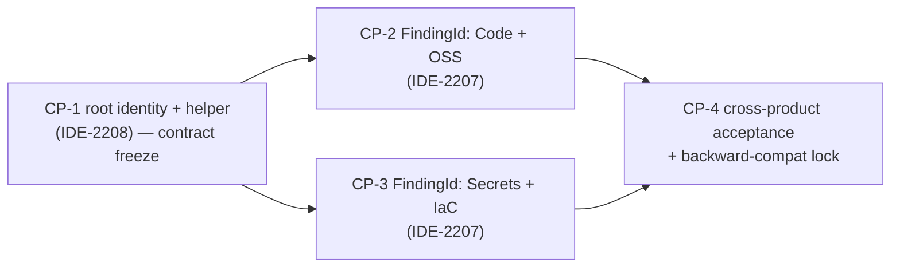

<!-- sub-plan: non-authoritative mirror of the Confluence master plan (to be published) -->
# IDE-2207 + IDE-2208 — Durable finding identity & workspace-root identity in snyk-ls scan output
> Committed per-PR sub-plan mirror. Source of truth = Confluence master (to be published). Working copy = repo-root `IDE-2207-2208_implementation_plan.md` (gitignored).
> Working copy (gitignored session scratchpad). Source of truth = Confluence master (to be published). Committed mirror = `docs/plans/IDE-2207-2208-durable-finding-and-root-identity.md`.

## SESSION RESUME

| Field | Value |
|-------|-------|
| Tickets | [IDE-2207](https://snyksec.atlassian.net/browse/IDE-2207) (stable per-finding route id / D10), [IDE-2208](https://snyksec.atlassian.net/browse/IDE-2208) (multi-root correlation via canonical `ContentRoot`) |
| Parent epic | [IDE-2052](https://snyksec.atlassian.net/browse/IDE-2052) — Ambient Canary (In Progress) |
| Traces to | ADR-18 open item #4 (`../ambient-canary/docs/requirements/architecture.md`) — stable finding identifier for before/after correlation across worktree boundaries |
| Repo (in scope) | `github.com/snyk/snyk-ls` only. Consumer `ambient-canary` is OUT of scope (defines the customer outcome) |
| Branch | current `feat/IDE-2052-fixfolder-return-diffs`; implementation should start a fresh branch `feat/IDE-2207-2208-durable-finding-identity` off `main` |
| Status | Planning — awaiting user confirmation |
| Last updated | 2026-07-13 |

### Current state (what already landed)

Commit `eb6063e` — `feat(codeaction): expose stable findingId and code action kind [IDE-2052]` — added `ScanIssue.FindingId` (`internal/types/lsp.go:1133`) sourced from `issue.GetFindingId()`, distinct from `ScanIssue.Id` (per-result-set key). That work is **stable-across-scans but NOT instance-unique**, and is **not populated consistently across products**. This plan closes those gaps.

### Next actions
1. User confirms the architecture decision (below) and the two open decisions.
2. Publish Confluence master + write ACs onto IDE-2207 / IDE-2208 (`customfield_10890`).
3. Spawn `coder` on CP-1 (foundation) first; CP-2/CP-3 parallelisable after CP-1 freezes the contract.

---

## BDD Offer (optional — confirm before coder starts)

No BDD framework detected (Go project; `go.mod` has no `cucumber/godog`; no `.feature` files). Adding one would:
- **Framework:** `github.com/cucumber/godog` (detected language: Go) — `go test` compatible via `godog.TestSuite`.
- **Estimated effort:** 0.5–1d for scaffold + `bdd-coverage-gate` CI job + `CONTRIBUTING.md`.
- **Approach:** Phase 0 (`.feature` files as docs + CI gate) → Phase 1 (wiring + step defs for these tickets' scenarios) → Phase 2 (`go test ./test/acceptance/` step).

**Confirm Y/N.** If N, mark this section "Declined" and proceed with the standard Go table-test pyramid described in Phase 1.4. Recommendation: **N for this pair** — the acceptance layer here is LSP-protocol roundtrips already well-served by `application/server` integration tests; adding godog now is scope the tickets don't need. Revisit as an epic-level decision.

---

## Phase 1: Planning

### 1.0 Background — why the existing identifiers don't work

> This section derives the conclusions the rest of the plan relies on, so a reviewer who has not read the code can follow the reasoning. All claims verified in source on 2026-07-13.

#### (a) Three identifiers, three different jobs

snyk-ls already carries three id-like values on a finding. They are **not** interchangeable:

| Value | Wire? | Where set | What it is | Job |
|-------|-------|-----------|------------|-----|
| `Issue.Fingerprint` | no (internal) | per-product (`SetFingerPrint`) | product-specific grouping hash | delta / `IsNew` fuzzy matching only |
| `ScanIssue.Id` | `json:"id"` | `domain/ide/converter` (= `additionalData.Key`) | `util.GetIssueKey` = `sha256(ruleId + absPath + startLine+endLine+startCol+endCol)` (`internal/util/identity.go:25`) | per-result-set key within one scan |
| `ScanIssue.FindingId` | `json:"findingId"` | `domain/ide/converter` (= `issue.GetFindingId()`) | the **intended** stable cross-scan correlation key, added by `eb6063e` | correlate the same finding across scans |

The single fact that drives the worktree failure: **`GetIssueKey` is derived from the absolute path and range.** The same finding scanned in a git-worktree copy sits at a different absolute path → different `Id`. So `Id` can never be worktree-portable by construction.

#### (b) Per-product sourcing today, and why each fails (verified in source)

- **Code** (`getCodeIssue`): `Id` = `CodeIssueData.Key` (abs-path `GetIssueKey`, `convert.go:380/386`); `FindingId` = `Fingerprints.SnykAssetFindingV1` (`convert.go:418`) — an **asset/grouping** key. The treeview groups every location of a finding under one node **by fingerprint** (`tree_builder.go` `buildIssueNodes`: "Issues sharing the same fingerprint are grouped under a single parent issue node with NodeTypeLocation children"). A grouping key by definition **collides** across the distinct instances IDE-2207 must individuate.
- **OSS** (`getOssIssue`): `Id` = `OssIssueData.Key` (abs-path key, `unified_converter.go:462`); `FindingId` = `introducingFinding.Id.String()` — a **testapi finding UUID** (`unified_converter.go:161`), not guaranteed stable across scans. (OSS `Fingerprint` via `CalculateFingerprintFromAdditionalData` = `packageName|version|depChain|rule` — stable but path-blind/grouping, and delta-only.)
- **Secrets** (`convert.go`): `Id`, `FindingId`, and `Fingerprint` **all fold `attrs.Key`, a per-scan UUID** (lines 93, 128, 129) → nothing is stable across scans; every re-scan mints new ids.
- **IaC** (`getIacIssue`): `Id` = `sha256(absPath + line + publicID)` (`iac.go:515`); `FindingId` = **empty** (the scanner never calls `SetFindingId`); `Fingerprint` = `rule|resourcePath` (delta-only).

| Product | stable across scans? | instance-unique? | location-independent? | one value with all three? |
|---------|:---:|:---:|:---:|:---:|
| Code | `FindingId` ✅ / `Id` ✅ | `Id` ✅ / `FindingId` ❌ | ❌ | **no** |
| OSS | `Id` ✅ / `FindingId` ❌ | ✅ | ❌ | **no** |
| Secrets | ❌ (UUID) | ✅ | ❌ | **no** |
| IaC | `Id` ✅ | ✅ | ❌ | **no** (`FindingId` empty) |

No product has {stable ∧ instance-unique ∧ location-independent} in a single value. That is the exact gap this plan fills.

#### (c) Why the workspace/folder construct isn't enough (IDE-2208)

`ScanIssue.ContentRoot` is stamped per issue and is already on the wire, so an in-place listing already knows a finding's folder — but today it is **not guaranteed to be the canonical registered root**: when a sub-path is scanned it can report a different value, so the consumer can't reliably rely on it and falls back to `roots[0]`. The fix is not a new opaque key; it is to **guarantee `ContentRoot` is always the canonical registered root path** (identical regardless of which sub-path was scanned) and to make `FindingId` **root-relative** so it is stable across the worktree boundary. The consumer created the worktree, so it already owns the worktree↔origin-root mapping and keys on `ContentRoot` + the root-relative `FindingId`. snyk-ls already relies on an ad-hoc path-prefix remap in the fix path (the daemon "prefix-remap contract" — `runDir` used verbatim/non-canonical — in `domain/snyk/remediation/`); a canonical `ContentRoot` + root-relative `FindingId` removes the need for that brittle workaround.

#### (d) Why fingerprint can't be the identity

Fingerprint solves a **different** problem — fuzzy base-vs-current delta diffing — and is structurally unfit as an identity (`internal/delta/fuzzy_matcher.go`):
- it is one weighted term (`FingerprintConfidence: 0.5`) in a similarity score with a **fuzzy** accept threshold (`MinimumAcceptableConfidence: 0.4`) — not 1:1 equality;
- `fingerprintDistance` returns a part-ratio, not equality;
- the matcher **derives a separate `GlobalIdentity`** (a base-branch UUID via `SetGlobalIdentity`) rather than using the fingerprint as the id;
- `Match` requires a base list, so it doesn't even exist outside a delta scan;
- its design goal is position-**blindness** (so a drifted finding still matches) — the exact opposite of the instance individuation IDE-2207 needs;
- coverage is inconsistent (`CalculateFingerprintFromAdditionalData` handles **OSS + IaC only**; Code uses a SARIF fingerprint; Secrets fp is the per-scan UUID).

**Core tension:** fingerprint optimises *tolerance*; identity optimises *exactness*; one value cannot be both. The fix therefore **reuses the fingerprint/grouping key as the `groupingKey` input** and **adds the root-relative path + range** to individuate — producing a value that is both durable (grouping core) and exact (location discriminator).

### 1.1 Requirements analysis

**Customer outcomes (from the consumer, ambient-canary — the reason this work exists):**

- **R1 (IDE-2207 — durable identity):** The same underlying finding keeps the **same** per-finding identity across repeated scans of the same code.
- **R2 (IDE-2207 — instance uniqueness):** Two **distinct** findings never receive the same per-finding identity, **even when they share a rule or fingerprint** (e.g. the same rule firing at two locations in one file).
- **R3 (IDE-2207 — worktree portability):** A finding's identity is **identical** whether the code is scanned in the user's working tree or in a git worktree copy of it, so a consumer can correlate before/after diagnostics across the worktree boundary (ADR-18 #4).
- **R4 (IDE-2207 — cross-product coverage):** R1–R3 hold for **all four products**: Snyk Code, Open Source, Secrets, IaC. No product emits an empty or per-scan-random identity.
- **R5 (IDE-2208 — root attribution):** In a workspace with **more than one root/folder**, every finding in the scan output carries a reliable identifier of **which workspace root it belongs to**, so a consumer correlates each finding to the correct root instead of defaulting to the first root.
- **R6 (backward compat):** The existing `ScanIssue.Id` (per-result-set key) and the existing consumers of published diagnostics keep working unchanged; new/repaired fields are additive or semantics-preserving for current IDE clients.

**Current-state gap analysis (verified in source, 2026-07-13):**

| Product | `ScanIssue.Id` (`additionalData.Key`) | Stable across scans? | Instance-unique? | `ScanIssue.FindingId` | Stable? | Instance-unique? | Worktree-portable? |
|---------|----------------------------------------|----------------------|------------------|-----------------------|---------|------------------|--------------------|
| Code | `util.GetIssueKey(ruleID, absPath, range)` (`infrastructure/code/convert.go:380,386`) | ✅ (unchanged code) | ✅ | `Fingerprints.SnykAssetFindingV1` (`convert.go:418`) | ✅ | ❌ **groups instances** | ❌ (abs path in `Id`) |
| OSS | `util.GetIssueKey(problem.Id, absPath, range)` (`oss/unified_converter.go:462`) | ✅ | ✅ | `introducingFinding.Id.String()` testapi UUID (`unified_converter.go:161`) | ❓ GAF-dependent | ✅-ish | ❌ |
| Secrets | `util.GetIssueKey(attrs.Key, absPath, range)` — **folds per-scan UUID** (`secrets/convert.go:93,99`) | ❌ **unstable** | ✅ | `attrs.Key` per-scan UUID (`convert.go:128`) | ❌ **unstable** | ✅ | ❌ |
| IaC | `getIssueKey(absPath, line, publicID)` (`iac/iac.go:515`) | ✅ | ✅ | **empty** (not set) | ❌ | ❌ | ❌ |

**Conclusion:** No single existing field is simultaneously *stable across scans*, *instance-unique*, and *worktree-portable* for all four products. `Id` is instance-unique but absolute-path-based (not worktree-portable) and unstable for Secrets; `FindingId` is stable-ish but groups instances (Code), is empty (IaC), or random per scan (Secrets).

**Files in scope (production):**
- `internal/types/lsp.go` — `ScanIssue` struct (`FindingId` semantics repaired; `ContentRoot` doc'd as the canonical registered root). No new field.
- `internal/util/identity.go` — add a deterministic composite-identity helper.
- `domain/ide/converter/converter.go` — the single conversion layer where `Id`, `FindingId`, and canonical `ContentRoot` are set per product (`getCodeIssue`/`getOssIssue`/`getSecretIssue`/`getIacIssue`).
- `infrastructure/code/convert.go`, `infrastructure/oss/unified_converter.go`, `infrastructure/secrets/convert.go`, `infrastructure/iac/iac.go` — per-product stable grouping-key sourcing (esp. Secrets: stop using the UUID; IaC: provide grouping key).
- `domain/snyk/issues.go` — `Issue` finding-id/root accessors if needed.
- `domain/ide/workspace/*` + wherever `$/snyk.scan` params are built — carry the canonical root identity at scan level.

### 1.2 Architecture design (the decision)

> This section is the ADR for the pair. It answers the user's two framing questions: **where the ids originate** and **how they surface to a consumer**. Persist it via `capture-requirements` (Phase 1.5) as `docs/requirements/architecture.md` ADR entry.

**Decision D-1 — Origin: compute the durable, instance-unique identity in snyk-ls's conversion layer; do NOT block on GAF.**
All inputs required to compute a stable + instance-unique + worktree-portable identity are already available inside snyk-ls at conversion time:
- a **stable grouping key** (what makes two observations "the same finding"): Code `SnykAssetFindingV1`, OSS testapi finding id, Secrets rule id/name, IaC `publicID`;
- an **instance discriminator** (what makes two findings distinct): file path + normalized range;
- the **workspace root** (to make the path root-relative and hence worktree-portable): the registered folder root (`ContentRoot`).

Therefore neither ticket is *hard*-blocked upstream. The "upstream-blocked" label assumed GAF must mint the id; it need not. Long-term, GAF/testapi should own the durable **asset-finding** grouping identity for every product (Code already emits `SnykAssetFindingV1`; OSS emits a finding id) and snyk-ls should consume it as the grouping core — but instance-uniqueness and root-relativity are conversion-layer concerns that stay in snyk-ls regardless. See "Optional future enhancement" below for the narrow part that remains a GAF ask.

**Decision D-2 — Identity formula (the per-finding id, R1–R4):**
```
findingIdentity = shortHash( groupingKey  + " " +
                             rootRelativePath + " " +
                             startLine + ":" + startCol + "-" + endLine + ":" + endCol )
```
- `groupingKey` = per-product durable key (above); Secrets uses the **rule id/name**, never the per-scan UUID.
- `rootRelativePath` = `affectedFilePath` expressed **relative to the finding's workspace root** (`ContentRoot`) with forward slashes — this is what makes the id identical in the working tree and in a worktree copy (R3).
- Range is normalized (0-based, half-open, as already produced by the converter).
- Deterministic (SHA-256, hex-truncated as `GetIssueKey` already does) → stable across scans for unchanged code (R1), unique per instance because the location discriminates instances that share a grouping key (R2).

**Decision D-3 — Surfacing: repair the existing `FindingId` field in place (recommended); keep `Id` unchanged.**
- `ScanIssue.FindingId` becomes the D-2 identity, populated identically for **all four products**. The consumer already reads `FindingId`; repairing it in place avoids a consumer field rename. `FindingId` is young (landed in `eb6063e`) and its only consumer is internal (ambient-canary), so redefining its semantics from "grouping fingerprint" to "stable+unique+portable instance id" is low-risk.
- `ScanIssue.Id` (per-result-set key) is **unchanged** for every product — existing IDE clients (VS Code/IntelliJ/Eclipse/VS) that key on `Id` are unaffected (R6).
- **DECIDED (2026-07-13):** repair `FindingId` in place; no new field.

**Decision D-4 — Root identity (R5): canonical `ContentRoot`, no new key. DECIDED (2026-07-13).**
- Guarantee `ScanIssue.ContentRoot` is **always populated** and **always equals the canonical registered workspace-folder root** (not a scan sub-path or file-scan directory) for every product — an identical value regardless of which sub-path was scanned.
- **No `RootId`** is added (a hashed key was judged over-engineered). The consumer correlates a finding to its root by keying on `ContentRoot` + the root-relative `FindingId`. Because the consumer created the worktree, it already owns the worktree↔origin-root mapping; snyk-ls owes only a canonical, reliable `ContentRoot` and a root-relative `FindingId`.

**Scope: all four products are fixed now, in snyk-ls.** The user has decided OSS/Secrets/IaC are **not** deferred. Every product emits a `FindingId` that is stable across scans, unique per instance, and location-independent (root-relative), computed entirely in snyk-ls's conversion layer from inputs already present. The D-2 composite needs nothing from GAF: it uses each product's existing grouping key (Code `SnykAssetFindingV1`, OSS testapi finding id, Secrets rule id/name, IaC `publicID`) and, where a product has no durable grouping key, degrades gracefully to rule-id — always combined with the root-relative path + range for exactness. **IDE-2207 and IDE-2208 are therefore fully unblocked by this snyk-ls work.**

**Optional future enhancement (NOT a blocker for this delivery):** a *machine-independent, movement-tolerant* asset-finding identity (one that survives the finding physically moving in the file without relying on re-scan delta matching) is the only thing that would additionally require a GAF/testapi asset-finding rollout for OSS/Secrets/IaC. It improves durability under large code drift but is not needed for R1–R6. If pursued, track it as a separate `deferred` child of IDE-2052 — it does not gate shipping a correct, stable, instance-unique `FindingId` per product now.

### 1.3 Flow diagrams

Create `docs/diagrams/IDE-2207-2208_identity_flow.mmd` (gitignored) — sequence: scanner → per-product converter (grouping key) → `domain/ide/converter` (compose FindingId with root-relative path; stamp canonical `ContentRoot`) → `ScanIssue` → `publishDiagnostics.data` → consumer correlates by (`ContentRoot`, `FindingId`). Render to PNG with `make generate-diagrams` if the target exists; otherwise embed the mermaid source in the Confluence master.

### 1.4 Test Scenario Definition (outside-in — defined before any checkpoint)

Acceptance layer for snyk-ls = **LSP-protocol roundtrip** tests in `application/server` (initialize → scan → observe `publishDiagnostics`/`$/snyk.scan` payload) — this is the customer-visible surface the consumer actually reads. Integration = converter + real per-product converters wired together. Unit = the identity helper and per-product grouping-key sourcing.

#### Layer 1 — Acceptance (LSP roundtrip; customer-visible outcomes)

| Test ID | Given | When | Then | File | Test function | Layer |
|---------|-------|------|------|------|---------------|-------|
| ACC-001 | a folder with a Code finding | folder scanned twice (unchanged code) | the finding's `FindingId` in `publishDiagnostics.data` is **identical** across both scans | `application/server/server_finding_identity_test.go` | `TestFindingId_StableAcrossScans_Code` | Accept |
| ACC-002 | a file with the **same rule firing at two different locations** (shared fingerprint) | folder scanned | the two findings have **different** `FindingId` values | same | `TestFindingId_InstanceUnique_SameRuleTwoLocations` | Accept |
| ACC-003 | a folder with a Code finding, and a git-worktree copy of that folder registered as a separate root | both scanned | the finding's `FindingId` is **identical** in the working tree and the worktree | same | `TestFindingId_WorktreePortable_RootRelative` | Accept |
| ACC-004a | a folder with a **Code** finding | scanned twice + at two locations of one rule | each Code finding keeps its id across scans and two locations get different ids | same | `TestFindingId_Code_StableUnique` | Accept |
| ACC-004b | a folder with an **OSS** finding | scanned twice | the OSS finding keeps the same id across scans (no longer a per-scan testapi UUID) | same | `TestFindingId_OSS_StableAcrossScans` | Accept |
| ACC-004c | a folder with a **Secrets** finding (re-scan mints a new internal UUID) | scanned twice | the Secrets finding keeps the **same** id across scans despite the UUID changing | same | `TestFindingId_Secrets_StableDespiteUUID` | Accept |
| ACC-004d | a folder with an **IaC** finding | scanned | the IaC finding has a **non-empty**, stable, instance-unique id (was empty before) | same | `TestFindingId_IaC_NonEmptyStableUnique` | Accept |
| ACC-005 | a workspace with **two roots**, each containing findings | workspace scanned | every finding's `ContentRoot` equals the canonical root it physically belongs to; **no** finding is attributed to the wrong/first root | `application/server/server_multiroot_test.go` | `TestFinding_RootAttribution_MultiRoot` | Accept |
| ACC-006 | current IDE client keying on `ScanIssue.Id` | folder scanned | `Id` values are unchanged from pre-change behaviour for all four products (golden-value regression) | `application/server/server_finding_identity_test.go` | `TestScanIssueId_Unchanged_BackwardCompat` | Accept |

#### Layer 2 — Integration (converter + real per-product converters)

| Test ID | Scenario | Components wired | Assertion | File | Test function | Layer |
|---------|----------|------------------|-----------|------|---------------|-------|
| INT-001 | Code SARIF → issues → `ToDiagnostics` | `code.SarifConverter` + `domain/ide/converter` | `FindingId` = D-2 composite; two same-rule locations differ; re-run identical | `domain/ide/converter/converter_finding_identity_test.go` | `TestToDiagnostics_Code_FindingIdComposite` | Integ |
| INT-002 | OSS testapi → issues → `ToDiagnostics` | `oss` unified converter + `domain/ide/converter` | `FindingId` composite non-empty, stable, instance-unique | same | `TestToDiagnostics_OSS_FindingIdComposite` | Integ |
| INT-003 | Secrets testapi (**re-run mints a new `attrs.Key` UUID**) → issues → `ToDiagnostics` | `secrets.FindingsConverter` + `domain/ide/converter` | `FindingId` is **identical** across the two runs despite the UUID changing (proves UUID no longer feeds identity) | same | `TestToDiagnostics_Secrets_FindingIdStable_DespiteUUIDChange` | Integ |
| INT-004 | IaC issues → `ToDiagnostics` | `iac` converter + `domain/ide/converter` | `FindingId` non-empty and instance-unique (fixes empty-id gap) | same | `TestToDiagnostics_IaC_FindingIdPopulated` | Integ |
| INT-005 | finding in a sub-path of a root | per-product converter + `domain/ide/converter` | `ContentRoot` = canonical registered root (not the scanned sub-path); `FindingId` uses root-relative path | same | `TestToDiagnostics_CanonicalContentRoot_RootRelativeFindingId` | Integ |
| INT-006 | worktree copy vs original tree, same file/finding | `domain/ide/converter` | `FindingId` identical; `Id` differs (abs-path based) — documents the contrast | same | `TestToDiagnostics_WorktreePortability` | Integ |

#### Layer 3 — Unit (identity helper + per-product grouping key)

| Test ID | Function under test | Input / state | Expected | File | Test function | Layer |
|---------|--------------------|---------------|----------|------|---------------|-------|
| UNIT-001 | `util.ComputeFindingIdentity` | groupingKey + rootRelPath + range | deterministic hex; same inputs → same output | `internal/util/identity_test.go` | `TestComputeFindingIdentity_Deterministic` | Unit |
| UNIT-002 | `util.ComputeFindingIdentity` | same groupingKey, two different ranges | different outputs | same | `TestComputeFindingIdentity_InstanceUnique` | Unit |
| UNIT-003 | `util.ComputeFindingIdentity` | same groupingKey+range, abs path vs root-relative caller | root-relative caller yields worktree-identical output | same | `TestComputeFindingIdentity_RootRelative` | Unit |
| UNIT-004 | Secrets grouping-key selection | `attrs.Key` UUID present + rule id present | grouping key = rule id (UUID ignored) | `infrastructure/secrets/convert_test.go` | `TestSecrets_GroupingKey_IgnoresUUID` | Unit |
| UNIT-005 | IaC grouping-key selection | issue with `publicID` | grouping key = `publicID` | `infrastructure/iac/iac_test.go` | `TestIaC_GroupingKey_PublicID` | Unit |

#### Layer 4 — Manual

| Test ID | Scenario | Steps | Expected | Layer |
|---------|----------|-------|----------|-------|
| MAN-001 | Existing IDE (VS Code) still renders + navigates findings | scan a multi-finding repo in VS Code | tree, navigation, code actions unaffected (no reliance on repaired `FindingId`) | Manual |

**Self-check:**
- [x] Every R1–R5 outcome has ≥1 ACC row; R6 → ACC-006 + MAN-001.
- [x] Every boundary (converter) has INT rows; identity helper has UNIT rows not duplicated by INT.
- [x] Ghost-test check: ACC rows assert **payload field values** in `publishDiagnostics.data`, not that a method was called.
- [x] Cross-language contract: `FindingId` and `ContentRoot` are consumed by ambient-canary (Rust/Go). Field names/JSON tags cross the language boundary → ACC-004/ACC-005 assert exact JSON field presence + value; the JSON tags (`findingId`, `contentRoot`) are the shared contract. (ambient-canary side is out of scope but the exact-tag assertion lives here.)

  | Value | snyk-ls emitter | Consumer | Test asserting exact wire value |
  |-------|-----------------|----------|---------------------------------|
  | `findingId` JSON tag + composite value | `converter.go` → `ScanIssue` | ambient-canary | ACC-004a–d, INT-001..004 |
  | `contentRoot` JSON tag = canonical root | `converter.go` → `ScanIssue` | ambient-canary | ACC-005, INT-005 |

### 1.5 Requirements capture
Before Phase 2, run `capture-requirements` to persist R1–R6 to the central store keyed to IDE-2207 and IDE-2208, and persist D-1..D-4 as an ADR in `docs/requirements/architecture.md`. Hard gate: ≥1 requirement per ticket in the store before coding.

---

## Phase 2: Implementation (outside-in TDD, structured for parallelism)

**Foundation-first:** CP-1 freezes the wire contract — repaired `FindingId` (root-relative, all four products) + canonical `ContentRoot` guarantee + the identity helper; **no `RootId`**. CP-2 and CP-3 implement per-product against that frozen contract and are **independent** (different converter files) → parallelisable by two coder agents. CP-4 is the cross-product acceptance sweep and depends on CP-2+CP-3. Every product's `FindingId` is repaired in this delivery — none deferred.

**Checkpoint DAG:**

CP-2 and CP-3 run in parallel once CP-1 merges (or stacks on CP-1).

### CP-1: Root identity foundation + identity helper (IDE-2208 core) — **contract freeze**
**Goal:** Every finding reliably names its canonical workspace root (`ContentRoot`), and a deterministic root-relative identity helper exists; the wire contract (repaired `FindingId` + canonical `ContentRoot`, **no `RootId`**) is frozen.
**Child ticket:** IDE-2208 (+ create sub-task if the team wants finer granularity).
**Architecture decisions:** D-1, D-3, D-4; add `util.ComputeFindingIdentity(groupingKey, rootRelPath string, r types.Range) string`; guarantee `ContentRoot` = canonical registered root in all four `getXxxIssue` converters; compute the root-relative path once in the converter. No `RootId` field, no scan-notification change.
**Files to create:** `internal/util/identity.go` additions (helper) + `internal/util/identity_test.go`.
**Files to modify:** `internal/types/lsp.go` (doc `FindingId`; doc `ContentRoot` as canonical registered root); `domain/ide/converter/converter.go` (stamp canonical `ContentRoot`, compute root-relative path once, feed the helper).
**Tests (outside-in):** ACC-005 (RED) → INT-005 (RED) → UNIT-001..003 (RED) → implement → GREEN.
**Real-wiring note:** canonical `ContentRoot` + root-relative `FindingId` set in the production converter path that feeds `publishDiagnostics`; ACC-005 exercises the real LSP server, no fakes at the boundary.
**Commit:** `feat(scan): guarantee canonical ContentRoot + root-relative finding identity [IDE-2208]`

### CP-2: Instance-unique, worktree-portable FindingId for Code + OSS (IDE-2207) — parallel
**Goal:** Code and OSS findings carry a stable, instance-unique, worktree-portable `FindingId`.
**Customer outcomes:** *A Code finding keeps the same identity across scans, and the same rule at two locations gets two identities (no collision). An OSS finding keeps the same identity across scans (no longer a per-scan UUID).*
**Child ticket:** IDE-2207.
**Architecture decisions:** D-2, D-3; Code grouping key = `SnykAssetFindingV1`; OSS grouping key = testapi finding id; both feed `ComputeFindingIdentity` with the root-relative path from CP-1.
**Files to modify:** `domain/ide/converter/converter.go` (`getCodeIssue`, `getOssIssue`); if grouping key must be plumbed, `infrastructure/code/convert.go` / `infrastructure/oss/unified_converter.go`.
**Tests:** ACC-001, ACC-002, ACC-003, ACC-004a, ACC-004b (RED) → INT-001, INT-002, INT-006 (RED) → implement → GREEN.
**Commit:** `feat(scan): stable instance-unique findingId for Code and OSS [IDE-2207]`

### CP-3: FindingId for Secrets + IaC — drop UUID, fill the empty (IDE-2207) — parallel
**Goal:** Secrets `FindingId` is stable despite the per-scan UUID; IaC `FindingId` is populated.
**Customer outcomes:** *A Secrets finding keeps the same identity across scans even though the internal UUID changes each scan. An IaC finding now has a real, stable, instance-unique identity (previously empty).*
**Child ticket:** IDE-2207 (sibling sub-task to CP-2).
**Architecture decisions:** D-2; Secrets grouping key = rule id/name (**not** `attrs.Key`); IaC grouping key = `publicID`; both via `ComputeFindingIdentity` + root-relative path.
**Files to modify:** `domain/ide/converter/converter.go` (`getSecretIssue`, `getIacIssue`); `infrastructure/secrets/convert.go` (source a stable grouping key, stop feeding the UUID into identity); `infrastructure/iac/iac.go` (expose `publicID` as grouping key).
**Tests:** ACC-004c, ACC-004d (RED) → INT-003, INT-004 (RED) → UNIT-004, UNIT-005 (RED) → implement → GREEN.
**Commit:** `feat(scan): populate stable findingId for Secrets and IaC [IDE-2207]`

### CP-4: Cross-product acceptance sweep + backward-compat lock
**Goal:** All four products proven together; `Id` backward-compat locked.
**Depends on:** CP-2 + CP-3.
**Tests:** ACC-004a–d (full four-product sweep), ACC-006 (RED→GREEN); run full suite + `make lint`. MAN-001 scheduled.
**Commit:** `test(scan): cross-product findingId + root attribution acceptance [IDE-2207][IDE-2208]`

**PR sizing:** CP-1 and CP-4 likely one PR each; CP-2/CP-3 one PR each (stacked on CP-1). Each < 700 lines.

---

## Decisions (resolved 2026-07-13)

1. **`FindingId` repaired in place — no new field.** Its only consumer (ambient-canary) is internal and the field is young (`eb6063e`), so redefining its semantics from "grouping fingerprint" to "stable + instance-unique + root-relative id" is low-risk and avoids a consumer rename. (D-3)
2. **Canonical `ContentRoot` only — no `RootId`.** A hashed root key was judged over-engineered. IDE-2208 is solved by (a) guaranteeing `ContentRoot` is the canonical registered root path (identical regardless of which sub-path was scanned) and (b) the root-relative `FindingId`, which makes a finding correlatable across the worktree boundary. The consumer created the worktree, so it already owns the worktree↔origin-root mapping and keys on `ContentRoot` + root-relative `FindingId`. No new opaque key on the wire. (D-4)
3. **Not upstream-blocked — proceed in snyk-ls.** All inputs to compute a stable, instance-unique, root-relative id exist in the conversion layer today; the tickets are fully unblocked by this snyk-ls work. The single optional future enhancement is a movement-tolerant, content-based asset identity (GAF/testapi) that survives a finding physically moving — a durability improvement, not a blocker; if pursued, track as a `deferred` child of IDE-2052. (D-1)

---

## Effort estimates

| PR | Scope | Agent dev | PR review | Manual | Total |
|----|-------|-----------|-----------|--------|-------|
| PR1 (CP-1) | root identity + helper + contract freeze | 1.0d | 1d | — | 2.0d |
| PR2 (CP-2) | Code+OSS findingId | 0.75d | 1d | — | 1.75d |
| PR3 (CP-3) | Secrets+IaC findingId | 0.75d | 1d | — | 1.75d |
| PR4 (CP-4) | cross-product acceptance + compat | 0.5d | 1d | 0.5d (MAN-001) | 2.0d |
| **Total** | | **3.0d** | **4d** | **0.5d** | **~7.5d** |

Scope note: all four products (Code, OSS, Secrets, IaC) are in this delivery — CP-2 (Code+OSS) and CP-3 (Secrets+IaC) run in parallel on the CP-1 contract, so widening from "Code-only + defer rest" to "all four now" adds no serial time; the two per-product PRs are concurrent.

---

## Phase 3: Review
- `make lint` + focused package tests per PR; full suite on CP-4.
- Run `verification` skill on each PR diff before push; fix all Critical/Should-Fix.
- Update `docs/requirements/architecture.md` ADR; update Confluence master status table + dual-sync IDE-2207/IDE-2208.
- Dual-remote push (`origin` + `snyk`).

## Progress tracking
Dual-sync at every checkpoint/PR: (1) IDE-2207/IDE-2208 status + progress comment, (2) Confluence master status table. Deferred GAF asset-finding item → new `deferred` child of IDE-2052.
