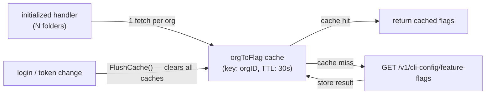
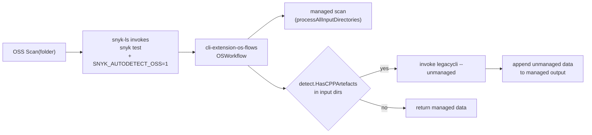

# Architecture Decisions

## Cache feature flags by org, not by folder

- **Ticket:** IDE-1898
- **Date:** 2026-05-28
- **Status:** Accepted

Note: diagram shows the feature-flag path only. SAST settings use two separate org-keyed caches (`orgToSastSettings` positive, 60s TTL; `orgToSastSettingsErr` negative, 60s TTL) that are also flushed on login.

**Decision.** Feature flags are scoped to a Snyk organisation, not to individual workspace folders. Both the feature-flag and SAST settings caches therefore use the org ID as the cache key. Fetching on every call (no cache) was rejected first: with N folders each calling `PopulateFolderConfig` on `initialized`, an uncached design makes N×M HTTP calls per startup cycle. Per-folder caching was rejected next because it stores N redundant copies of the same org's data, multiplies HTTP calls when the cache is cold, and requires folder-level invalidation on auth changes. The feature-flag positive TTL is 30 seconds, satisfying the 60-second observation bound required by IDE-1898. Feature flags have no separate negative-error cache. Each flag is fetched concurrently in its own goroutine; if a goroutine encounters an error (401, timeout, server error), it stores `false` for that specific flag in the shared per-org result map, while the other goroutines proceed independently. Once all goroutines finish, the entire per-org map (all flags for that org) is written to the cache under the org key. There is therefore no per-flag cache entry — the cache key is always the org ID — but a fetch error only affects the individual flag(s) whose goroutine failed; flags whose goroutines succeeded retain their correct values. All flags are stored in the positive cache for the same 30-second TTL. The SAST settings positive TTL is 60 seconds; the SAST negative-error TTL (for 401/network failures) is also 60 seconds. All caches are flushed synchronously on re-authentication so that a fresh login observes updated values without waiting for any TTL to expire (satisfying IDE-1898 Req 3).

## Auto-detect C/C++ workspaces delegated to the CLI OSS-flows extension

- **Ticket:** IDE-2089
- **Status:** Accepted

**Decision.** Detection of C/C++ artefacts and the decision to run an unmanaged scan now live in the CLI's `cli-extension-os-flows` (`pkg/unmanaged/detect.HasCPPArtefacts`, orchestrated in `OSWorkflow` behind the `SNYK_AUTODETECT_OSS` env var). snyk-ls sets that env var unconditionally when invoking the OSS CLI; the extension scans each input directory and, if any C/C++ artefacts are present, runs an extra unmanaged scan via the legacy CLI alongside the managed scan and appends its `workflow.Data` to the managed output. The previous snyk-ls–side prompt, per-folder `snyk_oss_unmanaged_enabled` toggle, `snyk_oss_unmanaged_prompted` latch, `EnableUnmanagedScanCommand`, and the panel sub-toggle were all removed: with detection and routing centralised in the extension, no per-folder IDE state is needed and no user interaction is required. Two alternatives were rejected: (a) keeping detection in snyk-ls and only moving the decision would split the logic across two repos with no benefit; (b) requiring users to opt in via a feature flag was rejected because the env var is set by snyk-ls — end users see the new behaviour automatically — and the extension treats the gate as off-by-default for direct CLI invocations, preserving existing CLI behaviour for non-IDE users.

**Limitation.** A native Go unmanaged workflow does not yet exist; the extension currently invokes the legacy TypeScript CLI to perform the unmanaged scan when C/C++ is detected. The legacy CLI's `workflow.Data` carries its own content type, so for mixed-content projects (manifest + C/C++) the unmanaged and managed results render as **separate sections** rather than as a single unified report. When a native `unmanaged.test` workflow is implemented, the extension can replace the legacy invocation and produce one merged structured output without changing snyk-ls behaviour.
