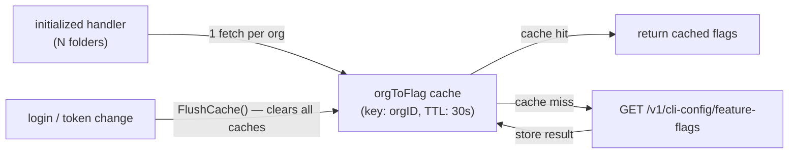
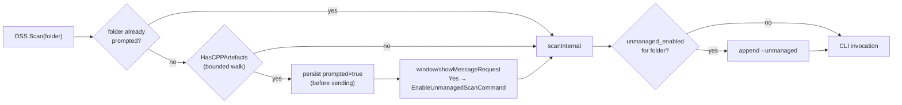

# Architecture Decisions

## Cache feature flags by org, not by folder

- **Ticket:** IDE-1898
- **Date:** 2026-05-28
- **Status:** Accepted

Note: diagram shows the feature-flag path only. SAST settings use two separate org-keyed caches (`orgToSastSettings` positive, 60s TTL; `orgToSastSettingsErr` negative, 60s TTL) that are also flushed on login.

**Decision.** Feature flags are scoped to a Snyk organisation, not to individual workspace folders. Both the feature-flag and SAST settings caches therefore use the org ID as the cache key. Fetching on every call (no cache) was rejected first: with N folders each calling `PopulateFolderConfig` on `initialized`, an uncached design makes N×M HTTP calls per startup cycle. Per-folder caching was rejected next because it stores N redundant copies of the same org's data, multiplies HTTP calls when the cache is cold, and requires folder-level invalidation on auth changes. The feature-flag positive TTL is 30 seconds, satisfying the 60-second observation bound required by IDE-1898. Feature flags have no separate negative-error cache. Each flag is fetched concurrently in its own goroutine; if a goroutine encounters an error (401, timeout, server error), it stores `false` for that specific flag in the shared per-org result map, while the other goroutines proceed independently. Once all goroutines finish, the entire per-org map (all flags for that org) is written to the cache under the org key. There is therefore no per-flag cache entry — the cache key is always the org ID — but a fetch error only affects the individual flag(s) whose goroutine failed; flags whose goroutines succeeded retain their correct values. All flags are stored in the positive cache for the same 30-second TTL. The SAST settings positive TTL is 60 seconds; the SAST negative-error TTL (for 401/network failures) is also 60 seconds. All caches are flushed synchronously on re-authentication so that a fresh login observes updated values without waiting for any TTL to expire (satisfying IDE-1898 Req 3).

## Auto-detect C/C++ workspaces and prompt once for unmanaged OSS scanning

- **Ticket:** IDE-2089
- **Date:** 2026-05-30
- **Status:** Accepted

**Decision.** Two folder-scoped settings drive unmanaged C/C++ scanning: `snyk_oss_unmanaged_enabled` (the toggle that adds `--unmanaged` to OSS scans) and `snyk_oss_unmanaged_prompted` (a local-only latch that records whether the user has already been asked). The auto-detect prompt runs at the top of `CLIScanner.Scan`, after the product-enabled and auth gates but before `scanInternal`, so the cost is paid once per scan and never blocks the scan itself (the prompt is fire-and-forget; the user's choice applies to subsequent scans). Detection is a bounded `filepath.WalkDir` (max 5000 entries, max depth 6, skipping `node_modules`, `vendor`, `cmake-build-*`, VCS dirs, common build outputs) that short-circuits on the first C/C++ file extension, recognised build-system filename, or `*.mk`. Both settings are deliberately local-only — neither appears in `ldxSyncSettingKeyMap`, and neither carries a GAF `AnnotationRemoteKey`. Two alternatives were rejected: (a) syncing the toggle through LDX-sync would require backend schema work and an org-level UI before any user benefit, and the v1 goal is purely local discoverability; (b) prompting from a workspace-open hook instead of from `Scan` was rejected because it would fire on folders the user never scans, generating prompt fatigue. The prompted-latch is persisted *before* the `ShowMessageRequest` is sent so that a crash or missed callback mid-prompt cannot cause a re-prompt on the next scan; the trade-off is that a user who dismisses the prompt without answering will never see it again unless they manually clear the setting, which is the desired behaviour.
