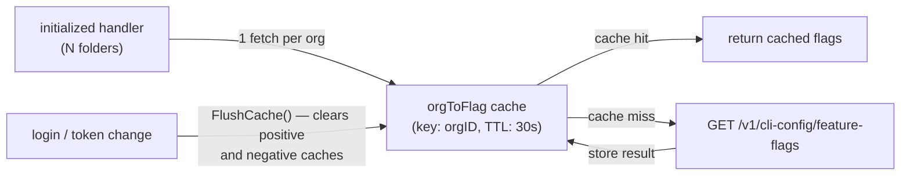

# Architecture Decisions

## Cache feature flags by org, not by folder

- **Ticket:** IDE-1898
- **Date:** 2026-05-28
- **Status:** Accepted

**Decision.** Feature flags are scoped to a Snyk organisation, not to individual workspace folders. The feature-flag cache therefore uses the org ID as its key. Fetching on every call (no cache) was rejected first: with N folders each calling `PopulateFolderConfig` on `initialized`, an uncached design makes N×M HTTP calls per startup cycle. Per-folder caching was rejected next because it stores N redundant copies of the same org's flags, multiplies HTTP calls when the cache is cold, and requires folder-level invalidation on auth changes. The positive cache TTL is 30 seconds, satisfying the 60-second observation bound required by IDE-1898. The negative-error cache (401/network failure) uses a 1-minute TTL to avoid aggressive retries; it is flushed synchronously on any re-authentication event so that a fresh login observes updated flags without waiting for the error TTL to expire (satisfying IDE-1898 Req 3). The SAST settings cache follows the same org-keyed strategy for the same reasons.
