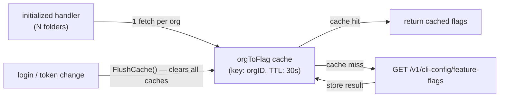
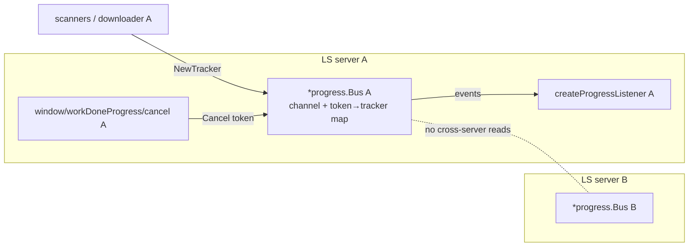
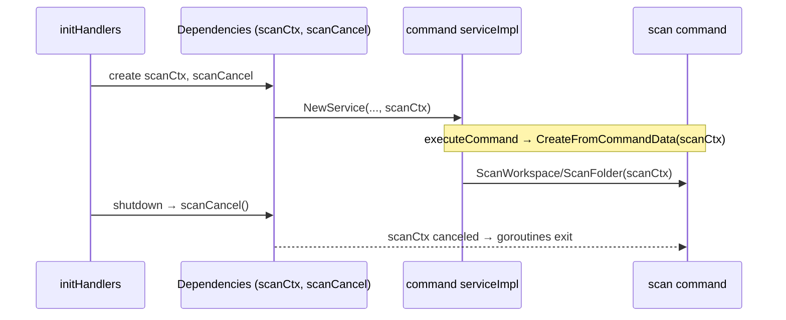
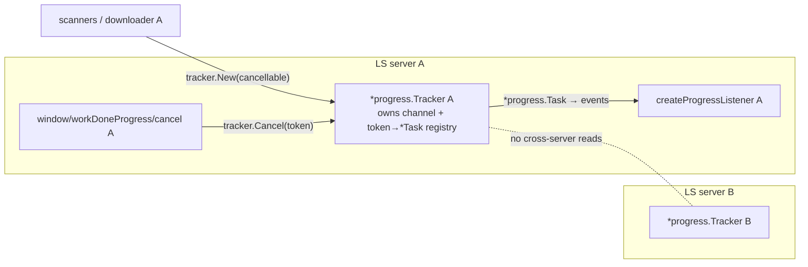

# Architecture Decisions

## Cache feature flags by org, not by folder

- **Ticket:** IDE-1898
- **Date:** 2026-05-28
- **Status:** Accepted



Note: diagram shows the feature-flag path only. SAST settings use two separate org-keyed caches (`orgToSastSettings` positive, 60s TTL; `orgToSastSettingsErr` negative, 60s TTL) that are also flushed on login.

**Decision.** Feature flags are scoped to a Snyk organisation, not to individual workspace folders. Both the feature-flag and SAST settings caches therefore use the org ID as the cache key. Fetching on every call (no cache) was rejected first: with N folders each calling `PopulateFolderConfig` on `initialized`, an uncached design makes N×M HTTP calls per startup cycle. Per-folder caching was rejected next because it stores N redundant copies of the same org's data, multiplies HTTP calls when the cache is cold, and requires folder-level invalidation on auth changes. The feature-flag positive TTL is 30 seconds, satisfying the 60-second observation bound required by IDE-1898. Feature flags have no separate negative-error cache. Each flag is fetched concurrently in its own goroutine; if a goroutine encounters an error (401, timeout, server error), it stores `false` for that specific flag in the shared per-org result map, while the other goroutines proceed independently. Once all goroutines finish, the entire per-org map (all flags for that org) is written to the cache under the org key. There is therefore no per-flag cache entry — the cache key is always the org ID — but a fetch error only affects the individual flag(s) whose goroutine failed; flags whose goroutines succeeded retain their correct values. All flags are stored in the positive cache for the same 30-second TTL. The SAST settings positive TTL is 60 seconds; the SAST negative-error TTL (for 401/network failures) is also 60 seconds. All caches are flushed synchronously on re-authentication so that a fresh login observes updated values without waiting for any TTL to expire (satisfying IDE-1898 Req 3).

## Replace global progress channel + tracker registry with a per-server progress.Bus

- **Ticket:** IDE-2036
- **Date:** 2026-06-15
- **Status:** Superseded by "Surface the per-server progress owner as progress.Tracker" (2026-06-15)



**Decision.** The process-global `progress.ToServerProgressChannel` and the process-global `trackers` map + `trackersMutex` are replaced by a per-server `*progress.Bus` value that owns both the progress channel and the token→tracker registry, exposing `NewTracker`/`Cancel`/`IsCanceled`/`Channel` as methods. Two alternatives were rejected: (1) token namespacing while keeping one global map — rejected because it does not remove the global and so fails the PR's "no unapproved globals" acceptance gate; (2) a registry threaded separately from the channel (two values) — rejected because the channel and its registry are always created and owned together, so bundling them into one Bus threads a single value and gives the LSP cancel handler one per-server object to resolve tokens against (via the existing `mustXFromContext` pattern). The Bus is created in `buildDependencies`, stored on `Dependencies`, and resolved from request context by the cancel handler; no process-global remains. The one possible exception is the GAF extension-mode UI tracker (one GAF engine per process): it is wired to the running server's Bus if feasible, else keeps a dedicated standalone Bus explicitly annotated `APPROVED-KEEP`, which still does not reintroduce the deleted global.

## Inject server-lifetime scanCtx into the command service for background scans

- **Ticket:** IDE-2036
- **Date:** 2026-06-15
- **Status:** Accepted



**Decision.** Background scans spawned by workspace-scan, workspace-folder-scan, and clear-cache commands must outlive the JSON-RPC request that triggered them but must stop on server shutdown. The per-request context is unusable because the command executor cancels it when the command returns (today the commands work around this with `context.Background()`, which never cancels and so leaks scan goroutines that hold workspace file handles — the Windows temp-dir cleanup race). The chosen design threads a single server-lifetime `scanCtx` (owned by `Dependencies`, cancelled by the shutdown handler) into `command.NewService` at construction; scan commands read this `scanCtx` for their un-awaited goroutines instead of `context.Background()`. Sourcing scanCtx from the per-request context was rejected (cancelled too early); creating a fresh `context.Background()` per command was rejected (never cancelled — the current bug). Ownership lives in `Dependencies` (rather than only in `initHandlers`) so the same context flows to both the LSP handlers and the command service from one place.

## Surface the per-server progress owner as progress.Tracker (rename per-operation handle to progress.Task)

- **Ticket:** IDE-2036
- **Date:** 2026-06-15
- **Status:** Accepted (supersedes the `progress.Bus` decision above)
- **Deciders:** architect agent + PR author (explicitly rejected the name "Bus"; requires "merged and surfaced as progress.Tracker") + [human confirmation pending]



**Context.** The superseded decision bundled the per-server progress channel + token→tracker registry into a value named `*progress.Bus`. The PR author rejected "Bus" and requires the per-server owner be **surfaced as `progress.Tracker`**. This collides with the EXISTING `progress.Tracker` type, which today is the per-operation progress handle (token, cancel channel, ~280 lines of `ui.ProgressBar` methods: Begin/Report/End/Clear/CancelOrDone). The question is which name binds to which responsibility.

**Decision.** Adopt **Option N1**: `progress.Tracker` becomes the per-server **owner** (channel + token→handle registry); the existing per-operation handle is renamed to **`progress.Task`**. The owner is created once per server in `buildDependencies`, stored on `di.Dependencies` (replacing the `ProgressChannel chan` field with a `*progress.Tracker` field), injected into request context by `withContext` under a new `ctx2.DepProgressTracker` key, and resolved by the `window/workDoneProgress/cancel` handler via a new `mustProgressTrackerFromContext(ctx)`. No process-global remains.

Owner type shape:

```go
// progress.Tracker — per-server owner of the progress channel + live-task registry.
type Tracker struct {
    channel chan types.ProgressParams         // was the global ToServerProgressChannel
    tasks   map[types.ProgressToken]*Task     // was the global trackers map
    mu      sync.RWMutex                       // was trackersMutex
    logger  *zerolog.Logger
}

func NewTracker(logger *zerolog.Logger) *Tracker                 // owner ctor; allocates channel (cap 1000) + map
func NewTrackerWithChannel(ch chan types.ProgressParams, logger *zerolog.Logger) *Tracker // owner ctor over a caller-supplied channel (tests/drainers)
func (t *Tracker) Channel() chan types.ProgressParams            // for createProgressListener
func (t *Tracker) New(cancellable bool) *Task                    // create + register a per-operation Task on this owner's channel
func (t *Tracker) Cancel(token types.ProgressToken)             // method form of the deleted package func
func (t *Tracker) IsCanceled(token types.ProgressToken) bool
func (t *Tracker) register(task *Task)                           // internal; was trackers[token]=t
func (t *Tracker) delete(token types.ProgressToken)             // internal; was deleteTracker
```

Per-operation handle (renamed, behaviour unchanged):

```go
// progress.Task — one in-flight progress operation. Implements ui.ProgressBar.
type Task struct {
    owner         *Tracker            // back-reference so Clear/CancelOrDone deregister without a global
    channel       chan types.ProgressParams
    cancelChannel chan bool
    token         types.ProgressToken
    cancellable   bool
    // ...unchanged: lastReport, lastReportPercentage, finished, lastMessage, m, logger
}
var _ ui.ProgressBar = (*Task)(nil)
// All existing methods move verbatim: Begin/BeginWithMessage/BeginUnquantifiableLength,
// Report/ReportWithMessage/UpdateProgress/SetTitle, End/EndWithMessage/Clear,
// CancelOrDone, GetToken/GetChannel/GetCancelChannel, IsCanceled (now t.owner.IsCanceled(t.token)).
// deleteTracker → t.owner.delete(t.token). Self-cancel in code.go uses t.owner.Cancel(t.token)
// (or, cleaner, a t.SelfCancel() that signals its own cancelChannel — no registry lookup needed).
```

**Rationale.** N1 is the only shape that literally satisfies "surfaced as `progress.Tracker`": the per-server object a caller and the cancel handler hold is typed `*progress.Tracker`. The decisive factor is the author's explicit naming constraint — N2 (keep `Tracker` as the handle, name the owner `TrackerFactory`/`Trackers`) does NOT surface the owner as `progress.Tracker` and so fails the constraint. On churn, N1 is cheap: the per-operation type is referenced by name in only **two production files** (`infrastructure/cli/install/downloader.go` ×4, `infrastructure/code/code.go:400` `UploadAndAnalyze` param) and **zero `_test.go` files reference `progress.Tracker` as a type** — they only pass `progress.ToServerProgressChannel` as a channel argument, which is migrated independently. The `ui.ProgressBar` implementation moves with the type body unchanged. "Tracker" is also the more natural English name for a long-lived registry that tracks many tasks, and "Task" is the natural name for one unit of work — so N1 improves naming clarity, not just satisfies the constraint.

**Token cancellation resolves per-server with no global.** `window/workDoneProgress/cancel` reads `mustProgressTrackerFromContext(ctx).Cancel(params.Token)`; the context carries this server's `*progress.Tracker` (injected by `withContext` exactly like every other dep), so a token only resolves against the owner that minted it. Self-cancellation inside the Code scanner (`code.go:292,405`) calls `t.owner.Cancel(t.token)` (or `t.SelfCancel()`), never a package func.

**Migration — expand→contract (Strangler Fig); never a wide rename in one step:**
1. **Expand.** Add `progress.Task` as the renamed per-operation type and `progress.Tracker` as the new owner, both alongside the legacy global symbols, so the tree compiles at every step. Keep `ToServerProgressChannel`, global `trackers`, `Cancel`/`IsCanceled`/`CleanupChannels`, and legacy `NewTracker()` temporarily.
2. **Migrate production.** `buildDependencies` creates one `*progress.Tracker` (owner) and passes `owner.Channel()` to the four scanner constructors (signatures already take a channel — no scanner change). Store the owner on `di.Dependencies` (replace the `ProgressChannel chan` field with `ProgressTracker *progress.Tracker`; `createProgressListener` consumes `deps.ProgressTracker.Channel()`). Add `ctx2.DepProgressTracker` + inject in `withContext` + `mustProgressTrackerFromContext`. Repoint the cancel handler. Update `Init()` / `RealDependencies()` to construct an owner instead of reading the global.
3. **Migrate ~73 test callsites + drainers.** Each test currently passing `progress.ToServerProgressChannel` to a scanner constructor switches to a per-test owner: `tr := progress.NewTracker(logger)`; pass `tr.Channel()`. **Deadlock-avoidance requirement (mandatory):** every per-test channel must have a drainer goroutine, because scanner `send` does a blocking `ch <- params` on a cap-1000 channel — an undrained per-test channel will block the scanner once full. The real-server path already drains via `createProgressListener`; tests that don't start a server must spawn a drain loop (the existing `internal/testutil/test_setup.go` global-channel drainers at lines 162/221/264 become per-owner drainers). Tests asserting "did NOT write to the global" (e.g. `iac_test.go:488`, `cli_scanner_test.go:585`, `code_tracker_test.go:130`) are rewritten to assert routing to the per-test owner's channel.
4. **Contract (delete).** Once no caller references them, DELETE `ToServerProgressChannel`, global `trackers` + `trackersMutex`, package funcs `Cancel`/`IsCanceled`/`CleanupChannels`, and legacy `NewTracker()`. The `gochecknoglobals` whitelist entries for these three globals are removed. This is the acceptance gate: `rg "ToServerProgressChannel|^var trackers"` returns nothing.

**Two legacy `NewTracker()` callers needing explicit handling:**
- `infrastructure/cli/install/downloader.go:45` — `NewDownloader` calls `progress.NewTracker(true, logger)` for the global channel. The `Downloader` is built by `install.Installer` (`installer.go:88,114`), which is constructed in `buildDependencies` (`localInstaller := install.NewInstaller(...)`). Thread the per-server owner through: `NewInstaller(..., progressTracker *progress.Tracker)` → store on `Install` → `NewDownloader(..., progressTracker)` → `d.progressTracker = owner.New(true)` (a `*progress.Task`). The `downloader.go` `*progress.Tracker` field/params (4 sites) become `*progress.Task`. This removes the last production `NewTracker()`/global dependency from the downloader.
- `ls_extension/language_server_workflow.go:110` — GAF extension-mode UI tracker: `user_interface.WithProgressBar(progress.NewTracker(true, logger))`. One GAF engine per process, wired before `server.Start`. Preferred: construct a dedicated owner here (`uiOwner := progress.NewTracker(logger)`) and pass `uiOwner.New(true)` as the `ui.ProgressBar`; if that owner can be the same one the server later uses, wire it through; otherwise this standalone owner is explicitly annotated `APPROVED-KEEP` (it is a per-process value, NOT a reintroduced package-global, so it does not violate the no-globals gate).

**Consequences.**
- **Positive:** the per-server object is exactly `*progress.Tracker` as the author requires; the global channel + registry are fully deleted; cancellation is server-scoped by construction (a token from server A can never be cancelled via server B); naming reads naturally (Tracker tracks Tasks).
- **Negative / trade-off:** every per-operation reference (`*progress.Tracker` → `*progress.Task`) and ~73 test callsites churn in one PR; the rename touches a widely-imported package, so the expand→contract discipline is mandatory to keep the tree green.
- **Constraints on future decisions:** "Tracker" is now reserved for the per-server owner; any future per-operation concept must use "Task" (or another name) — not "Tracker". New scanners/UI surfaces must obtain their handle via `tracker.New(...)`, never a package-level constructor.

**Rejected alternatives.**

| Option | Rejected because |
|--------|------------------|
| N2 — keep `Tracker` as the per-operation handle; name the owner `TrackerFactory`/`Trackers` | Does not surface the owner as `progress.Tracker`; violates the author's explicit constraint ("merged and surfaced as progress.Tracker"). |
| `progress.Bus` (superseded decision) | Author explicitly rejected the name "Bus". |
| Token namespacing with one retained global map | Does not remove the global; fails the PR's no-unapproved-globals acceptance gate. |
| Registry threaded as a value separate from the channel (two values) | Channel and its registry are always created and owned together; two values give the cancel handler two things to resolve instead of one. |
| Introduce a new structural pattern (Mediator/Blackboard/Space-based) | Codebase already uses pub/sub (channel + listener) + per-server DI for this; a second pattern violates consistency-over-novelty and adds ceremony without solving anything the direct approach doesn't. |
