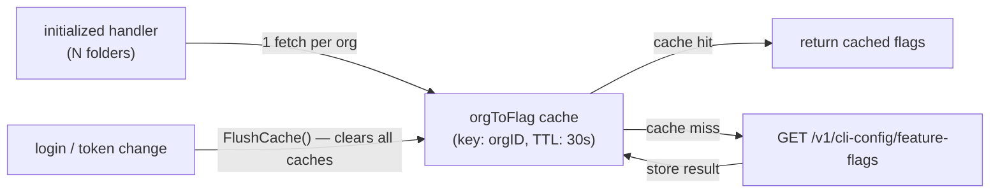

# Architecture Decisions

## Cache feature flags by org, not by folder

- **Ticket:** IDE-1898
- **Date:** 2026-05-28
- **Status:** Accepted

Note: diagram shows the feature-flag path only. SAST settings use two separate org-keyed caches (`orgToSastSettings` positive, 60s TTL; `orgToSastSettingsErr` negative, 60s TTL) that are also flushed on login.

**Decision.** Feature flags are scoped to a Snyk organisation, not to individual workspace folders. Both the feature-flag and SAST settings caches therefore use the org ID as the cache key. Fetching on every call (no cache) was rejected first: with N folders each calling `PopulateFolderConfig` on `initialized`, an uncached design makes N×M HTTP calls per startup cycle. Per-folder caching was rejected next because it stores N redundant copies of the same org's data, multiplies HTTP calls when the cache is cold, and requires folder-level invalidation on auth changes. The feature-flag positive TTL is 30 seconds, satisfying the 60-second observation bound required by IDE-1898. Feature flags have no separate negative-error cache — any fetch error (401, timeout, server error) causes the affected flag to be stored as `false` in the positive cache for the same 30-second TTL. The SAST settings positive TTL is 60 seconds; the SAST negative-error TTL (for 401/network failures) is also 60 seconds. All caches are flushed synchronously on re-authentication so that a fresh login observes updated values without waiting for any TTL to expire (satisfying IDE-1898 Req 3).
