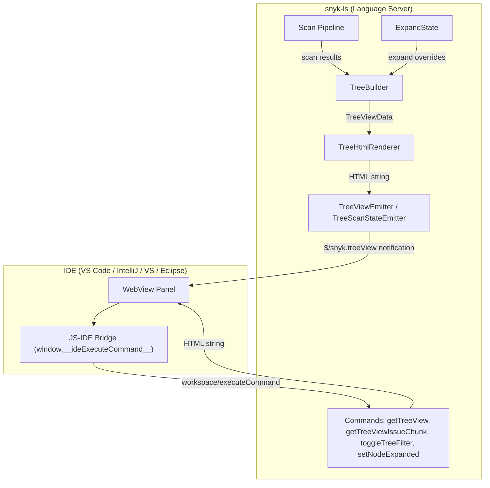
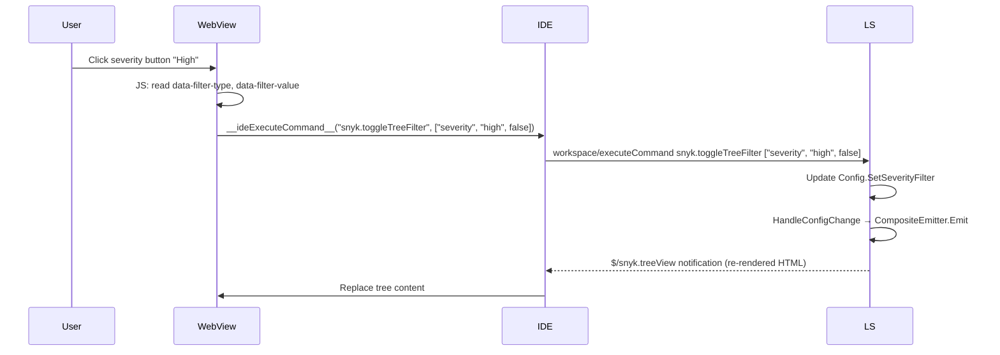
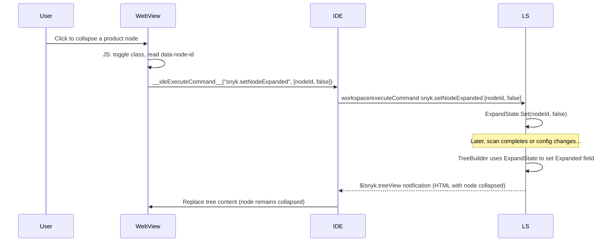

## Server-Driven HTML Tree View

The tree view displays Snyk scan results in a hierarchical panel rendered as an HTML web view inside each IDE. The HTML is produced entirely by snyk-ls using Go `html/template`, following the same pattern as the scan summary and configuration dialog.

### Architecture



### Tree Hierarchy

The tree follows a four-level hierarchy:

1. **Folder** (only for multi-root workspaces)
2. **Product** (Snyk Code, Snyk Open Source, Snyk IaC)
3. **File** (relative path, issue count)
4. **Issue** (title, severity icon, badges for ignored/new/fixable)

### Packages and Files

| File | Purpose |
|------|---------|
| `domain/ide/treeview/tree_node.go` | `TreeNode`, `TreeViewData`, `TreeViewFilterState` types |
| `domain/ide/treeview/tree_builder.go` | Builds tree hierarchy from workspace issue data |
| `domain/ide/treeview/tree_html.go` | Renders `TreeViewData` into HTML using `html/template` |
| `domain/ide/treeview/tree_emitter.go` | Sends `$/snyk.treeView` notifications |
| `domain/ide/treeview/tree_scan_emitter.go` | Adapts scan state changes to tree view updates |
| `domain/ide/treeview/template/tree.html` | HTML template with filter toolbar and tree nodes |
| `domain/ide/treeview/template/styles.css` | IE11-compatible CSS |
| `domain/ide/treeview/expand_state.go` | LS-side expand/collapse state persistence |
| `domain/ide/treeview/template/tree.js` | ES5 expand/collapse, lazy-loading, filter toggle handlers |
| `domain/ide/command/get_tree_view.go` | `snyk.getTreeView` command (on-demand full HTML) |
| `domain/ide/command/get_tree_view_issue_chunk.go` | `snyk.getTreeViewIssueChunk` command (paginated issues) |
| `domain/ide/command/toggle_tree_filter.go` | `snyk.toggleTreeFilter` command (severity/issueView toggles) |
| `domain/ide/command/set_node_expanded.go` | `snyk.setNodeExpanded` command (expand/collapse persistence) |
| `domain/ide/treeview/template/js-tests/` | JSDOM-based JS runtime tests for `tree.js` (run via `make test-js`) |
| `application/server/server_smoke_treeview_test.go` | Smoke tests for tree view commands and notifications |

### LSP Commands

#### `snyk.getTreeView`

Returns the full tree view HTML. Used for initial load or manual refresh.

**Arguments:** none

**Returns:** HTML string

#### `snyk.getTreeViewIssueChunk`

Returns a paginated chunk of issue nodes for a specific file and product.

**Arguments:** `[{ filePath: string, product: string, range: { start: number, end: number } }]`

**Returns:** `{ issueNodesHtml: string, totalFileIssues: number, hasMore: boolean, nextStart: number }`

#### `snyk.toggleTreeFilter`

Toggles a filter setting. The updated tree HTML is pushed via `$/snyk.treeView` notification (not returned directly).

**Arguments:** `[filterType: string, filterValue: string, enabled: boolean]`

- `filterType`: `"severity"` or `"issueView"`
- `filterValue`: for severity: `"critical"`, `"high"`, `"medium"`, `"low"`; for issueView: `"openIssues"`, `"ignoredIssues"`
- `enabled`: `true` to enable, `false` to disable

**Returns:** `null`

#### `snyk.setNodeExpanded`

Persists the expand/collapse state of a tree node. Called by `tree.js` whenever the user expands or collapses a node. The LS stores this state and applies it on subsequent tree re-renders so the tree retains its layout.

**Arguments:** `[nodeID: string, expanded: boolean]`

**Returns:** `null`

### LSP Notification

#### `$/snyk.treeView`

Pushed whenever scan results change. Payload:

```json
{
  "treeViewHtml": "<html>...</html>",
  "totalIssues": 42
}
```

### JS-IDE Bridge

The tree view HTML includes `${ideScript}` placeholder for IDE-specific bridge code. IDEs implement **one** function:

```javascript
window.__ideExecuteCommand__ = function(command, args, callback) {
  // Send workspace/executeCommand { command, arguments: args } to the LS.
  // If callback is provided, pass the result to callback(result).
};
```

`tree.js` calls this function for all JS→IDE communication:

| Call | Command | Args |
|------|---------|------|
| Issue click | `snyk.navigateToRange` | `[filePath, { start: { line, character }, end: { line, character } }]` |
| Filter toggle | `snyk.toggleTreeFilter` | `[filterType, filterValue, enabled]` |
| Chunk request | `snyk.getTreeViewIssueChunk` | `[requestId, filePath, product, start, end]` |
| Expand/collapse | `snyk.setNodeExpanded` | `[nodeID, expanded]` |

The IDE→JS callback `window.__onIdeTreeIssueChunk__(requestId, payload)` is still used by the IDE to deliver chunk responses into the WebView.

### Filter Architecture



### Expand/Collapse State Persistence

Node expand/collapse state is persisted in the LS via `ExpandState`. Node IDs are deterministic (derived from folder path, product, file path, issue ID) so state survives tree re-renders.



### Issue Sorting

Issues are sorted by `sortIssuesByPriority` which uses a weighted formula:
1. Severity (Critical > High > Medium > Low)
2. Product-specific score (`GetScore()` from `IssueAdditionalData`)
3. Issue ID as tie-breaker

### Build & Test

The `Makefile` includes dedicated targets:

- `make test` — runs JS tests (`test-js`) first, then all Go tests
- `make test-js` — runs the JSDOM-based JS runtime tests with `--experimental-test-coverage`
- `SMOKE_TESTS=1 make test -run Test_SmokeTreeView` — runs the end-to-end smoke tests against a real Snyk backend

### Performance

- **Collapsed by default**: file nodes start collapsed; issues load on expand
- **Lazy loading**: `snyk.getTreeViewIssueChunk` fetches issues in pages of 100
- **Auto-expand**: trees with <= 50 total issues auto-expand progressively
- **State persistence**: expand/collapse state survives re-renders via `ExpandState` in the LS

### IE11 Compatibility

All JS is ES5 (no arrow functions, no `const`/`let`, no template literals). CSS uses no variables, no grid, no `:focus-visible`. The `<meta http-equiv='X-UA-Compatible' content='IE=edge' />` tag is included.

### Test Scenarios

**Unit tests (`make test`):**
- Tree builder: empty, single, multi-folder, filtered, sorted, TotalIssues computation, deterministic IDs, expand state defaults + overrides
- HTML renderer: valid output, node rendering, filter toolbar, lazy-load attributes, issue chunks
- Emitter: notification sent, TotalIssues propagated
- ExpandState: set/get, defaults by node type, overrides, concurrent access
- Commands: getTreeView, getTreeViewIssueChunk, toggleTreeFilter (severity + issueView + error cases), setNodeExpanded

**JS runtime tests (`make test-js`, also run as part of `make test`):**

Located in `domain/ide/treeview/template/js-tests/tree-runtime.test.mjs`. These use JSDOM to execute `tree.js` in a browser-like environment and verify all interactive behaviors:

| Test | Covers |
|------|--------|
| LS-rendered expanded file node stays expanded | verifies LS-side auto-expand is preserved by JS (no client-side re-expand) |
| load-more click | `findAncestor`, `parseIntSafe`, append chunk request |
| expand/collapse toggle | click handler toggle logic, `findChildrenContainer` |
| issue node click → navigation | `snyk.navigateToRange` via `__ideExecuteCommand__` bridge |
| filter active → toggle off | filter toolbar click with `filter-active` class, `enabled=false` |
| filter inactive → toggle on | filter toolbar click without `filter-active`, `enabled=true` |
| chunk callback injects HTML | `__onIdeTreeIssueChunk__`, `clearLoadingRow`, attribute updates |
| chunk with hasMore | `data-next-start` attribute set |
| already-loaded skip | `maybeLoadIssuesForFileNode` early return when `data-issues-loaded="true"` |
| string payload parsing | JSON.parse branch in `__onIdeTreeIssueChunk__` |

Run JS tests standalone: `make test-js`

**Smoke tests (`SMOKE_TESTS=1 make test -run Test_SmokeTreeView`):**

Located in `application/server/server_smoke_treeview_test.go`. These run against a real Snyk backend using the `nodejs-goof` test repository:

| Test | Covers |
|------|--------|
| tree view notification received after scan | `$/snyk.treeView` notification emitted with valid HTML and `TotalIssues > 0` |
| getTreeView command returns HTML | `snyk.getTreeView` returns full HTML with product nodes and file nodes |
| toggleTreeFilter disables low severity | `snyk.toggleTreeFilter` toggles severity filter and triggers `$/snyk.treeView` notification |
| getTreeViewIssueChunk returns issues | `snyk.getTreeViewIssueChunk` returns paginated issues with HTML fragment |
