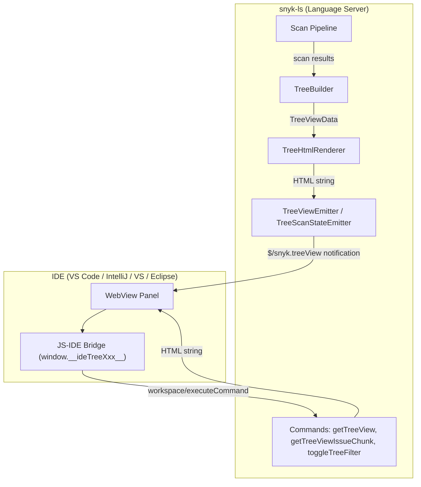
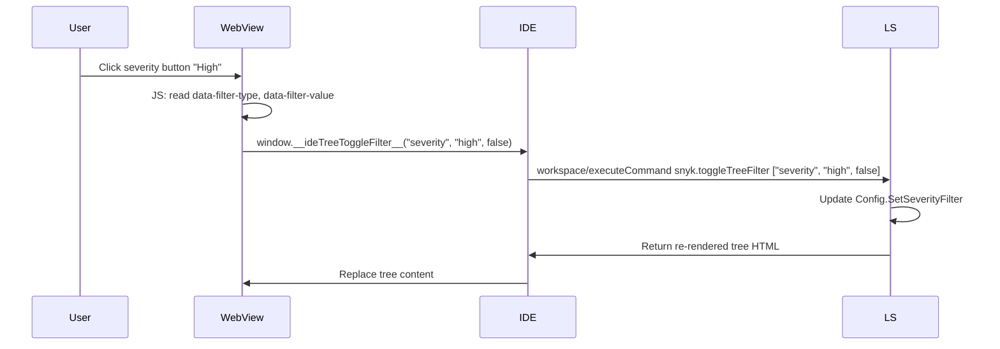

## Server-Driven HTML Tree View

The tree view displays Snyk scan results in a hierarchical panel rendered as an HTML web view inside each IDE. The HTML is produced entirely by snyk-ls using Go `html/template`, following the same pattern as the scan summary and configuration dialog.

### Architecture



### Tree Hierarchy

The tree follows a four-level hierarchy:

1. **Folder** (only for multi-root workspaces)
2. **Product** (Snyk Code, Snyk Open Source, Snyk IaC)
3. **File** (relative path, issue count)
4. **Issue** (title, severity icon, badges for ignored/new/fixable)

### Packages and Files

| File | Purpose |
|------|---------|
| `domain/ide/treeview/tree_node.go` | `TreeNode`, `TreeViewData`, `TreeViewFilterState` types |
| `domain/ide/treeview/tree_builder.go` | Builds tree hierarchy from workspace issue data |
| `domain/ide/treeview/tree_html.go` | Renders `TreeViewData` into HTML using `html/template` |
| `domain/ide/treeview/tree_emitter.go` | Sends `$/snyk.treeView` notifications |
| `domain/ide/treeview/tree_scan_emitter.go` | Adapts scan state changes to tree view updates |
| `domain/ide/treeview/template/tree.html` | HTML template with filter toolbar and tree nodes |
| `domain/ide/treeview/template/styles.css` | IE11-compatible CSS |
| `domain/ide/treeview/template/tree.js` | ES5 expand/collapse, lazy-loading, filter toggle handlers |
| `domain/ide/command/get_tree_view.go` | `snyk.getTreeView` command (on-demand full HTML) |
| `domain/ide/command/get_tree_view_issue_chunk.go` | `snyk.getTreeViewIssueChunk` command (paginated issues) |
| `domain/ide/command/toggle_tree_filter.go` | `snyk.toggleTreeFilter` command (severity/issueView toggles) |

### LSP Commands

#### `snyk.getTreeView`

Returns the full tree view HTML. Used for initial load or manual refresh.

**Arguments:** none

**Returns:** HTML string

#### `snyk.getTreeViewIssueChunk`

Returns a paginated chunk of issue nodes for a specific file and product.

**Arguments:** `[{ filePath: string, product: string, range: { start: number, end: number } }]`

**Returns:** `{ issueNodesHtml: string, totalFileIssues: number, hasMore: boolean, nextStart: number }`

#### `snyk.toggleTreeFilter`

Toggles a filter setting and returns re-rendered tree HTML.

**Arguments:** `[filterType: string, filterValue: string, enabled: boolean]`

- `filterType`: `"severity"` or `"issueView"`
- `filterValue`: for severity: `"critical"`, `"high"`, `"medium"`, `"low"`; for issueView: `"openIssues"`, `"ignoredIssues"`
- `enabled`: `true` to enable, `false` to disable

**Returns:** HTML string (updated tree)

### LSP Notification

#### `$/snyk.treeView`

Pushed whenever scan results change. Payload:

```json
{
  "treeViewHtml": "<html>...</html>",
  "totalIssues": 42
}
```

### JS-IDE Bridge Functions

The tree view HTML includes `${ideScript}` placeholder for IDE-specific bridge code. IDEs implement these `window` functions:

| Function | Purpose |
|----------|---------|
| `window.__ideTreeNavigateToFile__(filePath, startLine, endLine, startChar, endChar)` | Navigate to file at position |
| `window.__ideTreeToggleFilter__(filterType, filterValue, enabled)` | Toggle filter via `snyk.toggleTreeFilter` command |
| `window.__ideTreeRequestIssueChunk__(requestId, filePath, product, start, end)` | Request paginated issues via `snyk.getTreeViewIssueChunk` |
| `window.__onIdeTreeIssueChunk__(requestId, payload)` | Callback for received issue chunks |

### Filter Architecture



### Issue Sorting

Issues are sorted by `sortIssuesByPriority` which uses a weighted formula:
1. Severity (Critical > High > Medium > Low)
2. Product-specific score (`GetScore()` from `IssueAdditionalData`)
3. Issue ID as tie-breaker

### Performance

- **Collapsed by default**: file nodes start collapsed; issues load on expand
- **Lazy loading**: `snyk.getTreeViewIssueChunk` fetches issues in pages of 100
- **Auto-expand**: trees with <= 50 total issues auto-expand progressively

### IE11 Compatibility

All JS is ES5 (no arrow functions, no `const`/`let`, no template literals). CSS uses no variables, no grid, no `:focus-visible`. The `<meta http-equiv='X-UA-Compatible' content='IE=edge' />` tag is included.

### Test Scenarios

**Unit tests:**
- Tree builder: empty, single, multi-folder, filtered, sorted, TotalIssues computation
- HTML renderer: valid output, node rendering, filter toolbar, lazy-load attributes, issue chunks
- Emitter: notification sent, TotalIssues propagated
- Commands: getTreeView, getTreeViewIssueChunk, toggleTreeFilter (severity + issueView + error cases)

**JS runtime tests:**
- `domain/ide/treeview/template/js-tests/tree-runtime.test.mjs` — expand/collapse, lazy-load request, auto-expand behavior
