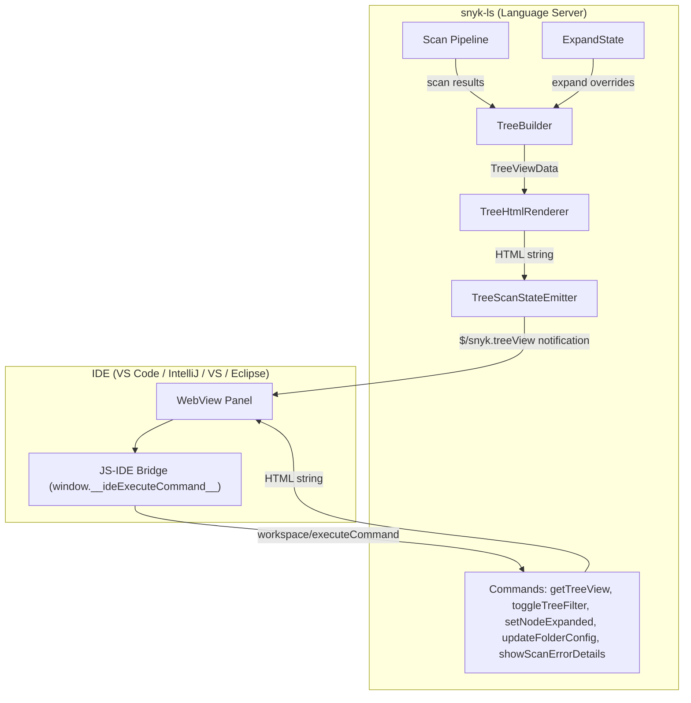
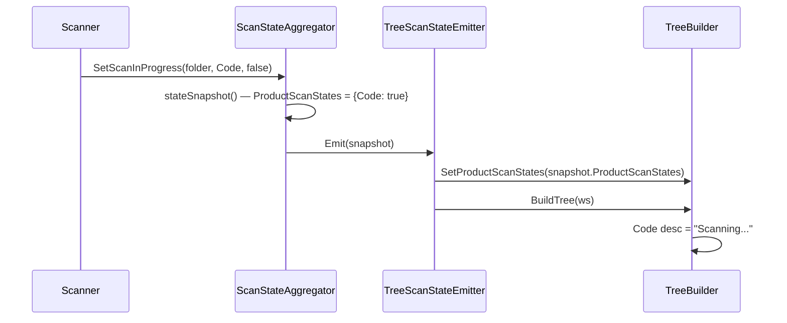
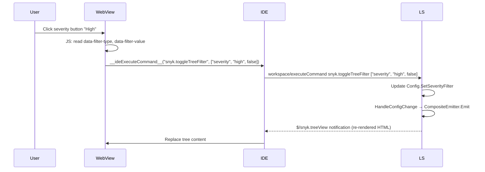
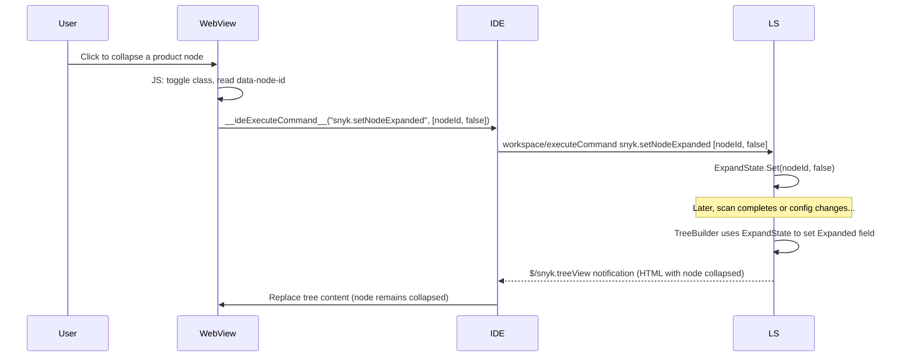

## Server-Driven HTML Tree View

The tree view displays Snyk scan results in a hierarchical panel rendered as an HTML web view inside each IDE. The HTML is produced entirely by snyk-ls using Go `html/template`, following the same pattern as the scan summary and configuration dialog.

### Architecture



### Tree Hierarchy

The tree follows a four-level hierarchy:

1. **Folder** (only for multi-root workspaces)
2. **Product** (Open Source, Code Security, Infrastructure As Code)
3. **File** (relative path, issue count)
4. **Issue** (title, severity icon, badges for ignored/new/fixable)

### Packages and Files

| File | Purpose |
|------|---------|
| `domain/ide/treeview/tree_node.go` | `TreeNode`, `TreeViewData`, `TreeViewFilterState` types |
| `domain/ide/treeview/tree_builder.go` | Builds tree hierarchy from workspace issue data |
| `domain/ide/treeview/tree_html.go` | Renders `TreeViewData` into HTML using `html/template` |
| `domain/ide/treeview/tree_scan_emitter.go` | Adapts scan state changes to tree view updates (sends `$/snyk.treeView`) |
| `domain/ide/treeview/template/tree.html` | HTML template with filter toolbar and tree nodes |
| `domain/ide/treeview/template/styles.css` | IE11-compatible CSS |
| `domain/ide/treeview/expand_state.go` | LS-side expand/collapse state persistence |
| `domain/ide/treeview/template/tree.js` | ES5 expand/collapse, filter toggle handlers |
| `domain/ide/command/get_tree_view.go` | `snyk.getTreeView` command (on-demand full HTML) |
| `domain/ide/command/toggle_tree_filter.go` | `snyk.toggleTreeFilter` command (severity/issueView toggles) |
| `domain/ide/command/set_node_expanded.go` | `snyk.setNodeExpanded` command (expand/collapse persistence) |
| `domain/ide/command/update_folder_config.go` | `snyk.updateFolderConfig` command (delta reference updates) |
| `domain/ide/command/navigate_to_range.go` | `snyk.navigateToRange` command (navigation + detail panel) |
| `domain/ide/treeview/template/js-tests/` | JSDOM-based JS runtime tests for `tree.js` (run via `make test-js`) |
| `application/server/server_smoke_treeview_test.go` | Smoke tests for tree view commands and notifications |

### LSP Commands

#### `snyk.getTreeView`

Returns the full tree view HTML. Used for initial load or manual refresh.

**Arguments:** none

**Returns:** HTML string

#### `snyk.toggleTreeFilter`

Toggles a filter setting. The updated tree HTML is pushed via `$/snyk.treeView` notification (not returned directly).

**Arguments:** `[filterType: string, filterValue: string, enabled: boolean]`

- `filterType`: `"severity"` or `"issueView"`
- `filterValue`: for severity: `"critical"`, `"high"`, `"medium"`, `"low"`; for issueView: `"openIssues"`, `"ignoredIssues"`
- `enabled`: `true` to enable, `false` to disable

**Returns:** `null`

#### `snyk.setNodeExpanded`

Persists the expand/collapse state of a tree node. Called by `tree.js` whenever the user expands or collapses a node. The LS stores this state and applies it on subsequent tree re-renders so the tree retains its layout.

**Arguments:** `[nodeID: string, expanded: boolean]`

**Returns:** `null`

#### `snyk.navigateToRange`

Navigates the editor to a file location. When optional `issueId` and `product` arguments are provided, also opens the issue detail panel via a `snyk://` URI `showDocument` callback.

**Arguments:** `[filePath: string, range: Range, issueId?: string, product?: string]`

**Returns:** `null`

The snyk:// URI is constructed by replacing the `file://` scheme from `uri.PathToUri` with `snyk://`, reusing the centralized path normalization that handles Windows backslashes and UNC paths.

#### `snyk.updateFolderConfig`

Updates folder-level configuration (PATCH semantics). Clears the scan cache and triggers a background rescan when delta-related settings change. The rescan uses `context.Background()` to avoid premature cancellation when the LSP request context is released.

**Arguments:** `[folderPath: string, configUpdate: { baseBranch?: string, referenceFolderPath?: string }]`

**Returns:** `true`

### LSP Notification

#### `$/snyk.treeView`

Pushed whenever scan results change. Payload:

```json
{
  "treeViewHtml": "<html>...</html>",
  "totalIssues": 42
}
```

### Per-Product Scan Status

Each product node shows its scan status in the description:
- **Scanning in progress, no issues yet**: description = `"Scanning..."`
- **Scanning in progress, existing issues**: description = `"N issues: ... (scanning...)"`
- **Scan complete, no issues**: description = `"- No issues found"`
- **Product disabled**: description = `"- disabled in Settings"`, node rendered with `tree-node-disabled` CSS class (greyed out)

The per-product scan state flows from `ScanStateAggregator.StateSnapshot.ProductScanStates` through `TreeScanStateEmitter` to `TreeBuilder.SetProductScanStates()`. The emitter's `Emit()` method is guarded by a `sync.Mutex` to prevent data races when concurrent scan state changes arrive.



### Product Display

Product nodes use the `FilterableIssueType` display names:

| Product | Display Name |
|---------|-------------|
| `ProductOpenSource` | Open Source |
| `ProductCode` | Code Security |
| `ProductInfrastructureAsCode` | Infrastructure As Code |

Product order: Open Source, Code Security, Infrastructure As Code.

Disabled products (not in `SupportedIssueTypes`) are rendered with `opacity: 0.5` and have no children.

### Node Selection

Clicking an issue node highlights it with the `.selected` CSS class. Only one node can be selected at a time.

The IDE can programmatically select a node by calling:

```javascript
window.__selectTreeNode__(nodeId)
```

This finds the node by `data-node-id`, applies the `.selected` class, and removes it from any previously selected node.

### Issue Badges

Issue nodes display badges in this order: severity icon, ignored badge, fixable icon, label, new badge.

- The **fixable icon** (`⚡`) always reserves space (rendered with `visibility: hidden` when not fixable) to keep subsequent elements aligned.
- The **new badge** appears after the label on the right side.

### JS-IDE Bridge

The tree view HTML includes `${ideScript}` placeholder for IDE-specific bridge code. IDEs implement **one** function:

```javascript
window.__ideExecuteCommand__ = function(command, args, callback) {
  // Send workspace/executeCommand { command, arguments: args } to the LS.
  // If callback is provided, pass the result to callback(result).
};
```

`tree.js` calls this function for all JS→IDE communication:

| Call | Command | Args |
|------|---------|------|
| Issue click | `snyk.navigateToRange` | `[filePath, { start: { line, character }, end: { line, character } }, issueId, product]` |
| Filter toggle | `snyk.toggleTreeFilter` | `[filterType, filterValue, enabled]` |
| Expand/collapse | `snyk.setNodeExpanded` | `[nodeID, expanded]` |

### Filter Architecture



### Expand/Collapse State Persistence

Node expand/collapse state is persisted in the LS via `ExpandState`. Node IDs are deterministic (derived from folder path, product, file path, issue ID) so state survives tree re-renders.



### Issue Sorting

Issues are sorted by `sortIssuesByPriority` which uses a weighted formula:
1. Severity (Critical > High > Medium > Low)
2. Product-specific score (`GetScore()` from `IssueAdditionalData`)
3. Issue ID as tie-breaker

### Build & Test

The `Makefile` includes dedicated targets:

- `make test` — runs JS tests (`test-js`) first, then all Go tests
- `make test-js` — runs the JSDOM-based JS runtime tests with `--experimental-test-coverage`
- `SMOKE_TESTS=1 make test -run Test_SmokeTreeView` — runs the end-to-end smoke tests against a real Snyk backend

### Performance

- **Collapsed by default**: file nodes start collapsed
- **Auto-expand**: trees with <= 50 total issues auto-expand progressively
- **State persistence**: expand/collapse state survives re-renders via `ExpandState` in the LS

### IE11 Compatibility

All JS is ES5 (no arrow functions, no `const`/`let`, no template literals). CSS uses no variables, no grid, no `:focus-visible`. The `<meta http-equiv='X-UA-Compatible' content='IE=edge' />` tag is included. `scrollIntoView` uses the boolean argument form (`scrollIntoView(false)`) instead of the options object, since IE11 (used by Visual Studio's webview) does not support `ScrollIntoViewOptions`.

### Test Scenarios

**Unit tests (`make test`):**
- Tree builder: empty, single, multi-folder, filtered, sorted, TotalIssues computation, deterministic IDs, expand state defaults + overrides, product display names, product order, disabled products, fixable info nodes, scanning description
- HTML renderer: valid output, node rendering, filter toolbar, badge ordering, disabled product class, isEnabled template function
- Emitter: notification sent, TotalIssues propagated, per-product scan status in HTML, concurrent Emit() calls (race detector)
- ExpandState: set/get, defaults by node type, overrides, concurrent access
- ScanStateAggregator: ProductScanStates populated from per-product scan states
- Commands: getTreeView, toggleTreeFilter (severity + issueView + error cases), setNodeExpanded, navigateToRange (Windows path normalization), updateFolderConfig (mutual exclusivity, reference folder)
- TreeBuilder: nil AdditionalData handling (no panic)

### Delta Reference Selection (Branch or Folder)

When delta scanning is enabled for a folder, the folder node becomes visible (even in single-folder workspaces) and provides an interactive reference picker to change either the base branch or reference folder path. **Only one can be active at a time** — selecting a branch clears the folder, and vice versa.

**Data flow:**

1. `BuildTree` reads `BaseBranch`, `LocalBranches`, and `ReferenceFolderPath` from the folder's stored config via `FolderConfigReadOnly()`
2. The folder node in the HTML template renders `data-delta-enabled`, `data-base-branch`, `data-local-branches`, `data-reference-folder-path`, and `data-file-path` attributes
3. When clicked, `tree.js` shows an inline reference picker overlay with two sections:
   - **Base Branch**: list of local branches (checkmark on active)
   - **Reference Folder**: text input with Select/Clear buttons
4. Selecting a branch calls `executeCommand('snyk.updateFolderConfig', [folderPath, {baseBranch: "branch"}])` — this clears `referenceFolderPath`
5. Entering a folder path and confirming calls `executeCommand('snyk.updateFolderConfig', [folderPath, {referenceFolderPath: "/path"}])` — this clears `baseBranch`
6. The `snyk.updateFolderConfig` command handler enforces mutual exclusivity, updates the stored config, clears the scan cache, and triggers a folder rescan
7. The tree re-renders with the updated reference

**Key files:**

| File | Role |
|------|------|
| `domain/ide/treeview/tree_builder.go` | Populates `FolderData.BaseBranch`/`LocalBranches`/`ReferenceFolderPath`, sets folder node description and data attributes |
| `domain/ide/treeview/tree_node.go` | `DeltaEnabled`, `BaseBranch`, `LocalBranches`, `ReferenceFolderPath` fields on `TreeNode` |
| `domain/ide/treeview/template/tree.html` | Renders delta data attributes on folder node |
| `domain/ide/treeview/template/tree.js` | Reference picker overlay with branch list and folder input |
| `domain/ide/treeview/template/styles.css` | `.ref-picker-overlay` and related styles |
| `domain/ide/command/update_folder_config.go` | `snyk.updateFolderConfig` command handler with mutual exclusivity enforcement |
| `internal/types/command.go` | `UpdateFolderConfig` constant |

**JS runtime tests (`make test-js`, also run as part of `make test`):**

Located in `domain/ide/treeview/template/js-tests/tree-runtime.test.mjs`. These use JSDOM to execute `tree.js` in a browser-like environment and verify all interactive behaviors:

| Test | Covers |
|------|--------|
| LS-rendered expanded file node stays expanded | verifies LS-side auto-expand is preserved by JS (no client-side re-expand) |
| expand/collapse toggle | click handler toggle logic, `findChildrenContainer` |
| issue node click → navigation | `snyk.navigateToRange` via `__ideExecuteCommand__` bridge |
| filter active → toggle off | filter toolbar click with `filter-active` class, `enabled=false` |
| filter inactive → toggle on | filter toolbar click without `filter-active`, `enabled=true` |
| expand all / collapse all | toolbar buttons expand/collapse all nodes |
| auto-expand for small trees | trees with <= 50 issues auto-expand file nodes |
| issue click applies .selected | clicking issue node highlights it, removes from previous |
| __selectTreeNode__ programmatic select | IDE→JS bridge selects node by ID |
| __selectTreeNode__ unknown ID | no crash when nodeId not found |

Run JS tests standalone: `make test-js`

**Smoke tests (`SMOKE_TESTS=1 make test -run Test_SmokeTreeView`):**

Located in `application/server/server_smoke_treeview_test.go`. These run against a real Snyk backend using the `nodejs-goof` test repository:

| Test | Covers |
|------|--------|
| tree view notification received after scan | `$/snyk.treeView` notification emitted with valid HTML and `TotalIssues > 0` |
| getTreeView command returns HTML | `snyk.getTreeView` returns full HTML with product nodes and file nodes |
| toggleTreeFilter disables low severity | `snyk.toggleTreeFilter` toggles severity filter and triggers `$/snyk.treeView` notification |
