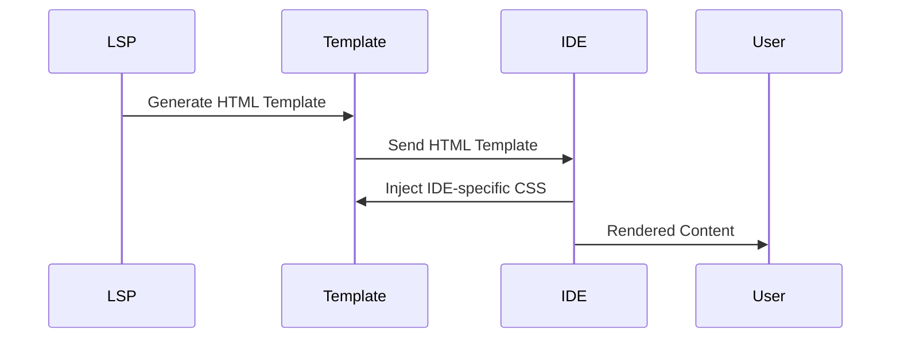
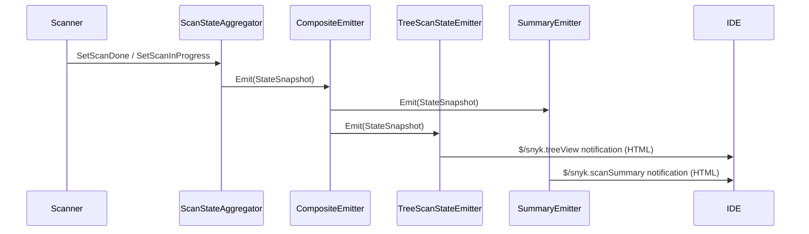

## UI Rendering with Language Server

This document explains the architecture and interaction between the Language Server and IDEs for rendering the UI components. It aims to guide contributors in adding or modifying UI components.


### Architecture Overview

Our approach unifies the user interface for Snyk Code Ignores across multiple IDEs by leveraging the Language Server Protocol. This ensures consistency, reduces redundancy, and simplifies future enhancements.




### Workflow Description

1. **Generate HTML Template**: The Language Server generates an HTML template using the Go `html/template` library. The template includes placeholders for dynamic content.
2. **Send HTML Template**: The generated HTML template is sent to the IDEs. This template includes the structure of the UI components but lacks specific styling.
3. **Injected IDE-specific CSS**: Each IDE injects its own CSS to style the HTML template according to its theming and design guidelines. This allows the same HTML structure to be visually consistent with the rest of the IDE.

### Using `//go:embed` for CSS and HTML Files

This directive loads static assets like CSS and HTML files directly into our application. This is particularly useful for embedding resources such as templates and stylesheets that are needed for rendering the UI components.

```go
//go:embed template/index.html
var detailsHtmlTemplate string

//go:embed template/styles.css
var stylesCSS string
```

The Go build system will recognize the directives and arrange for the declared variable to be populated with the matching files from the file system. 

### Adding or Modifying UI Components

#### Snyk Code Suggestion Panel
To add or modify UI components in the IDEs that support the Language Server, follow these steps:

1. Process the dynamic data to be rendered in the HTML template in `infrastructure/code/code_html.go`. For example, to display the issue ecosystem in the UI:

```go
func getCodeDetailsHtml(issue snyk.Issue) string {
	c := config.CurrentConfig()

	data := map[string]interface{}{
		"Ecosystem":          issue.Ecosystem,
		"IssueTitle":         additionalData.Title,
    // more data
	}

	var html bytes.Buffer
	if err := globalTemplate.Execute(&html, data); err != nil {
		c.Logger().Error().Msgf("Failed to execute main details template: %v", err)
		return ""
	}

	return html.String()
}
```

2. Update the HTML template in `infrastructure/code/template/details.html` to include the placeholders for the dynamic data. Include CSS in the template itself if the styles are the same across all IDEs, otherwise use IDE-specific files.

```html
<head>
  <style>
    .ecosystem-badge {
      padding: 0.35em 0.35em;
      border-radius: 0.25em;
      margin-left: 1em;
      background: #FFF4ED;
      color: #B6540B;
      border: 1px solid #E27122;
    }
  </style>
</head>
<body>
  <h2 class="severity-title">{{.IssueTitle}}</h2>
  <span class="delimiter"></span>
  <div>Priority score: {{.PriorityScore}}</div>
  <span class="delimiter"></span>
  <div class="ecosystem-badge">{{.Ecosystem}}</div>
  <!-- more HTML -->
</body>
```

3. If necessary, add IDE-specific CSS:

**VSCode**
- CSS: [suggestionLS.scss](https://github.com/snyk/vscode-extension/blob/ae111dd5aa7a1e1eaa33bef33b2af7c15ef558d2/media/views/snykCode/suggestion/suggestionLS.scss)
- HTML Rendering: [codeSuggestionWebviewProvider.ts](https://github.com/snyk/vscode-extension/blob/ae111dd5aa7a1e1eaa33bef33b2af7c15ef558d2/src/snyk/snykCode/views/suggestion/codeSuggestionWebviewProvider.ts#L92)
- Script Injection: [codeSuggestionWebviewScriptLS.ts](https://github.com/snyk/vscode-extension/blob/ae111dd5aa7a1e1eaa33bef33b2af7c15ef558d2/src/snyk/snykCode/views/suggestion/codeSuggestionWebviewScriptLS.ts)

**IntelliJ**
- CSS: [snyk_code_suggestion.scss](https://github.com/snyk/snyk-intellij-plugin/blob/2581e2dc2e8722a960d0f0095377b7912a3789fe/src/main/resources/stylesheets/snyk_code_suggestion.scss)
- HTML Rendering: [JCEFDescriptionPanel.kt](https://github.com/snyk/snyk-intellij-plugin/blob/2581e2dc2e8722a960d0f0095377b7912a3789fe/src/main/kotlin/io/snyk/plugin/ui/toolwindow/panels/JCEFDescriptionPanel.kt)

  

4. **Handle Nonce and IDE-Specific Styles**

When dealing with Content Security Policies (CSP) in the HTML generated by the Language Server, it’s important to correctly handle `nonce` attributes for both styles and scripts to ensure they are applied securely.

- **Language Server**: Ensure the HTML template includes `nonce` placeholders that will be replaced by dynamically generated nonces. For example:

```html

<head>
  <meta charset="UTF-8">
  <meta name="viewport" content="width=device-width, initial-scale=1.0">
  <meta http-equiv="Content-Security-Policy"
    content="default-src 'none'; style-src 'self' 'nonce-{{.Nonce}}' 'nonce-ideNonce'; script-src 'nonce-{{.Nonce}}';">
  <!--noformat-->
  <style nonce="{{.Nonce}}">
    {{.Styles}}
  </style>
  <!--noformat-->
  <style nonce="ideNonce" data-ide-style></style>
</head>
```

- `{{.Nonce}}`: This is a dynamically generated **nonce** passed from, for example, `infrastructure/iac/iac_html.go`.
- `{{.Styles}}`: This is where the styles defined in the Language Server are injected, also passed via `infrastructure/iac/iac_html.go`.
- `ideNonce`: This placeholder will be replaced by the IDE with its own dynamically generated nonce for IDE-specific styles.

- **IDE (e.g., VSCode)**: Replace the nonce placeholder in the HTML with the actual nonce generated by the IDE, and inject IDE-specific styles:

```typescript
private getHtmlFromLanguageServer(html: string): string {
  const nonce = getNonce();
  const ideStylePath = vscode.Uri.joinPath(
    vscode.Uri.file(this.context.extensionPath),
    'media',
    'views',
    'snykCode',
    'suggestion',
    'suggestionLS.css',
  );

  const ideStyle = readFileSync(ideStylePath.fsPath, 'utf8');
  html = html.replace(/nonce-ideNonce/g, `nonce-${nonce}`); // Replace the placeholder with IDE nonce
  html = html.replace(
  '<style nonce="ideNonce" data-ide-style></style>',
  `<style nonce="${nonce}">${ideStyle}</style>`,
);

return html;
}
```

### Final Workflow

1. **Generate HTML Template with Nonce**: The Language Server generates an HTML template, including placeholders for
`nonce` attributes.
2. **Send HTML Template to IDE**: The IDE receives the template and prepares to render it.
3. **Replace Nonce and Inject Styles**: The IDE replaces the nonce placeholders with actual nonces and injects any IDE-specific styles.

---

## Server-Driven HTML Tree View

The tree view panel is rendered server-side and sent to IDEs as a web view. This replaces
per-IDE native tree implementations (IntelliJ JTree, VS Code TreeDataProvider) to reduce
maintenance.

### Architecture



### Key Components

| Component | Package | Purpose |
|---|---|---|
| `TreeNode`, `TreeViewData` | `domain/ide/treeview` | Data types for the tree hierarchy |
| `TreeBuilder` | `domain/ide/treeview` | Builds tree from workspace folder data |
| `TreeHtmlRenderer` | `domain/ide/treeview` | Renders `TreeViewData` → HTML via Go templates |
| `TreeViewEmitter` | `domain/ide/treeview` | Sends tree view HTML via notifier (direct use) |
| `TreeScanStateEmitter` | `domain/ide/treeview` | Adapts `ScanStateChangeEmitter` interface |
| `CompositeEmitter` | `domain/scanstates` | Fans out to summary + tree view emitters |
| `getTreeViewCommand` | `domain/ide/command` | On-demand `snyk.getTreeView` LSP command |

### Tree Hierarchy

```
[Folder]  ← only in multi-root workspaces
  └─ [Product]  (Snyk Code, Open Source, IaC)
       └─ [File]
            └─ [Issue]  ← leaf, clickable → navigate to file
```

### LSP Notifications & Commands

- **`$/snyk.treeView`** — automatic push notification containing `{ "treeViewHtml": "<html>..." }`
- **`snyk.getTreeView`** — on-demand command returning the tree HTML synchronously

### IDE Integration

IDEs render the tree HTML in a WebView. The HTML includes:
- `${ideStyle}` — placeholder for IDE-injected CSS
- `${ideScript}` — placeholder for IDE-injected JS bridge
- `${nonce}` — placeholder for CSP nonce

The tree uses `window.__ideTreeNavigateToFile__(filePath, startLine, endLine, startChar, endChar)`
to communicate back to the IDE when an issue is clicked.

### IE11 Compatibility (Visual Studio)

- ES5 JavaScript only (no `const`, `let`, arrow functions, template literals)
- No `<details>`/`<summary>` — uses `div` + class toggling
- `document.createEvent('Event')` fallback for event dispatching
- CSS compatible with IE11 (no CSS variables, no grid)

### Filtering

Filters (severity, open/ignored) are applied server-side via existing
`SeverityFilter` and `IssueViewOptions` in the workspace folder configuration.
The tree builder reads `FilteredIssues` which already reflect these filters.

### Expand/Collapse

In v1, expand/collapse is handled entirely in client-side JavaScript within the
WebView. Product nodes default to expanded, file nodes default to collapsed.

### Tested Scenarios

#### Unit Tests (`domain/ide/treeview`)
- Tree node creation with all option variants
- Tree building: empty workspace, single/multi folder, single/multi product
- Issue sorting by severity, file sorting alphabetically
- Ignored/new/fixable badge flags
- Product and file description containing issue counts
- HTML rendering: valid HTML structure, CSS, IE11 meta tag
- Data attributes on issue nodes for click navigation
- Scan-in-progress indicator
- Multi-root folder rendering
- Emitter notification delivery (both direct and scan-state-driven)

#### Unit Tests (`domain/scanstates`)
- Composite emitter calls all child emitters

#### Unit Tests (`domain/ide/command`)
- `getTreeView` command returns valid HTML
