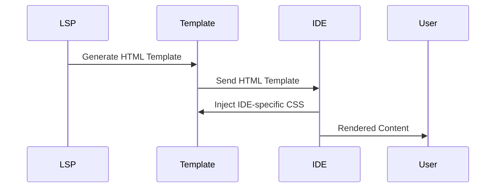

## UI Rendering with Language Server

This document explains the architecture and interaction between the Language Server and IDEs for rendering the UI components. It aims to guide contributors in adding or modifying UI components.


### Architecture Overview

Our approach unifies the user interface for Snyk Code Ignores across multiple IDEs by leveraging the Language Server Protocol. This ensures consistency, reduces redundancy, and simplifies future enhancements.




### Workflow Description

1. **Generate HTML Template**: The Language Server generates an HTML template using the Go `html/template` library. The template includes placeholders for dynamic content.
2. **Send HTML Template**: The generated HTML template is sent to the IDEs. This template includes the structure of the UI components but lacks specific styling.
3. **Injected IDE-specific CSS**: Each IDE injects its own CSS to style the HTML template according to its theming and design guidelines. This allows the same HTML structure to be visually consistent with the rest of the IDE.

### Adding or Modifying UI Components

To add or modify UI components in the IDEs that support the Language Server, follow these steps:

1. Process the dynamic data to be rendered in the in the HTML template in `infrastructure/code/code_html.go`. For example, to display the issue ecosystem in the UI:

```go
func getCodeDetailsHtml(issue snyk.Issue) string {
	c := config.CurrentConfig()

	data := map[string]interface{}{
		"Ecosystem":          issue.Ecosystem,
		"IssueTitle":         additionalData.Title,
    // more data
	}

	var html bytes.Buffer
	if err := globalTemplate.Execute(&html, data); err != nil {
		c.Logger().Error().Msgf("Failed to execute main details template: %v", err)
		return ""
	}

	return html.String()
}
```

2. Update the HTML template in `infrastructure/code/template/details.html` to include the placeholders for the dynamic data. Include CSS in the template itself if the styles are the same across all IDEs, otherwise use IDE-specific files.

```html
<head>
  <style>
    .ecosystem-badge {
      padding: 0.35em 0.35em;
      border-radius: 0.25em;
      margin-left: 1em;
      background: #FFF4ED;
      color: #B6540B;
      border: 1px solid #E27122;
    }
  </style>
</head>
<body>
  <h2 class="severity-title">{{.IssueTitle}}</h2>
  <span class="delimiter"></span>
  <div>Priority score: {{.PriorityScore}}</div>
  <span class="delimiter"></span>
  <div class="ecosystem-badge">{{.Ecosystem}}</div>
  <!-- more HTML -->
</body>
```

1. If necessary, add IDE-specific CSS:

**VSCode**
- CSS: [suggestionLS.scss](https://github.com/snyk/vscode-extension/blob/main/media/views/snykCode/suggestion/suggestionLS.scss)
- HTML Rendering: [showPanel](https://github.com/snyk/vscode-extension/blob/main/src/snyk/snykCode/views/suggestion/codeSuggestionWebviewProvider.ts#L92)
- Script Injection: [codeSuggestionWebviewScriptLS.ts](https://github.com/snyk/vscode-extension/blob/main/src/snyk/snykCode/views/suggestion/codeSuggestionWebviewScriptLS.ts)

**IntelliJ**
- CSS: [snyk_code_suggestion.scss](https://github.com/snyk/snyk-intellij-plugin/blob/master/src/main/resources/stylesheets/snyk_code_suggestion.scss)
- HTML Rendering: [OpenFileLoadHandlerGenerator](https://github.com/snyk/snyk-intellij-plugin/blob/master/src/main/kotlin/io/snyk/plugin/ui/jcef/OpenFileLoadHandlerGenerator.kt)


